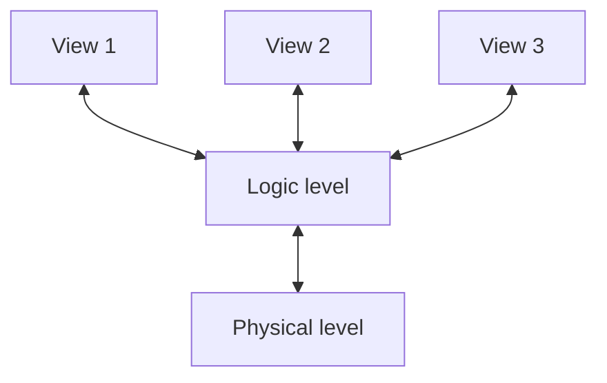
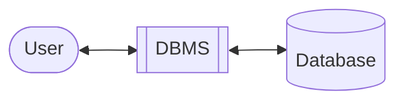
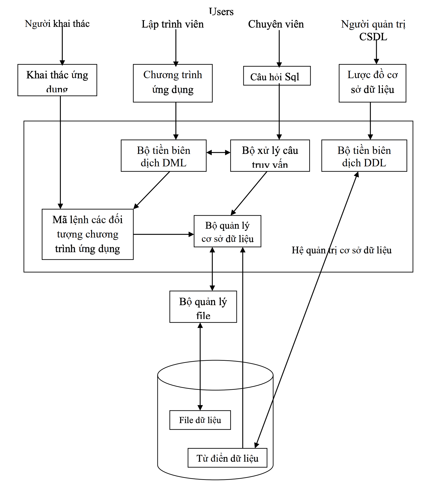

# Chương 1 - Đại Cương Về Các Hệ Cơ Sở Dữ Liệu

---

<!-- @import "[TOC]" {cmd="toc" depthFrom=2 depthTo=6 orderedList=false} -->

<!-- code_chunk_output -->

- [Khái niệm về cơ sở dữ liệu](#khái-niệm-về-cơ-sở-dữ-liệu)
  - [Khái niệm về cơ sở dữ liệu](#khái-niệm-về-cơ-sở-dữ-liệu-1)
  - [Mục đích của các hệ cơ sở dữ liệu](#mục-đích-của-các-hệ-cơ-sở-dữ-liệu)
- [Kiến trúc của một hệ thống cơ sở dữ liệu](#kiến-trúc-của-một-hệ-thống-cơ-sở-dữ-liệu)
  - [Mức vật lí](#mức-vật-lí)
  - [Mức logic](#mức-logic)
  - [Mức khung hình](#mức-khung-hình)
- [Hệ quản trị cơ sở dữ liệu](#hệ-quản-trị-cơ-sở-dữ-liệu)
  - [Khái niệm](#khái-niệm)
  - [Các chức năng của hệ quản trị cơ sở dữ liệu](#các-chức-năng-của-hệ-quản-trị-cơ-sở-dữ-liệu)
  - [Khái niệm về sự độc lập dữ liệu và chương trình](#khái-niệm-về-sự-độc-lập-dữ-liệu-và-chương-trình)
  - [Bộ quản lí cơ sở dữ liệu](#bộ-quản-lí-cơ-sở-dữ-liệu)
  - [Người quản trị cơ sở dữ liệu](#người-quản-trị-cơ-sở-dữ-liệu)
  - [Những người sử dụng cơ sở dữ liệu](#những-người-sử-dụng-cơ-sở-dữ-liệu)
  - [Cấu trúc cơ bản của hệ thống quản trị cơ sở dữ liệu](#cấu-trúc-cơ-bản-của-hệ-thống-quản-trị-cơ-sở-dữ-liệu)

<!-- /code_chunk_output -->

---

## Khái niệm về cơ sở dữ liệu

### Khái niệm về cơ sở dữ liệu

Cơ sở dữ liệu (database) là một tập hợp có cấu trúc của dữ liệu được lưu trữ trong các thiết bị ghi nhớ, có thể được truy xuất bởi các chương trình quản trị cơ sở dữ liệu, để thỏa mãn đồng thời nhiều người sử dụng.

### Mục đích của các hệ cơ sở dữ liệu

Hệ cơ sở dữ liệu được sinh ra để giảm thiểu các vấn đề của hệ thống file cũ:

- Sự dư thừa dữ liệu (data redundancy).
- Sự mâu thuẫn dữ liệu (data inconsistency).
- Khó khăn trong việc truy xuất dữ liệu.
- Sự tách biệt dữ liệu.
- Sự bất thường trong truy xuất đồng thời (concurrent access anomalies).
- Các vấn đề an toàn (security problems).
- Các vấn đề toàn vẹn (integrity problems). Là những vấn đề có thể gặp về constrain của dữ liệu, ví dụ như tốc độ thì không thể âm.

---

## Kiến trúc của một hệ thống cơ sở dữ liệu

Hệ quản trị cơ sở dữ liệu là tập hợp các files có mối quan hệ và một tập chương trình cho phép những người sử dụng truy xuất và thay đổi các files này.

Mục đích chính của hệ cơ sở dữ liệu là cung cấp cho những người sử dụng một cái nhìn trừu tượng (abstract view) về dữ liệu.

**Kiến trúc hệ cơ sở dữ liệu:**

### Mức vật lí

Đây là mức thấp nhất mô tả dữ liệu được lưu trữ thực sự như thế nào. Tại mức vật lý, các cấu trúc vật lý phức tạp được mô tả chi tiết.

### Mức logic

Mức logic là mức cao tiếp theo, nó mô tả một mô hình dữ liệu phản ánh thế giới thực mà ta cần lưu trữ trong cơ sở dữ liệu. Ở đây toàn bộ cơ sở dữ liệu được mô tả như là một số lược đồ quan hệ đơn giản.

Mức logic được dùng cho người quản trị cơ sở dữ liệu và các lập trình viên, họ phải quyết định những thông tin nào được giữ lại trong cơ sở dữ liệu và lập trình như thế nào.

### Mức khung hình

Đây là mức cao nhất mô tả chỉ một phần cơ sở dữ liệu. Thay vì sử dụng lược đồ đơn giản hơn ở mức logic, một số lược đồ phức tạp sẽ được giữ lại do kích thước dữ liệu lớn của cơ sở dữ liệu. Nhiều người sử dụng hệ thống cơ sở dữ liệu không quan tâm đến tất cả thông tin này mà chỉ một phần của cơ sở dữ liệu. Do đó để đơn giản hóa sự tương tác với hệ thống, mức khung nhìn được định nghĩa. Hệ thống có thể cung cấp nhiều khung nhìn trên cùng một cơ sở dữ liệu cho các đối tượng sử dụng khác nhau.

---

## Hệ quản trị cơ sở dữ liệu

### Khái niệm

Hệ quản trị cơ sở dữ liệu là một phần mềm tức là một hệ thống các chương trình cho phép người sử dụng giao tiếp với cơ sở dữ liệu.

Hệ quản trị cơ sở dữ liệu cho phép ta tổ chức cơ sở dữ liệu, lưu trữ nó trên thiết bị ghi nhớ và cung cấp cho chúng ta các thủ tục để sửa đổi cấu trúc cơ sở dữ liệu, cập nhật dữ liệu và truy vấn trên các dữ liệu.

### Các chức năng của hệ quản trị cơ sở dữ liệu

1. Hỗ trợ một mô hình dữ liệu để tổ chức cơ sở dữ liệu nghĩa là một công cụ để trừu tượng hóa một cách toán học thế giới thực cần quản lý và thông qua đó người sử dụng có thể thấy được các dữ liệu của thế giới thực này.
2. Hỗ trợ cho một vài ngôn ngữ lập trình cấp cao cho phép người sử dụng định nghĩa cấu trúc dữ liệu, truy xuất dữ liệu; ngoài ra còn cung cấp một ngôn ngữ để thao tác lên dữ liệu và truy vấn dữ liệu. Các ngôn ngữ đó được gọi là ngôn ngữ hỏi (Query Language), trong đó ngôn ngữ được sử dụng rộng rãi nhất là ngôn ngữ SQL (Structured Query Language).
3. Quản lí giao dịch (transaction). Cứ một lần truy xuất cơ sở dữ liêu được gọi là một giao dịch. Hệ quản trị cơ sở dữ liệu cung cấp công cụ cho phép nhiều người sử dụng truy xuất đồng thời đến cơ sở dữ liệu.
4. Khả năng bảo vệ và phục hồi dữ liệu : Hệ quản trị cơ sở dữ liệu có khả năng bảo vệ và phục hồi dữ liệu từ các hệ thống bị hư hỏng do các tác nhân:
    - Virus
    - Chương trình không hoàn chỉnh, thiếu an toàn nên bị hỏng bởi chính người sử dụng.
    - Đĩa hư.
5. Điều khiển truy xuất: Hệ quản trị cơ sở dữ liệu có khả năng giới hạn quyền truy xuất dữ liệu của người sử dụng và hơn nữa còn kiểm tra tính hợp lệ của dữ liệu khi đưa vào cơ sở dữ liệu.

    > **Quyền truy xuất:** Hệ quản trị cơ sở dữ liệu cho phép cấp hoặc lấy đi các quyền thâm nhập và truy xuất cơ sở dữ liệu cho những người sử dụng như các quyền:
    >
    > - Không được xem dữ liệu.
    > - Được xem những không được sửa dữ liệu (chỉ xem).
    > - Được xem và sửa dữ liệu (xem và sửa).
    >
    > Mỗi người sử dụng được cấp cho một quyền truy xuất và quyền đó được lưu trữ trong 1 bảng phân quyền.

6. Kiểm tra tính hợp lệ của dữ liệu: hệ quản trị cơ sở dữ liệu cho phép ràng buộc các dữ liệu nhất là các dữ liệu nhập để thể hiện tính toàn vẹn của dữ liệu.

### Khái niệm về sự độc lập dữ liệu và chương trình

Độc lập dữ liệu và chương trình là cấu trúc dữ liệu dù có thay đổi nhưng chương trình vẫn không thay đổi.

Có hai loại độc lập dữ liệu:

**1. Độc lập dữ liệu vật lí:**

Là trường hợp **sơ đồ vật lý bị thay đổi** (nghĩa là đưòng địa chỉ thư mục dữ liệu bị thay đổi, các cấu trúc tập tin bị thay đổi) nhưng **sơ đồ ý niệm không thay đổi và như vậy các chương trình ứng dụng cũng không phải thay đổi**. Để làm được điều này ta phải thay đổi các phép biến đổi từ sơ đồ vật lý.

**2. Độc lập dữ liệu luận lý:**

Là khi **sơ đồ ý niệm thay đổi** nhưng **sơ đồ ngoài không thay đổi nghĩa là các chương trình ứng dụng không cần phải viết lại**, từ đó ta phải thay đổi các phép biến đổi từ sơ đồ ngoài đến sơ đồ ý niệm.

### Bộ quản lí cơ sở dữ liệu

Bộ quản lý cơ sở dữ liệu là một module chương trình cung cấp sự giao tiếp giữa dữ liệu ở mức thấp được lưu trữ trong cơ sở dữ liệu với các chương trình ứng dụng. Bộ quản lý cơ sở dữ liệu có nhiệm vụ thực hiện các chức năng được trình bày ở phần [các chức năng của hệ quản trị cơ sở dữ liệu](#các-chứ-năng-của-hệ-quản-trị-cơ-sở-dữ-liệu).

### Người quản trị cơ sở dữ liệu

Hệ thống cơ sở dữ liệu là một hệ thống dữ liệu lớn và được sử dụng thường xuyên và lâu dài do đó phải cần có một người quản lý tập trung cả hệ thống. Người đó được gọi là người quản trị cơ sở dữ liệu.

Các chức năng của người quản trị cơ sở dữ liệu bao gồm:

- Xác định lược đồ cơ sở dữ liệu. Lược đồ cơ sở dữ liệu được tạo ra cho hệ thống sẽ được lưu trữ thường trực trong tự điển dữ liệu.
- Xác định được cấu trúc lưu trữ dữ liệu và phương thức truy xuất cơ sở dữ liệu.
- Thay đổi lược đồ và tổ chức vật lý. Các thay đổi lược đồ cơ sở dữ liệu hoặc các tổ chức lưu trữ vật lý mặc dù rất hiếm phải được thực hiện bởi người quản trị cơ sở dữ liệu thông qua ngôn ngữ định nghĩa dữ liệu.
- Cấp quyền truy xuất dữ liệu cho người sử dụng.
- Đặc tả các ràng buộc toàn vẹn. Các ràng buộc toàn vẹn được giữ trong một cấu trúc hệ thống đặc biệt và được tham khảo bởi người quản trị cơ sở dữ liệu khi có một sự thay đổi trong hệ thống.

### Những người sử dụng cơ sở dữ liệu

Mục đích chính của hệ thống cơ sở dữ liệu là cung cấp một môi trường cho việc tìm kiếm thông tin cho nhiều người sử dụng. Những người sử dụng cơ sở dữ liệu được chia thành 4 loại sau:

1. Người quản trị cơ sở dữ liệu.
2. Các chuyên viên: Những người này không dùng các chương trình ứng dụng để truy cập vào cơ sở dữ liệu. Họ sử dụng ngôn ngữ hỏi để truy cập trực tiếp vào cơ sở dữ liệu.
3. Lập trình viên: người viết ra các chương trình ứng dụng cho cơ sở dữ liệu.
4. Người khai thác: Người khai thác là người giao tiếp với hệ thống thông qua 
các chương trình ứng dụng.

### Cấu trúc cơ bản của hệ thống quản trị cơ sở dữ liệu

- Hệ quản lý tập tin (File manager): Bộ quản lý tập tin quản lý sự định vị các không gian lưu trữ và các cấu trúc dữ liệu dùng để thể hiện các thông tin lưu trữ trên đĩa.
- Bộ quản lý cơ sở dữ liệu (Database manager): Cung cấp sự giao tiếp giữa dữ liệu được lưu trữ ở mức thấp trong cơ sở dữ liệu với các chương trình ứng dụng.
- Bộ xử lý câu truy vấn (Query processor): Bộ này biên dịch các phát biểu trong ngôn ngữ hỏi thành các câu lệnh ở mức thấp sao cho bộ quản lý cơ sở dữ liệu có thể hiểu được. Hơn nữa nó còn tối ưu hoá câu truy vấn sao cho việc thực thi câu hỏi được nhanh hơn.
- Bộ tiền biên dịch DML (DML precompiler): Bộ tiền biên dịch DML dịch các phát biểu của ngôn ngữ hỏi được nhúng trong ngôn ngữ chủ thành các mã lệnh thích hợp.
- Bộ biên dịch DDL (DDL compiler): Biên dịch các phát biểu DDL thành một tập các bảng.
- Các files dữ liệu: lưu trữ chính cơ sở dữ liệu.
- Tự điển dữ liệu: Chứa các dữ liệu định nghĩa dữ liệu tức toàn bộ các định nghĩa của cơ sở dữ liệu.

