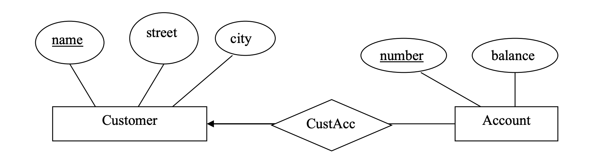
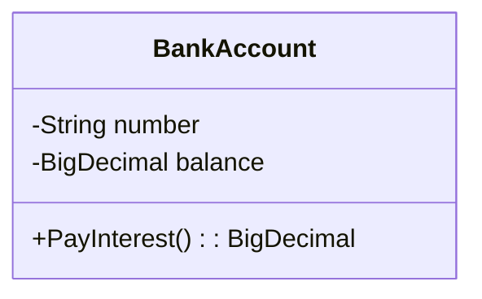

# Chương 2 - Các Mô Hình Dữ Liệu

---

<!-- @import "[TOC]" {cmd="toc" depthFrom=2 depthTo=6 orderedList=false} -->

<!-- code_chunk_output -->

- [Mô hình dữ liệu - Data model](#mô-hình-dữ-liệu---data-model)
  - [Các mô hình dữ liệu - Data models](#các-mô-hình-dữ-liệu---data-models)
  - [Mô hình logic dựa trên đối tượng - Object-Based logical models](#mô-hình-logic-dựa-trên-đối-tượng---object-based-logical-models)
    - [Mô hình thực thể các liên kết - Entity-Relationship Model](#mô-hình-thực-thể-các-liên-kết---entity-relationship-model)
    - [Mô hình hướng đối tượng - Object-Oriented Model](#mô-hình-hướng-đối-tượng---object-oriented-model)
  - [Các mô hình dựa trên mẫu tin - Record-Based Logical Models](#các-mô-hình-dựa-trên-mẫu-tin---record-based-logical-models)
    - [Mô hình quan hệ](#mô-hình-quan-hệ)
- [Mô hình thực thể mối liên kết - Entity Relationship Model](#mô-hình-thực-thể-mối-liên-kết---entity-relationship-model)
  - [Thực thể - Entity](#thực-thể---entity)
  - [Tập thực thể - Entity Set](#tập-thực-thể---entity-set)
  - [Các thuộc tính và khóa](#các-thuộc-tính-và-khóa)
  - [Hệ phân cấp isa hay sự tổng quát hoá - chuyên biệt hóa](#hệ-phân-cấp-isa-hay-sự-tổng-quát-hoá---chuyên-biệt-hóa)
  - [Mối liên kết](#mối-liên-kết)

<!-- /code_chunk_output -->

---

## Mô hình dữ liệu - Data model

### Các mô hình dữ liệu - Data models

Quan niệm về mô hình dữ liệu là cấu trúc ở mức cơ sở của cơ sở dữ liệu. Mô hình dữ liệu có các công cụ quan niệm cho việc mô tả dữ liệu, mô tả các mối quan hệ dữ liệu, các ngữ nghĩa của dữ liệu và các ràng buộc nhất quán.

Có rất nhiều mô hình dữ liệu và được chia thành ba nhóm:

1. Các mô hình logic dựa trên đối tượng.
2. Các mô hình logic dựa trên mẫu tin.
3. Các mô hình dữ liệu vật lý.

### Mô hình logic dựa trên đối tượng - Object-Based logical models

Các mô hình logic dựa trên đối tượng được sử dụng để mô tả các mức quan niệm (logic level) và mức tầm nhìn (view level).

Các mô hình này có các đặc trưng:

- Khả năng cấu trúc hóa linh động.
- cho phép đặc tả một cách rõ ràng các ràng buộc dữ liệu.

Một số các mô hình logic dựa trên đối tượng được biết đến rộng rãi:

- Mô hình thực thể liên kết
- Mô hình hướng đối tượng
- Mô hình nhị phân
- Mô hình dữ liệu ngữ nghĩa
- Mô hình dữ liệu chức năng

> *Trong bài giảng tập trung nghiên cứu về mô hình thực thể liên kết và mô hình hướng đối tượng khi nói về mô hình logic dựa trên đối tượng.*

#### Mô hình thực thể các liên kết - Entity-Relationship Model

ER Model là mô hình dựa trên việc quan sát thế giới thực dưới góc độ các đối tượng cơ bản gọi là thực thể (Entity) và các mối liên kết (relationship) giữa các thực thể này.

- Môt thực thể là một đối tượng có thể phân biệt với các đối tượng khác thông qua tập các thuộc tích đặc tả của đối tượng đó.
- Một mối liên kết là mối quan hệ giữa các thực thể.
- Tập tất cả các thực thể cùng kiểu và tập các mối liên kết có cùng kiểu được gọi là tập thực thể và tập mối liên kết tương ứng.

ER Model là mô hình của tập các thực thể và liên kết tương ứng đồng thời bổ sung việc thể hiện các ràng buộc mà nội dung dữ liệu trong cơ sở dữ liệu phải tuân theo.

Cấu trúc logic của toàn bộ cơ sở dữ liệu có thể dược biểu diễn bằng một sơ đồ thực thể mối liên kết ER (ER diagram) bao gồm các thành phần sau:

- Hình chữ nhật thể hiện tập thực thể.
- Hình elip thể hiện các thuộc tính.
- Hình thoi thể hiện mối liên kết giữa các tập thực thể.
- Đường nối liên kết các thuộc tính với tập thực thể và tập thực thể với mối liên kết.

Mỗi thành phần đều có tên mà thực thể và mối liên kế thể hiện chúng.

**Ví dụ:** một phần hệ thống cơ sở dữ liệu ngân hàng bao gồm các khách hàng và các tài khoản của họ.



Trong mô hình trên, có hai thực thể chính là `Customer` và `Account`. Trong đó:

- Đối tượng `Customer` có ba thuộc tính là `name`, `street` và `city`.
- Đối tượng `Account` có hai thuộc tính là `number` và `balance`.

Giữa `Account` và `Customer` có một mối liên kết là `CustomerAccount`.

#### Mô hình hướng đối tượng - Object-Oriented Model

Tương tự mô hình ER, mô hình hướng đối tượng cũng dựa trên một tập các đối tượng. Một đối tượng mang dữ liệu, được chứa trong biến có kiểu là đối tượng đó thì biến đó là một instance variable. Các biến này bản thân nó là một đối tượng. Và các đối tượng có những chức năng có thể tác động đến đối tượng gọi là các phương thức (method).

Các đối tượng chứa cùng kiểu giá trị và cùng kiểu phương thức được gom lại trong một lớp (class). Một lớp có thể được xem như một định nghĩa kiểu cho các đối tượng.

Một cách duy nhất mà một đối tượng có thể truy xuất dữ liệu của một đối tượng khác là gọi một phương thức của đối tượng đó. Điều này được gọi là **gửi thông báo đến đối tượng.**

**Ví dụ:** xét một đối tượng thể hiện tài khoản ngân hàng (bank account). Đối tượng này chứa các biến number và balance thể hiện số tài khoản và ngân khoản của nó. Đối tượng này cũng chứa phương thức chi trả lãi (pay-interest).



> **Giả sử** trước đây ngân hàng chi trả lãi $6\%$ cho tất cả các tài khoản nhưng nay ngân hàng thay đổi cách chi trả lãi như sau: trả lãi $5\%$ đối với các tài khoản có ngân khoản nhỏ hơn $\$1000$ và $6\%$ đối với các tài khoản có ngân khoản lớn hơn hay bằng $\$1000$. Đối với hầu hết các mô hình, sự thay đổi này dẫn đến việc thay đổi mã lệnh trong một hoặc nhiều chương trình ứng dụng. Nhưng trong mô hình hướng đối tượng thì điều này chỉ cần thay đổi trong phương thức pay-interest mà thôi.

### Các mô hình dựa trên mẫu tin - Record-Based Logical Models

Các mô hình dựa trên mẫu tin được **sử dụng để mô tả dữ liệu ở các mức quan niệm và khung nhìn**. Ngược lại với các mô hình dựa trên đối tượng, chúng được *dùng cho việc đặc tả toàn bộ cấu trúc logic của cơ sở dữ liệu* và *cung cấp một mô tả mức cao hơn cho việc hiện thực cơ sở dữ liệu vật lý*.

> Các mô hình dược gọi là dựa trên mẫu tin vì cơ sở dữ liệu được xây dựng theo dạng các mẫu tin xác định. Mỗi kiểu mẫu tin dịnh nghĩa một số các trường hoặc các thuộc tính và mỗi trường thường có chiều dài cố định.

Các mô hình dựa trên mẫu tin không chứa một cơ chế cho việc thể hiện các mã lệnh trực tiếp trong cơ sở dữ liệu. Vì thế nó có hai ngôn ngữ riêng rẽ nhưng gắn liền với mô hình để biểu diễn các truy vấn cơ sở dữ liệu và cập nhật cơ sở dữ liệu.

> Ba mô hình dữ liệu dựa trên mẫu tin được chấp nhận rộng rãi nhất là mô hình quan hệ, mô hình mạng và mô hình phân cấp. Mô hình quan hệ là mô hình dành được sự ưa chuộng hơn hai mô hình kia trong những năm gần đây, nó sẽ được nghiên cứu sâu trong giáo trình này. Mô hình mạng và mô hình phân cấp chỉ còn được sử dụng trong một số các cơ sở dữ liệu cũ.

#### Mô hình quan hệ

Mô hình quan hệ thể hiện dữ liệu và mối quan hệ giữa chúng bằng một tập các bảng. Mỗi bảng chứa một số cột với tên duy nhất.

Để biểu diễn mô hình dữ liệu quan hệ với người dùng bảng, trong đó:

- 1 cột thì tương ứng với một thuộc tính.
- 1 hàng thì tương ứng với 1 bộ (record).
- 1 bảng thì tương ứng với 1 quan hệ (file).

**Ví dụ:** Để minh họa cho mẫu cơ sở dữ liệu thể hiện khách hàng (customer) và tài khoản (account) của họ, ta có hai bảng thể hiện sau:

|  name  |  street  |   city   | number |
|:------:|:--------:|:--------:|:------:|
| Lowery |  Mapple  |  Queens  |  900   |
| Shiver |  North   |  Bronx   |  556   |
| Shiver |  North   |  Bronx   |  647   |
| Hodges | Sidehill | Brooklyn |  801   |
| Hodges | Sidehill | Brooklyn |  647   |

|number|balance |
|:----:|:------:|
| 900  |   55   |
| 556  | 100000 |
| 647  | 105366 |
| 801  | 10533  |

---

## Mô hình thực thể mối liên kết - Entity Relationship Model

### Thực thể - Entity

Thực thể là 1 sự vật hay sự việc mà ta có thể phân biệt được, tồn tại trong thế giới khách quan mà ta có thể liên kết thực thể này với 1 thực thể khác. Thực thể có thể là một thực thể cụ thể hoặc trừu tượng. Mỗi thực thể được mô tả bởi một số thuộc tính.

> **Ví dụ:**
>
> - Trong ngân hàng, thực thể khách hàng có thể phân biệt với nhau thông qua mã khách hàng hoặc giữa các thực thể tài khoản ngân hàng có thể được phân biệt với nhau thông qua số tài khoản.
> - Thực thể các môn học có thể được phân biệt với nhau thông qua mã môn học, song cũng có mối liên hệ như môn học tiên quyết phải học trước môn kia.

Qua hai ví dụ trên thì tài khoản ngân hàng là thực thể cụ thể và thực thể môn học là thực thể trừu tượng.

### Tập thực thể - Entity Set

Tập thực thể là một tập bao gồm những thực thể giống nhau.

> **Ví dụ:**
>
> - Tập các tài khoản ngân hàng sẽ là tập thực thể ngân hàng.
> - Tập các môn học là tập thực thể môn học.

### Các thuộc tính và khóa

***Thuộc tính:*** Các tập thực thể thì có những đặc tính, những đặc tính này gọi là thuộc tính.

> **Ví dụ:** Tập thực thể Mặt hàng có các thuộc tính như tên mặt hàng, số lượng.

Mỗi thuộc tính có một kiểu dữ liệu (số nguyên, số thực, các chuỗi ký tự .. .) và có giá trị trong một miền giá trị.

> **Ví dụ:**
>
> - Mã vật tư là một chuỗi các ký tự.
> - Số lượng là 1 số nguyên.
> - Khối lượng là 1 số thực.

***Khóa*** là một thuộc tính hoặc là một tập các thuộc tính mà giá trị của nó được dùng để xác định duy nhất 1 thực thể trong một tập thực thể.

> **Ví dụ:** Để phân biệt các sinh viên người ta có thể dùng khóa sau:
>
> - Mã sinh viên có 1 thuộc tính mà người ta gọi là khóa đơn (single key).
> - Dùng họ tên và năm sinh có nhiều thuộc tính, khóa này gọi là khóa tổ hợp.
> - Dùng mã sinh viên và họ tên để làm khóa thì khoá này được gọi là siêu khoá (super key). Siêu khóa là 1 khóa mà có tập con các thuộc tính khóa của nó lại là khóa.

### Hệ phân cấp isa hay sự tổng quát hoá - chuyên biệt hóa

Ta nói `A isa B` được đọc là “A là B” nghĩa là nếu tập thực thể B là sự tổng quát hóa của tập thực thể A hay nói cách khác đi A là 1 loại riêng biệt của B.

> **Ví dụ:** Ta nói "sinh viên isa con người".

Ta nói:

$$
A \; \text{isa} \; B \Harr
\begin{cases}
\forall a \in A \mid a \in B \\
\exist b \in B \mid a = b
\end{cases}
$$

**Tính chất của hệ phân cấp isa:**

- A thừa hưởng mọi thuộc tính của B.
- A có những thuộc tính mà B không có.
- B có tồn tại 1 thực thể mà không tương ứng 1 thực thể trong A.

> **Ví dụ:** Sinh viên chứa mọi thuộc tính của Con người, khi đó thuộc tính khóa của Con Người cũng sẽ là thuộc tính khóa của Sinh viên, và các thuộc tính riêng của Sinh viên trong đó có thuộc tính nhận dạng thực thể sinh viên. Và trong Con người chắc chắn tồn tại thực thể không phải là Sinh viên mà là Công nhân.

### Mối liên kết

Một mối liên kết giữa các tập thực thể là 1 danh sách có thứ tự của các tập thực thể. Nếu có 1 mối liên kết $R$ giữa các tập thực thể $E_1, E_2, E_3, \ldots, E_k$ thì 1 minh họa của $R$ là 1 tập hợp các bộ $k$. Ta gọi một tập hợp như thế là 1 mối liên kết.

Một bộ $k(e_1, e_2, e_3, \ldots, e_k)$ trong một tập mối liên kết $R$ gồm các thực thể $(e_1, e_2, e_3, \ldots, e_k | e_i \in E_i, i \in 1 \ldots k)$

> **Ví dụ:**
>
> Mối liên kết giữa tập thực thể Sinh viên và môn học:
>
> ```mermaid
> flowchart LR
>  A[Sinh viên] --"R = Đã học"--- B[Môn học]
> ```
>
> Đã học (Sinh viên, Môn học) : Sinh viên $x$ đã học môn học $y$.
>

> **Ví dụ:**
>
> Xét mối liên kết giữa môn học, giảng viên, lớp:
>
> ```mermaid
> flowchart TD
>  A[Giảng viên] --- D{Dạy}
>  D{Dạy} --- B[Môn học]
>  C[Lớp] --- D{Dạy}
> ```
>
> Dạy (Giảng viên, Môn học, Lớp) : Giáo viên $x$ dạy môn $y$ ở lớp $z$.

Mối liên kết sẽ chứa các thuộc tính khóa của các các tập thực thể tham gia liên kết (còn gọi là thuộc tính khóa vay mượn) và các thuộc tính riêng đặc tả cho mối liên kết đó.

> **Ví dụ:** Các thuộc tính khóa vay mượn:
>
> - Sinh viên có khóa là mã SV.
> - Môn học có khóa là mã MH.
>
> Mối liên kết “Đã học” liên kết hai tập thực thể Sinh viên và Môn học sẽ có khóa là mã SV và mã MH. Vậy khóa của chúng là khóa vay mượn của các tập thực thể Sinh viên và Môn học.
