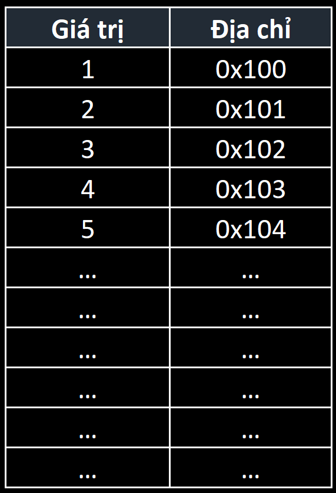

# Linear List - Danh sách tuyến tính

---

## Definition - Định nghĩa

Danh sách tuyến tính là một tập hợp các phần tử có **cùng kiểu dữ liệu** và **được xếp liên tiếp nhau**. Nghĩa là một tập hợp $n$ phần tử: $a_0, a_1, a_2, \ldots, a_{n - 1}$ có **cùng kiểu dữ liệu** và được xếp **liên tiếp nhau**.

Tính **tuyến tính** của cấu trúc dữ liệu thể hiện ở việc ta có thể tìm giá trị của phần tử $a_{i + 1}$ từ vị trí của phần tử $a_i$.

### Đặc điểm của danh sách tuyến tính

- Kích thước của danh sách sẽ được cấp phát theo khai báo. Nghĩa là khi khai báo danh sách thì phải đồng thời khai báo số lượng phần tử của danh sách.
- Các phần tử trong danh sách được nằm liên tiếp nhau trong bộ nhớ. Nghĩa là không có phần tử nào tồn tại giữa hai phần tử $a_i$ và $a_{i + 1}$ với mọi $i$ từ $[0, n - 1]$.
- Ví dụ tiêu biểu cho danh sách tuyến tính là `array` mảng một chiều.

### Các cách khai báo và mảng con trỏ

> Về bản chất, **điều giúp xác định hai biến** $a$ và $b$ trong máy tính **là địa chỉ của hai biến** đó trong bộ nhớ máy tính chứ không phải tên biến.

</img>

<!--  -->

Bản chất, một mảng một chiều $n$ phần tử là một **tập hợp $n$ biến** có **địa chỉ liên tiếp** nhau với **phần tử đầu tiên là phần tử đại diện** của mảng.

***Như ví dụ trên:*** nếu ta khai báo mảng $a$ có $5$ phần tử và phần tử đầu tiên có địa chỉ `0x100` thì $4$ phần tử còn lại có địa chỉ liên tiếp nhau tương tự như hình minh họa.

## Declaration - Khai báo

`LinearList.h`

```cpp
namespace LinearList {
    const int MAX_SIZE = 100000;

    struct List {
        int numberOfElement; // number of element of the list.
        int nodes[MAX_SIZE]{};

        List();
    };
}
```

*Danh sách tuyến tính được khai báo là danh sách chứa các số nguyên được khai báo theo dạng cấp phát tĩnh.*

`LinearList.cpp`

```cpp
namespace LinearList {
    List::List() {
        this->numberOfElement = 0;
        for (auto& node : this->nodes) {
            node = 0;
        }
    }
}
```

`main.cpp`

```cpp
#include <iostream>

#include "LinearList.h"

int main() {
    LinearList::List primeNumbers;

    return 0;
}
```

*Trong hàm `main()` tạo ra một danh sách tuyến tính là danh sách các số nguyên tố.*

## Initialize - Module khởi tạo

Phương thức khởi tạo sẽ khởi tạo một danh sách có kích thước và giá trị khởi tạo cho mọi phần tử theo yêu cầu.

`LinearList.h`

```cpp
namespace LinearList {
    void Initialize(List& list, int size, int initialValue);
}
```

`LinearList.cpp`

```cpp
namespace LinearList {
    void Initialize(List &list, int size, int initialValue) {
        list.numberOfElements = size;
        for (auto& item : list.nodes) {
            item = initialValue;
        }
    }
}
```

`main.cpp`

```cpp
#include <iostream>

#include "LinearList.h"

int main() {
    LinearList::List primeNumbers;
    LinearList::Initialize(primeNumbers, 20, 0);
    return 0;
}
```

## IsEmpty & IsFull - Module kiểm tra rỗng và phương thức kiểm tra đầy

Danh sách tuyến tính về bản chất là một mảng một chiều, do vậy mà cố định về kích thước của danh sách. Do đó, cần phải kiểm soát trạng thái của danh sách trước khi thực hiện các thao tác khác.

Ta quy ước:

1. Nếu `numberOfElement` có giá trị bằng $0$ thì danh sách ở trạng thái rỗng.
2. Nếu `numberOfElement` có giá trị bằng `MAX_SIZE` thì danh sách đầy.
3. `MAX_SIZE` là kích thước được quy định mặc định của mảng một chiều.
4. Chỉ số (*vị trí*) của phần tử cuối cùng của danh sách là `numberOfElement - 1`.

`LinearList.h`

```cpp
namespace LinearList {
    bool IsEmpty(const List& list);

    bool IsFull(const List& list);
}
```

`LinearList.cpp`

```cpp
namespace LinearList {
    bool IsEmpty(const List &list) {
        return list.numberOfElement == 0;
    }

    bool IsFull(const List &list) {
        return list.numberOfElement == MAX_SIZE;
    }
}
```

## Insert - Module thêm phần tử vào danh sách

Phương thức sẽ thực hiện thao tác thêm một phần tử vào danh sách tại một vị trí cho phép bất kì.

Độ phức tạp thời gian của thuật toán được sử dụng là $O(n)$.

`LinearList.h`

```cpp
namespace LinearList {
    bool Insert(List& list, int value, int position);
}
```

`LinearList.cpp`

```cpp
namespace LinearList {
    bool Insert(List& list, int value, int position) {
        if (IsFull(list) || position < 0 || position > list.numberOfElement){
            return false;
        }

        for (int i = list.numberOfElement; i > position; --i) {
            list.nodes[i] = list.nodes[i - 1];
        }

        list.nodes[position] = value;
        list.numberOfElement += 1;

        return true;
    }
}
```

***Giải thích:***

Phương thức nhận:

- Danh sách đầu vào là một tham số hình thức biến vì danh sách sẽ được thay đổi.
- Giá trị được thêm vào.
- Vị trí của giá trị được thêm.

Phương thức sẽ trả về giá trị `true` nếu thêm phần tử thành công và ngược lại.

**Lưu ý:** nếu giá trị được thêm vào nằm ở đầu hoặc giữa danh sách thì các phần tử khác sẽ dịch sang phải một đơn vị tạo khoảng trống cho phần tử mới sẽ được thêm vào.

## Remove - Module loại bỏ phần tử khỏi danh sách

Phương thức cho phép loại bỏ một phần tử tại một vị trí tồn tại trong danh sách. Các phần tử đứng sau phần tử được xóa (*nếu có*) sẽ dịch trái (*dồn lên*) để khỏa lấp vị trí bị trống.

`LinearList.h`

```cpp
namespace LinearList {
    bool Remove(List& list, int position);
}
```

`LinearList.cpp`

```cpp
namespace LinearList {
    bool Remove(List& list, int position) {
        if (IsEmpty(list) || position < 0 || position > list.numberOfElement) {
            return false;
        }

        for(int i = position + 1; i < list.numberOfElement; i++){
            list.nodes [i - 1] = list.nodes[i];
        }
        list.numberOfElement -= 1;

        return true;
    }
}
```

***Giải thích:***

Phương thức nhận:

- Danh sách đầu vào là một tham số hình thức biến vì danh sách sẽ được thay đổi.
- Vị trí của giá trị cần xóa.

Phương thức sẽ trả về giá trị `true` nếu xóa thành công phần tử cần xóa và ngược lại.

## Search - Module tìm kiếm phần tử trong danh sách

Phương thức cho phép tìm kiếm vị trí đầu tiên xuất hiện trong danh sách. Nếu không tồn tại phần tử cần tìm thì sẽ trả về giá trị $-1$.

`LinearList.h`

```cpp
namespace LinearList {
    int Search(const List& list, int info);
}
```

`LinearList.cpp`

```cpp
namespace LinearList {
    int Search(const List &list, const int info) {
        if (LinearList::IsEmpty(list)) {
            return -1;
        }

        for (int i = 0; i < list.numberOfElement; ++i) {
            if (list.nodes[i] == info) {
                return i;
            }
        }

        return -1;
    }
}
```

Độ phức tạp thời gian của thuật toán được sử dụng là $O(n)$.

---

> *Đây là handbook của mình dựa trên quá trình học môn Cấu trúc dữ liệu và Giải thuật ở Học viện Cơ sở do thầy Lưu Nguyễn Kì Thư giảng dạy. Lưu ý: đây không phải tài liệu giáo khoa mà là tài liệu tham khảo do mình biên soạn và tóm tắt lại.*

