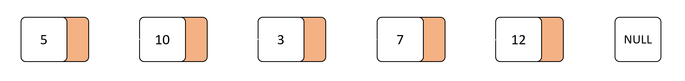
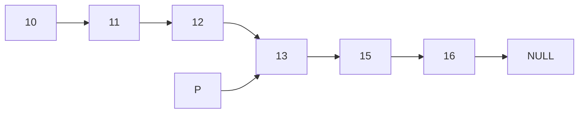

# Linked List - Danh sách liên kết

---

## Kiến thức yêu cầu

- Kiến thức cơ bản ngôn ngữ lập trình `C++`.
- Khái niệm pointer (con trỏ).
- Khái niệm `struct` và `class`.
- Khái niệm `function prototype` hay `function declaration` và `function definition`.
- Phân biệt giữa `procedure` và `function` (thủ tục và hàm).

Một số khái niệm sẽ xuất hiện thêm (khuyến khích tìm hiểu):

- Khái niệm `namespace` trong `C++`.
- Khái niệm `header` trong `C++`.
- Khái niệm `reference` (tham chiếu) trong `C++`.

IDE sử dụng: Clion hoặc Visual Studio. Các bạn cũng có thể sử dụng VS Code. Song vì VS Code không hỗ trợ Linker nên việc áp dụng hoàn toàn theo Handbook sẽ có đôi chút khác, các bạn nên lưu ý.

***Lưu ý:*** 

- Mình sẽ mặc định các bạn đọc đã biết và hiểu các kiến thức yêu cầu ở trên để việc học và áp dụng xây dựng cấu trúc dữ liệu được hiệu quả hơn.
- Các phần giải thích code sẽ chỉ giái thích:

    1. Chức năng của hàm.
    2. Ý nghĩa của hàm (hàm thực hiện chức năng vì mục đích gì).
    3. Lí do truyền tham số và ý nghĩa của từng loại tham số.

---

## Mở đầu về danh sách liên kết



Danh sách liên kết về bản chất là một danh sách dùng để lưu trữ dữ liệu. Song, khác với danh sách tuyến tính thì danh sách liên kết có những ưu điểm riêng biệt khiến cho danh sách liên kết có nhiều điểm mạnh hơn so với danh sách tuyến tính trong một số trường hợp cụ thể.

Danh sách liên kết là một danh sách nên Là một tập hợp các phần tử cùng kiểu dữ liệu. Song, khác với danh sách tuyến tính thì:

- Xét về mặt địa chỉ, thì các phần tử trong danh sách liên kết không nhất thiết phải liên tiếp nhau.
- Mối quan hệ giữa hai phần tử được xác định bởi "liên kết", là điều khiến danh sách liên kết đặc biệt.
- Mỗi phần tử trong danh sách liên kết, ngoài việc chứa dữ liệu cần lưu trữ thì sẽ chứa một "liên kết" dẫn đến phần tử tiếp theo trong danh sách. Liên kết này có thể bị loại bỏ hoặc thay đổi tùy thuộc vào nhu cầu.

Một số điểm cần lưu ý về danh sách liên kết:

1. Kích thước của danh sách liên kết là không giới hạn.
2. Việc thêm phần tử vào danh sách liên kết tùy vào vị trí thêm sẽ có độ phức tạp khác nhau.
3. Có nhiều loại danh sách liên kết khác nhau.
4. Để truy cập đến một phàn tử thuộc danh sách cần phải duyệt từ đầu danh sách đến vị trí cần truy cập, không thể truy cập qua chỉ số như danh sách tuyến tính.

---

## Xây dựng danh sách liên kết

> *Trong khuôn khổ bài viết, mình sẽ xây dựng danh sách liên kết đơn, mỗi phần tử chỉ sở hữu duy nhất một liên kết dẫn đến phần tử kế tiếp trong danh sách. Do vậy, từ phần sau của tài liệu, khi nói đến danh sách liên kết (hay danh sách), ta hiểu đó là danh sách liên kết đơn!*

***Mục tiêu:*** Xây dựng danh sách liên kết chứa các số nguyên kiểu `int`.

***Quy ước:***

1. Khi danh sách được khởi tạo là một danh sách rỗng.
2. Ta sẽ quản lí phần tử đầu tiên của danh sách chứ không quản lí toàn bộ phần tử trong danh sách. Ta gọi phần tử này là `First` hoặc `Head` ở một số tài liệu khác. Về bản chất, `First` sẽ là một con trỏ, trỏ tới địa chỉ của phần tử đầu tiên của danh sách tuyến tính.
3. Danh sách được xem là **rỗng** nếu phần tử `First` bằng `NULL`.
4. Phần tử cuối cùng của danh sách có liên kết trỏ tới giá trị `NULL`.

### Xây dựng từng node của danh sách

Đối với danh sách liên kết ta đang xây dựng, mỗi phần tử sẽ lưu trữ hai thông tin:

1. `info`: là giá trị cần lưu trữ trong danh sách.
2. `next`: là con trỏ lưu trữ địa chỉ của phần tử tiếp theo trong danh sách. Đây chính là "liên kết" giữa phần tử hiện tại và phần tử kết tiếp trong danh sách.

Như vậy, có thể sử dụng `struct` hoặc `class` để xây dựng `node` cho danh sách. Song, nếu dữ liệu liên quan đến `node` không quá phức tạp, nên sử dụng `struct` cho đơn giản. Ở đây mình sẽ sử dụng `struct`.

`LinkedList.h`

```cpp
namespace LinkedList {
    struct Node {
        int info;
        Node* next;
    };
    typedef Node* Pointer;
}
```

**Giải thích Code:**

Bên trên là `struct Node` gồm hai `field` là `info` và `next` có ý nghĩa như mô tả ở trên. Cụ thể:

- Field `info` có kiểu dữ liệu `int` chứa các số nguyên là giá trị được lưu trữ.
- Field `next` có kiểu dữ liệu `Node*` là một con trỏ, trỏ tới ô nhớ có kiểu dữ liệu là một `Node` (trỏ tới `node` tiếp theo).
- Bên cạnh đó, ta tạm định nghĩa lại kiểu `Node*` là `Pointer` cho dễ hiểu là con trỏ.

### Initialize - Module khởi tạo.

Như đã quy ước, danh sách khi được khởi tạo sẽ là một danh sách rỗng. Do đó, `First` sẽ có giá trị là `NULL` khi danh sách được khởi tạo.

`LinkedList.h`

```cpp
namespace LinkedList {
    void Initialize(Pointer& First);
}
```

`LinkedList.cpp`

```cpp
void LinkedList::Initialize(LinkedList::Pointer& First) {
    First = nullptr;
}
```

**Giải thích Code:** 

- Thủ tục `Initialize` có chưc năng khởi tạo cho danh sách được truyền vào.
- Vì danh sách được truyền vào sẽ bị `modify` (thay đổi), do đó, danh sách sẽ được truyền vào thủ tục theo dạng tham chiếu.
- Theo như quy ước, danh sách khi khỏi tạo sẽ rỗng, do đó giá trị của `First` sẽ bằng `NULL`. Vì vậy, ta gán giá trị cho biến `First` là `nullptr`.

### IsEmpty - Module kiểm tra danh sách rỗng

Theo như quy ước trên, danh sách rỗng khi giá trị `First` bằng `NULL`. Do đó, ta lập luận, nếu `First` bằng `NULL` thì kết luận danh sách rỗng và ngược lại.

`LinkedList.h`

```cpp
namespace LinkedList {
    bool IsEmpty(const Pointer& First);
}
```

`LinkedList.cpp`

```cpp
bool LinkedList::IsEmpty(const LinkedList::Pointer& First) {
    return First == nullptr;
}
```

**Giải thích Code:**

- Hàm trả về giá trị thuộc kiểu `bool` và nhận vào tham chiếu hằng `First` đại diện cho danh sách.
- Nếu `First` bằng `nullptr` thì danh sách rỗng và trả về `true` và ngược lại.

### Traversal - Module duyệt danh sách

Để có thể làm việc tốt với dữ liệu thì việc hiểu và hình dung được nó là một điều cần thiết. Và dễ dàng nhất là khi ta có thể nhìn thấy được dữ liệu đang chứa gì. Có được khả năng xem toàn bộ danh sách bất cứ lúc nào sẽ giúp cho việc làm việc với danh sách trở nên thuận tiện hơn nhiều.

Với danh sách tuyến tính, ta chỉ quản lí phần tử đầu tiên của danh sách, do vậy ta phải duyệt tuần tự từ đầu đến cuối danh sách dựa trên các liên kết giữa các phần tử đã thiết lập sẵn.

`LinkedList.h`

```cpp
namespace LinkedList {
    void Traversal(Pointer First, const std::string& message = "List: ");
}
```

`LinkedList.cpp`

```cpp
void LinkedList::Traversal(LinkedList::Pointer First, const std::string& message) {
    std::cout << message << ": [";

    for (; First != nullptr; First = First->next) {
        std::cout << First->info;
        if (First->next != nullptr) {
            std::cout << ", ";
        }
    }
    std::cout << "]" << std::endl;
}
```

**Giải thích code:**

Thủ tục sẽ thực hiện duyệt và in từng phần tử của danh sách ra màn hình console cùng với một tham số `message` được đưa vào.

Thủ tục nhận hai tham số lần lượt là phần tử quản lí `First` của danh sách và thông điệp `message` sẽ được in ra.

Ta quy định thủ tục sẽ in ra màn hình console như sau: `<message>: [a, b, c, ..., x, y, z]`. Trong đó, chuỗi `message` sẽ được thay thế cho `<message>` và nội dung của các phần tử trong danh sách sẽ thay cho `a, b, c, ..., x, y, z` (dấu `,` sẽ được dùng để ngăn cách các nội dung).

Ta sử dụng vòng lặp `for` để duyêt qua danh sách. Ta sẽ dừng lại khi duyệt hết danh sách, nghĩa là duyệt đến giá trị `nullptr` và sau mỗi lần lặp, ta sẽ di chuyển sang phần tử kế tiếp bằng lệnh `First = First->next`. Trong mỗi lần lặp, ta sẽ in ra `info` của `First` và sử dụng câu lệnh `if` để xem xét có cần in dấu `,` hay không.

***Lưu ý:*** Đây chỉ là một cách in do mình gợi í, bạn có thể tùy biến lại theo cách bạn muốn hoặc đơn giản hóa nó đi.

### Search - Module tìm kiếm phần tử dựa trên `info`

Một phép toán thường thấy khi làm việc với cơ sở dữ liệu là phép tìm kiếm dữ liệu cần thiết. Ở đây, ta sẽ xây dựng một module tìm kiến trong danh sách phần tử có nội dung `info` và trả về con trỏ của phần tử đó nếu có, hoặc trả về `NULL` nếu không.

```cpp
namespace LinkedList {
    Pointer Search(const Pointer& First, int info);
}
```

`LinkedList.cpp`

```cpp
LinkedList::Pointer LinkedList::Search(LinkedList::Pointer const &First, const int info) {
    for (LinkedList::Pointer p = First; p != nullptr; p = p->next) {
        if (p->info == info) {
            return p;
        }
    }
    return nullptr;
}
```

**Giải thích Code:**

- Hàm sẽ nhận hai tham số, trong đó một tham biến hằng `First` là con trỏ đại diện cho danh sách và một bằng số `info` là giá trị cần tìm.
- Hàm trả về con trỏ trỏ đến phần tử có nội dung trùng với `info` và trả về `nullptr` trong trường hợp ngược lại.
- Ta sẽ dùng vòng lặp `for` để duyệt qua danh sách, dừng lại khi gặp con trỏ `nullptr` và sẽ di chuyển từ phần tử này sang phần tử khác qua câu lệnh `p = p->next`.
- Trong mỗi bước lặp, ta kiểm tra, nếu `p->info` bằng với `info` thì `p` chính là con trỏ, trỏ tới phần tử có nội dung trùng với `info`. Khi đó, ta trả về `p` là kết quả cần tìm.
- Khi ta kết thúc vòng lặp `for` nghĩa là ta đã duyệt hết danh sách, lúc này ta trả về con trỏ `nullptr` vì ta đã duyệt hết danh sách nhưng vẫn không tìm ra phần tử cần tìm.

### InsertFirst - Module thêm phần tử có nội dung `info` vào đầu danh sách

Khi thêm một phần tử vào danh sách, thường sẽ có $3$ vị trí có thể thêm vào đó là đầu, giữa và cuối danh sách. Đây là module thực hiện chức năng thêm một phần tử có nội dung là `info` vào danh sách.

Ý tưởng của thuật toán như sau:

1. Tạo `node` mới có `info` là `info` được truyền vào.
2. Tạo liên kết giữa phần tử `First` hiện tại của danh sách với `node` mới.

Ở đây, ta sẽ lợi dụng `constructor function` có sẵn trong `struct` để thực hiện tạo một `node` mới một cách nhanh chóng như sau:

`LinkedList.h`

```cpp
namespace LinkedList {
    struct Node {
        int info;
        Node* next;

        Node();

        Node(int value, Node* nextNode);
    };
}
```

`LinkedList.cpp`

```cpp
LinkedList::Node::Node() {
    this->info = 0;
    this->next = nullptr;
}

LinkedList::Node::Node(int value, Node* nextNode) {
    this->info = value;
    this->next = nextNode;
}
```

**Giải thích Code:**

Trong file `LinkedList.h`, tại `struct Node` ta sẽ thêm hai `constructor function`: `Node()` và `Node(int value, Node* nextNode)` vào để thực hiện `struct Node` có thêm chức năng tạo `node` mới một cách ngắn gọn hơn.

1. `Node()` là `default constuctor` - Phương thức khởi tạo mặc định. Sẽ gán các giá trị mặc định cho các `field` có trong `struct Node`. Ở đây, quy ước giá trị mặc định cho các `field`: `info` và `next` sẽ là $0$ và `nullptr`.
2. `Node(int value, Node* nextNode)` là `parameterized constructor` - Phương thức khởi tạo có tham số, nhận hai tham số là `value` và `nextNode` lần lượt là giá trị của `node` được tạo ra và con trỏ trỏ đến `node` kế tiếp trong danh sách.

Với $2$ `constructor function` vừa xây dựng thêm cho `struct Node` ta sẽ thiết kế module `InsertLast` như sau:

`LinkedList.h`

```cpp
namespace LinkedList {
    void InsertFirst(Pointer& First, int value);
}
```

`LinkedList.cpp`

```cpp
void LinkedList::InsertFirst(LinkedList::Pointer& First, int value) {
    LinkedList::Pointer newNode = new Node(value, First);
    First = newNode;
}
```

**Giải thích Code:**

- Thủ tục có $2$ tham số đầu vào là tham chiếu `First` đại diện cho danh sách và tham biến `value` là giá trị của `node` mới sẽ được thêm vào danh sách.
- Ta tạo một con trỏ `nweNode` là con trỏ trỏ tới `node` mới sẽ được tạo ra và thêm vào danh sách. Con trỏ `newNode` này có kiểu là `Node*` hay `Pointer` như ta đã tái định nghĩa ở đầu bài viết.
- Ta sử dụng từ khóa `new` để tạo ra một con trỏ mới trỏ tới ô nhớ chứa biến có kiểu `Node`. Kết hợp với `parameterized constructor` ta đã viết ở trên ta có dòng lệnh dưới đầy.

```cpp
LinkedList::Pointer newNode = new Node(value, First);
```

Ở vế phải toán tử `=`, ta tạo ra một `Node` mới, có giá trị của `info` là `value` và `next` là `First`. Cụ thể:

- `Node(value, First)` sẽ gọi và chạy `paramaterized constructor` của `struct Node` tạo ra một `Node` mới với giá trị các `field` tương ứng dụa trên tham số được truyền vào.
- Sau đó, con trỏ của `Node` này sẽ được lưu vào biến `newNode` ở bên vế trái của toán tử `=`.

`newNode` vừa được tạo ra có `info` là `value` được truyền vào và `next` là địa chỉ của phần tử đầu tiên của danh sách cũ. Điều này đồng nghĩa `newNode` đang đứng trước `First` trong danh sách. Do đó ta sẽ cập nhật lại biến `First` bằng `newNode` vì lúc này, `newNode` chính là phần tử đầu mới của danh sách.

### InsertLast - Module thêm phần tử có `info` vào cuối danh sách

Trong $3$ vị trí thêm có thể khi thêm một phần tử mới vào danh sách thì đây là vị trí tốn nhiều chi phí nhất.

Như đã nói ở trước, ta chỉ quản lí phần tử đầu tiên của danh sách, do vậy, để thêm phần tử vào cuối danh sách thì ta phải di chuyển đến phần tử cuối cùng của danh sách hiện tại rồi sau đó mới thêm phần tử mới vào danh sách.


`LinkedList.h`

```cpp
namespace LinkedList {
    void InsertLast(Pointer& First, int value);
}
```

`LinkedList.cpp`

```cpp
void LinkedList::InsertLast(LinkedList::Pointer& First, int value) {
    LinkedList::Pointer newNode = new Node(value, nullptr);

    if (LinkedList::IsEmpty(First)) {
        First = newNode;
        return;
    }

    LinkedList::Pointer Last = First;
    for (; Last->next != nullptr; Last = Last->next);
    Last->next = newNode;
}
```

**Giải thích code:**

Khi thêm một phần tử vào cuối danh sách, ta thấy, nếu danh sách rỗng thì ta chỉ cần trỏ `First` vào phần tử mới. Ngược lại, ta sẽ duyệt đến cuối danh sách và thêm phần tử mới vào.

- Thủ tục nhận $2$ tham số bao gồm một tham số hình thứ biến `First` đại diện cho danh sách và `value` là giá trị của phần tử sẽ được thêm vào.
- Ta sử dụng từ khóa `new` để tạo ra một `struct Node` mới và lưu địa chỉ của nó vào con trỏ `newNode`. `struct Node` mới này có nội dung là `value` và giá trị của con trỏ `next` trỏ tới `nullptr` vì phần tử được thêm vào cuối danh sách.
- Như đã nói, nếu danh sách rỗng, ta chỉ cần trỏ `First` tới `newNoed`. Ngược lại, ta sẽ duyệt đến phần tử cuối cùng của danh sách, là phần tử có trường `next` bằng `nullptr`, gọi phần tử đó là `Last`. Khi đó, ta chỉ cần tạo liên kết từ `Last` đến `newNote`.

### InsertAfter - Thêm phần tử có nội dung `info` vào sau phần tử `p` trong danh sách

Bên cạnh việc thêm phần tử vào đầu hoặc cuối danh sách thì việc thêm phần tử vào giữa danh sách, tại một vị trí cụ thể nào đó là một phép toán thường gặp. Đối với danh sách liên kết thì việc thêm một phần tử vào vị trí bất kì trong danh sách tương đối khó khăn vì khác với danh sách tuyến tính thì danh sách liên kết không có truy cập phần tử dựa trên chỉ số (indexing access).

Để giải quyết vấn đề này ta sẽ sử dụng thêm thuật toán tìm kiếm. Ví dụ, ta có một danh sách như sau:



Giả sử ta cần thêm một phần tử có nội dung $14$ vào sau phần tử có nội dung là $13$ ta sẽ làm như sau:

1. Đầu tiên, cần tìm con trỏ của phần tử chứa nội dung $13$ trong danh sách. Để làm được điều này, ta sẽ sử dụng module `Search()` đã viết ở trên.
2. Sau khi tìm được con trỏ của phần tử chứa nội dung $13$ ta sẽ tạo một `node` mới và thêm vào sau phần tử có nội dung là $13$ và trước phần tử có nội dung là $15$.

Module `InsertAfter()` sẽ giúp ta thực hiện công việc ở bước 2 với giả định ta luôn tìm được kết quả ở bước 1.

`LinkedList.h`

```cpp
namespace LinkedList {
    void InsertAfter(Pointer& First, Pointer& p, int value);
}
```

`LinkedList.cpp`

```cpp
void LinkedList::InsertAfter(LinkedList::Pointer &First, LinkedList::Pointer& p, int value) {
    if (p == nullptr || LinkedList::IsEmpty(First)) {
        LinkedList::InsertFirst(First, value);
        return;
    }

    LinkedList::Pointer q = p->next;
    LinkedList::Pointer newNode = new LinkedList::Node(value, q);
    p->next = newNode;
}
```

**Giải thích Code:**

- Thủ tục sẽ nhận ba tham số đầu vào, lần lượt là:

    1. Tham số hình thức biến `First` là phần tử đầu tiên đại diện cho danh sách.
    2. Tham số hình thức biến `p` là con trỏ trỏ đến phần tử mà phần tử mới sẽ được thêm vào.
    3. Tham biến `value` là nội dung của `node` mới sẽ được thêm vào.

- Ta sẽ thấy có một vài trường hợp như con trỏ `p` bằng `nullptr` hoặc danh sách rỗng thì ta sẽ quay lại trường hợp thêm phần tử vào đầu danh sách.
- Khi con trỏ `p` khác `nullptr` thì ta sẽ thực hiện thêm phần tử mới vào danh sách sau `p` như sau:

    1. Gọi `q` là con trỏ của phần tử tiếp theo đứng ngay sau `p` trong danh sách.
    2. Dùng từ khóa `new` để tạo ra con trỏ `newNode` trỏ đến phần tử mới sẽ được thêm vào danh sách. `newNodw` sẽ có `info` bằng với `value` và `next` sẽ trỏ đến `q`.
    3. Ta sẽ xóa bỏ liên kết từ `p` đến `q` và thay bằng liên kết từ `p` đến `newNode` bằng câu lệnh `p->next = newNode`.


