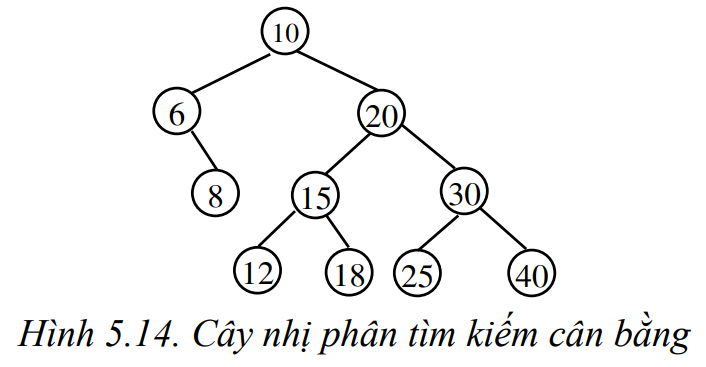
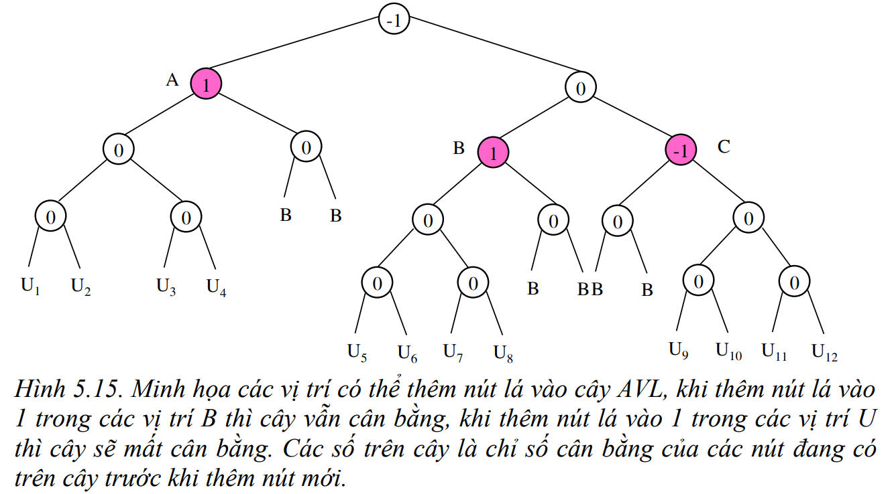

# AVL Tree - Cây nhị phân tìm kiếm cân bằng

---

## Definition - Định nghĩa

- Cây nhị phân tìm kiếm cân bằng (AVL) là cây nhị phân tìm kiếm mà tại tất cả các nút của nó chiều cao của cây con bên trái của nó và chiều cao của cây con bên phải chênh lệch nhau không quá một.



> ***Lưu ý:*** Với cây AVL, việc thêm vào hay loại bỏ 1 nút trên cây có thể làm cây mất cân bằng, khi đó ta phải cân bằng lại cây. Tuy nhiên việc cân bằng lại trên cây AVL chỉ xảy ra ở phạm vi cục bộ bằng cách xoay trái hoặc xoay phải ở một vài nhánh cây con nên sẽ giảm thiểu chi phí cân bằng.

### Balance factor - Chỉ số cân bằng

Balance factor của một `node` $p$ trên cây AVL được xác định bằng công thức:

$$bf(p) = lh(p) - rh(p)$$

Trong đó:

$$
\begin{cases}
bf(p) &: \text{Chỉ số cân bằng của node} \; p \\
lh(p) &: \text{Chiều cao cây con bên trái của} \; p \\
rh(p) &: \text{Chiều cao cây con bên phải của} \; p \\
\end{cases}
$$

Cụ thể:

$$
\begin{cases}
bf(p) = 0 \; &\text{nếu} \; lh(p) = rh(p) \rightarrow \text{nút} \; p \; \text{cân bằng} \\
bf(p) = 1 \; &\text{nếu} \; lh(p) = rh(p) + 1 \rightarrow \text{nút} \; p \; \text{bị lệch về trái} \\
bf(p) = -1 \; &\text{nếu} \; lh(p) = rh(p) - 1 \rightarrow \text{nút} \; p \; \text{vị lệch về phải} \\
\end{cases}
$$



## Operations - Các phép toán trên cây

### AVL Tree structure defenition

```cpp
struct Node {
    int key;
    int balanceFactor;
    int info;
    Node* left;
    Node* right;
};

typedef Node* NodePointer;
```

### Insert new node - Thêm nút mới

#### Goal - Mục tiêu

Thêm $1$ `node` có khóa $x$ và nội dung (giá trị) $a$ vào cây AVL sao cho sau khi thêm thì cây vẫn là cây AVL.

#### Algorithm - Giải thuật

1. Thêm $1$ `node` vào cây theo thuật toán `InsertNode()` của cây BST như thông thường, như vậy, nút vừa được thêm vào sẽ là `leaf node`.
2. Tính lại balance factor của các `node` bị ảnh hưởng. 
3. Kiểm tra lại tính cân bằng của cây và cân bằng lại cây nếu cần thiết.

***Các trường hợp làm cây mất cân bằng:***

1. Thêm nút lá vào bên trái của cây có balance factor là $1$.
2. Thêm nút lá bào bên phải của cây có balance factor là $-1$.

***Cân bằng lại cây:***

<!-- 
TODO: Vẽ một mô hình giả thuyết phù hợp với mô tả của giả thuyết và vẽ một cây ví dụ thỏa mãn giả thuyết.
 -->

**Giả thuyết:** gọi `node` $y_a$ à `node` trước, gần nhất bị mất cân bằng khi thêm `node` $x$ vào cây AVL (Vì cả hai trường hợp khiến cây bị mất cân bằng là tương tự nhau nên chỉ xét trường hợp balance factor của $y_a$ là $bf(y_a) = 1$ và `node` $x$ được thêm vào bên trái của `node` $y_a$).

**Nhận xét:**

- Tại `node` $y_a$ có $bf(y_a) = 1$, suy ra tồn tại `child node` $s$ bên trái `node` $y_a$ có $bf(s) = 0$.
- Vì $y_a$ là `node` gần `node` $x$ nhất bị mất cân bằng nên chắc chắn mọi `node` $s$ trước `node` $x$ và dưới `node` $y_a$ đều cân bằng.
- Và $h(T_1) = h(T_2) = h(T_3) = n$.

***Trường hợp 1:*** Nếu thêm `node` $x$ vào bên trái `node` $s$ (cây con $T_1$) $\rightarrow$ Xoay phải quanh `node` $y_a$ để cân bằng.

Khi đó:

- `node` $s$ sẽ là `root node` mới của nhánh cây với $bf(s) = 0$.
- `node` $y_a$ sẽ là `right node` của $s$ với $bf(y_a) = 0$.

***Trường hợp 2:*** Nếu thêm `node` $x$ vào bên phải `node` $s$ (cây con $T_2$) $\rightarrow$ Xoay $2$ lần: xoay trái quanh `node` $s$ và xoay phải quanh `node` $y_a$.

Khi đó:

- `node` $p$ sẽ là `root node` mới của nhánh cây với $bf(p) = 0$.
- `node` $y_a$ là `right child node` của $p$ với $bf(y_a) = -1$.
- `node` $s$ là `left child node` của $p$ với $bf(s) = 0$.