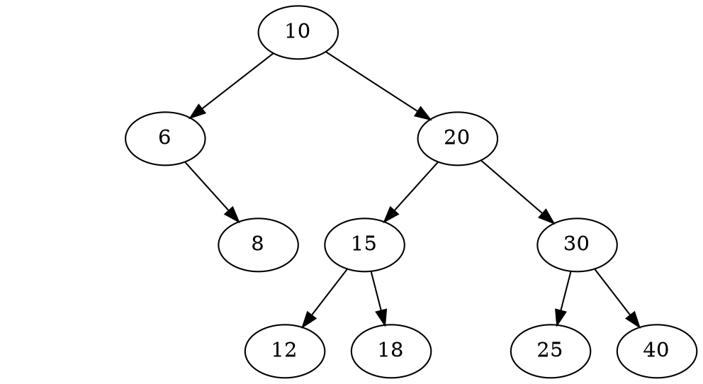
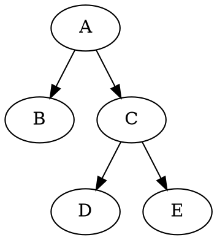
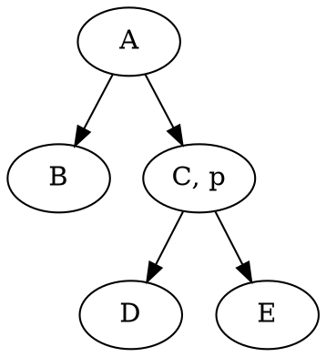
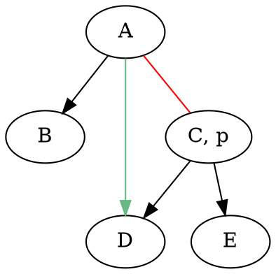
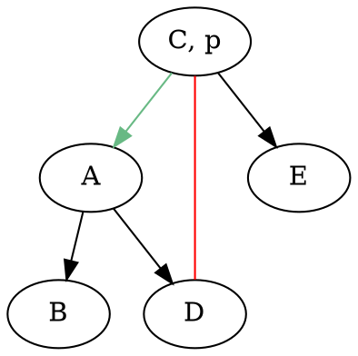
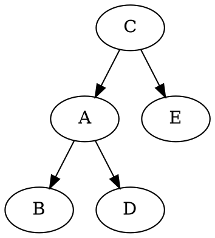

# AVL Tree - Cây nhị phân tìm kiếm cân bằng

---


<!-- @import "[TOC]" {cmd="toc" depthFrom=2 depthTo=6 orderedList=false} -->

<!-- code_chunk_output -->

- [Definition - Định nghĩa](#definition---định-nghĩa)
  - [Balance factor - Chỉ số cân bằng](#balance-factor---chỉ-số-cân-bằng)
- [Operations - Các phép toán trên cây](#operations---các-phép-toán-trên-cây)
  - [AVL Tree structure defenition](#avl-tree-structure-defenition)
  - [Insert - Module thêm nút mới](#insert---module-thêm-nút-mới)
    - [Goal - Mục tiêu](#goal---mục-tiêu)
    - [Algorithm - Giải thuật](#algorithm---giải-thuật)
    - [RotateLeft - Module xoay trái](#rotateleft---module-xoay-trái)

<!-- /code_chunk_output -->


---

## Definition - Định nghĩa

Cây nhị phân tìm kiếm cân bằng (AVL) là cây nhị phân tìm kiếm mà tại tất cả các nút của cây thỏa mãn tính chất: chiều cao của cây con bên trái của một nút bất kì và chiều cao của cây con bên phải chênh lệch nhau không quá một.



> ***Lưu ý:*** Với cây AVL, việc thêm vào hay loại bỏ 1 nút trên cây có thể làm cây mất cân bằng, khi đó ta phải cân bằng lại cây. Tuy nhiên việc cân bằng lại trên cây AVL chỉ xảy ra ở phạm vi cục bộ bằng cách xoay trái hoặc xoay phải ở một vài nhánh cây con nên sẽ giảm thiểu chi phí cân bằng.

### Balance factor - Chỉ số cân bằng

Balance factor của một `node` $p$ trên cây AVL được xác định bằng công thức:

$$bf(p) = lh(p) - rh(p)$$

Trong đó:

$$
\begin{cases}
bf(p) &: \text{Chỉ số cân bằng của node} \; p \\
lh(p) &: \text{Chiều cao cây con bên trái của} \; p \\
rh(p) &: \text{Chiều cao cây con bên phải của} \; p \\
\end{cases}
$$

Cụ thể:

$$
\begin{cases}
bf(p) = 0 \; &\text{nếu} \; lh(p) = rh(p) \rightarrow \text{nút} \; p \; \text{cân bằng} \\
bf(p) = 1 \; &\text{nếu} \; lh(p) = rh(p) + 1 \rightarrow \text{nút} \; p \; \text{bị lệch về trái} \\
bf(p) = -1 \; &\text{nếu} \; lh(p) = rh(p) - 1 \rightarrow \text{nút} \; p \; \text{vị lệch về phải} \\
\end{cases}
$$


## Operations - Các phép toán trên cây

### AVL Tree structure defenition

```cpp
struct Node {
    int key;
    int balanceFactor;
    int info;
    Node* left;
    Node* right;
};

typedef Node* NodePointer;
```

### Insert - Module thêm nút mới

#### Goal - Mục tiêu
Thêm $1$ `node` mới có khóa $x$ và nội dung (giá trị) $a$ vào cây AVL sao cho sau khi thêm thì cây vẫn là cây AVL.

#### Algorithm - Giải thuật

1. Thêm $1$ `node` mới vào cây theo thuật toán `InsertNode()` của BST như thông thường, như vậy, nút vừa được thêm vào sẽ là `leaf node`.
2. Tính lại balance factor của các `node` bị ảnh hưởng. 
3. Kiểm tra lại tính cân bằng của cây và cân bằng lại cây nếu cần thiết.

***Các trường hợp làm cây mất cân bằng:***

1. Thêm nút lá vào bên trái của cây có balance factor là $1$.
2. Thêm nút lá bào bên phải của cây có balance factor là $-1$.

***Cân bằng lại cây:***

<!-- 
TODO: Vẽ một mô hình giả thuyết phù hợp với mô tả của giả thuyết và vẽ một cây ví dụ thỏa mãn giả thuyết.
 -->

**Giả thuyết:** 

> Gọi `node` $y_a$ là `node` trước, gần nhất bị mất cân bằng khi thêm `node` $x$ vào cây AVL (Vì cả dhai trường hợp khiến cây bị mất cân bằng là tương tự nhau nên chỉ xét trường hợp balance factor $bf(y_a) = 1$ và `node` $x$ được thêm vào bên trái của `node` $y_a$).

**Nhận xét:**

1. Tại `node` $y_a$ có $bf(y_a) = 1$, suy ra tồn tại `child node` $s$ bên trái `node` $y_a$ có $bf(s) = 0$.
2. Vì $y_a$ là `node` gần `node` $x$ nhất bị mất cân bằng nên chắc chắn mọi `node` $s$ trước `node` $x$ và dưới `node` $y_a$ đều cân bằng.
3. Và $h(T_1) = h(T_2) = h(T_3) = n$.

***Trường hợp 1:***

> Nếu thêm `node` $x$ vào bên trái `node` $s$ (cây con $T_1$) $\rightarrow$ Xoay phải quanh `node` $y_a$ để cân bằng.

Khi đó:

- `node` $s$ sẽ là `root node` mới của nhánh cây với $bf(s) = 0$.
- `node` $y_a$ sẽ là `right node` của $s$ với $bf(y_a) = 0$.

***Trường hợp 2:*** 
> Nếu thêm `node` $x$ vào bên phải `node` $s$ (cây con $T_2$) $\rightarrow$ Xoay $2$ lần: xoay trái quanh `node` $s$ và xoay phải quanh `node` $y_a$.

Khi đó:

- `node` $p$ sẽ là `root node` mới của nhánh cây với $bf(p) = 0$.
- `node` $y_a$ là `right child node` của $p$ với $bf(y_a) = -1$.
- `node` $s$ là `left child node` của $p$ với $bf(s) = 0$.

Suy luận tương tự với trường hợp `node` $x$ được thêm vào bên phải của `node` $y_a$, ta sẽ được một bảng các trường hợp như sau:

<!-- TODO: thêm bảng -->

#### RotateLeft - Module xoay trái

Ta thực hiện xoay trái BST quanh `root node` và bắt buộc phải có `right child node = p`. Sau khi xoay trái, thì `p` sẽ là `root node` mới và `root node` cũ trở thành `left child node` của `p`.

`BinarySearchTree.h`

```cpp
namespace BinarySearchTree {
	Pointer RotateLeft(Pointer root);
}
```

`BinarySeachTree.cpp`

```cpp
BinarySearchTree::Pointer BinarySearchTree::RotateLeft(BinarySearchTree::Pointer root) {
    if (root == nullptr) {
        std::cerr << "[ERROR] TREE IS EMPTY!\n";
        return nullptr;
    }

    if (root->right == nullptr) {
        std::cerr << "[ERROR] CANNOT ROTATE LEFT BECAUSE THERE IS NO RIGHT TREE!\n";
        return nullptr;
    }

    BinarySearchTree::Pointer p = root->right;
    root->right = p->left;
    p->left = root;

    return p;
}
```

**Giải thích Code:**

Đầu tiên, ta filter (lọc bỏ) các trường hợp không thể thực hiện xoay cây như `root node` là `NULL` hay không tồn tại `right child node` của `root node`.

Sau đó, ta xem xét một ví dụ nhỏ đơn giản như sau để hiểu được từng bước quá trình thực hiện xoay cây:

> Với `root node` là $A$, ta sẽ thực hiện xoay trái quanh $A$.



**Bước $1$:** Lưu trữ `right child node` của `root node` vào con trỏ $p$. Nghĩa là sẽ có một con trỏ $p$ trỏ tới `right child node` của $A$, là $C$.



**Bước $2$:** Thay thế cây con bên phải của $A$ bằng cây con bên trái của $p$. Khi đó, liên kết cũ từ $A$ sang cây con phải (cũ) của nó sẽ bị mất (cạnh màu đỏ).



**Bước $3$:** Thay thế cây con bên trái của $p$ bằng `root node`. Nghĩa là $A$ sẽ trở thành cây con bên trái của $p$ và $p$ sẽ thành `root node` mới.



**Sau cùng** ta thu được cây mới như bên dưới và trả về nút gốc mới.


