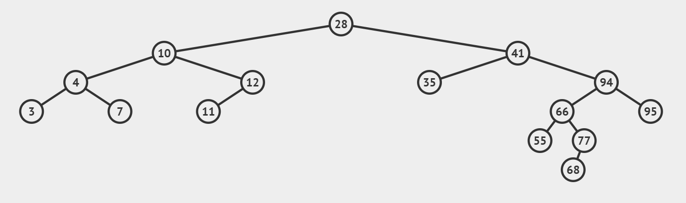
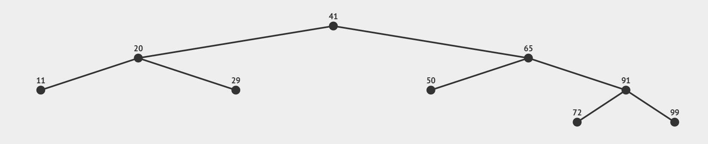
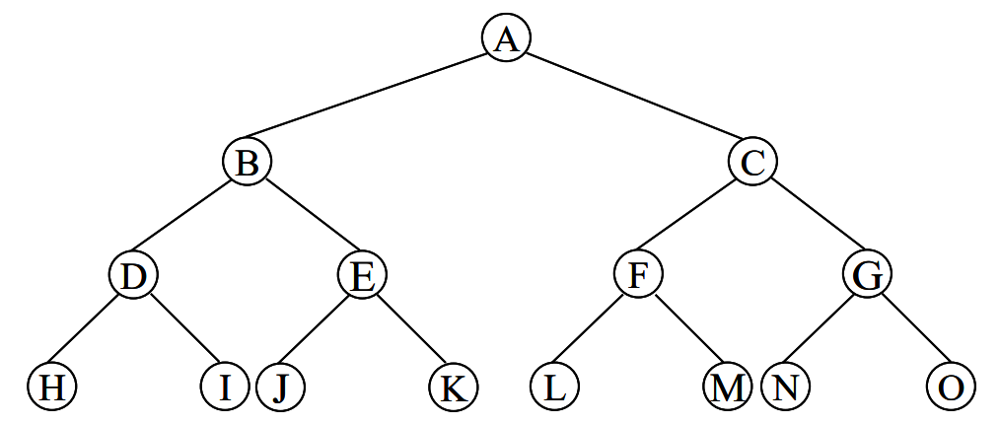
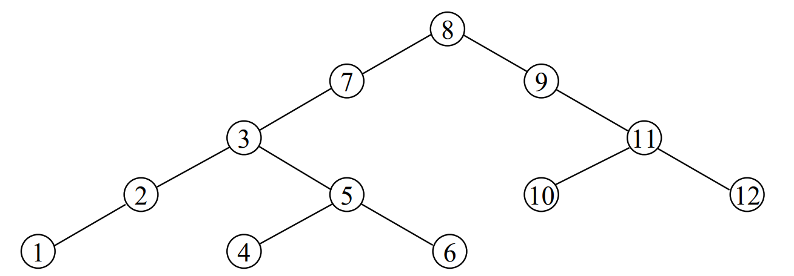
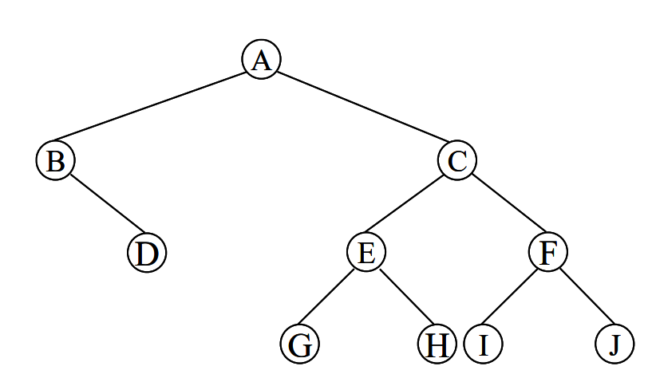
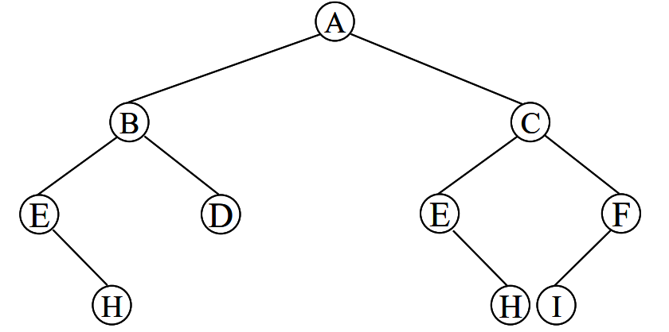
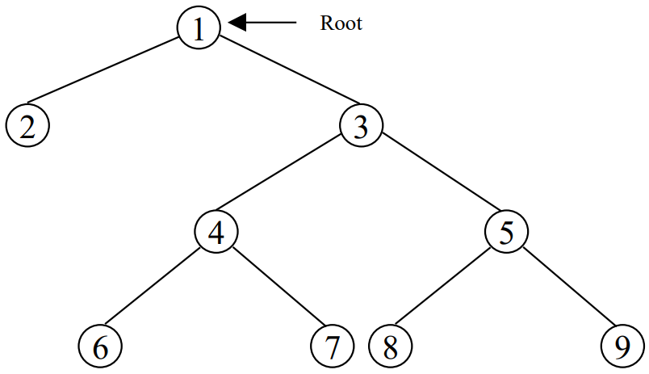
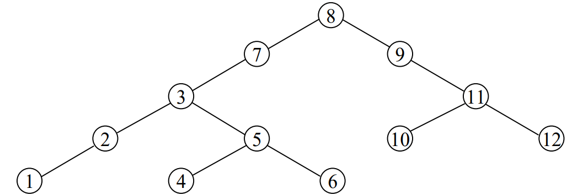

# Tree

> Note: cây nhị phân tìm kiếm không cần thuật toán sắp xếp vì sẵn đã có tính thứ tự.

---

## Binary Tree - Cây nhị phân

### Defenition - Định nghĩa

- Cây nhị phân là cây có **bậc bằng $2$**. *Nghĩa là mọi `node` trên cây đều có tối đa $2$ `child node`*.
- Cây nhị phân có thể là một cây rỗng (*cây không có `node` nào!*), hoặc cây chỉ có $1$ `node`. Với cây chỉ có $1$ `node` thì `node` đó có thể là `left node` hoặc `right node`.



### Type of binary trees - Các loại cây nhị phân

#### Complete binary tree - Cây nhị phân đúng

- Cây nhị phân đúng là cây nhị phân thỏa mãn các tính chất sau:
    1. Cây là **cây nhị phân**.
    2. Tất cả các `node` trừ `leaf node` đều có $2$ `child node`.

- Nếu cây nhị phân đúng có $m$ `leaf node` thì sẽ có tổng cộng $n = 2m - 1$ `node`.



#### Perfect binary tree - Cây nhị phân đầy

- Cây nhị phân đầy là cây nhị phân thỏa mãn các tính chất sau:
    1. Cây là **cây nhị phân đúng**.
    2. Tất cả các `leaf node` đếu có cùng mức là $d$.

***Ghi chú:*** cây nhị phân đầy là cây nhị phân có số nút tối đa ở mỗi mức.



#### Binary search tree - Cây nhị phân tìm kiếm

- Cây nhị phân tìm kiếm là cây nhị phân thỏa mã các tính chất:

    1. Cây là **cây nhị phân**. 
    2. Với mọi `node` ở trên cây thì khóa của nó sẽ lớn hơn khóa của tất cả các `node` thuộc cây con bên trái và nhỏ hơn khóa của tất cả các `node` thuộc cây con bên phải của nó.



#### AVL Tree - Cây nhị phân cân bằng

- Cây nhị phân cân bằng là cây nhị phân thỏa mãn tính chất sau:

    1. Cây là **cây nhị phân**.
    2. Đối với mọi `node` của cây thì chiều cao của cây con bên trái và chiều cao của cây con bên phải chênh lệch nhau không quá $1$ đơn vị.



#### Cây nhị phân cân bằng hoàn toàn

- Cây nhị phân cân bằng hoàn toàn là cây nhị phân thỏa mãn tính chất sau:

    1. Cây là **cây nhị phân**.
    2. Với mọi `node` trên cây thì số `node` của cây con bên trái và số `node` của cây con bên phải chênh lệch nhau không quá $1$ đơn vị.



### Các phép duyệt cây

Là quá trình đi qua các nút đúng một lần. Có $3$ phép duyệt cây như sau:



> *Ví dụ minh họa khi duyệt cây nhị phân*

#### Preorder - Tiền tự

Là trình tự duyệt qua nút gốc trước, sau đó đi qua cây con bên trái rồi áp dụng `Preorder` cho cây con bên trái. Tiếp đến sẽ là đi qua cây con bên phải và áp dụng `Preorder` cho cây con bên phải.

Ví dụ: sau khi duyệt tiền tự ta sẽ được kết quả là $1, 2, 3, 4, 6, 7, 5, 8, 9$.

#### Inorder - Trung tự

Là trình tự duyệt qua cây con bên trái trước rồi áp dụng `Inorder` cho cây con bên trái. Sau đó duyệt sang nút gốc và cuối cùng là sang cây con bên phải và áp dụng `Inorder` với cây con bên phải.

Ví dụ: sau khi duyệt trung tự ta sẽ được kết quả là $2, 1, 6, 4, 7, 3, 8, 5, 9$.

#### Postorder - Hậu tự

Là trình tự duyệt qua cây con bên trái trước rồi áp dụng `Postorder` cho cây con bên trái. Sau đó duyệt cây con bên phải rồi áp dụng `Postorder` cho cây con bên phải. Cuối cùng là duyệt nút gốc.

Ví dụ: sau khi duyệt hậu tự ta sẽ được kết quả là $2, 6, 7, 4, 8, 9, 5, 3, 1$.

***Ghi chú:*** Ta có thể tổ chức thư tự của cây là nội dung của `node` hoặc tạo thêm một `field` và xem đó là `key` của `node`.

---

### Các phép toán trên cây nhị phân tìm kiếm

***Khai báo:*** để tổ chức dữ liệu theo cây nhị phân tìm kiếm, ta có thể dùng nội dung của dữ liệu để làm `key` sắp xếp và tổ chức cây theo nhiều cách khác nhau. Song người ta thường tạo một `field` đóng vai trò làm `key` cho các phần tử và tạo ra cây nhị phân tìm kiếm.

Để dễ ví dụ, nội dung tìm kiếm của mỗi `node` sẽ là một số nguyên kiểu `int` và khóa là một số nguyên kiểu `int` khác. Ta sẽ khai báo dữ liệu cho mỗi `node` như sau:

File `BinarySearchTree.h`:
```cpp
namespace BinarySearchTree {
    struct Node {
        int key;
        int info;
        Node* left;
        Node* right;

        Node(int key, int info);
    };

    typedef Node* Pointer;
}
```

File `BinarySearchTree.cpp`:
```cpp
BinarySearchTree::Node::Node(int key, int info) : key(key), info(info) {

}
```

Và khi muốn tạo ra một cây nhị phân tìm kiếm ta chỉ cần khai báo biến quản lí `root node` để quản lí toàn bộ cây.

File `main.cpp`:
```cpp

#include <iostream>

#include "BinarySearchTree.h"

int main() {
    BinarySearchTree::Pointer tree = nullptr;
    return 0;
}

```

#### Initialize - Phương thức khởi tạo

Chức năng chính của phương thức là để khởi tạo cây nhị phân, cho phép chương trình xác định được là cây nhị phân đang rỗng.

File `BinarySearchTree.h`:
```cpp
namespace BinarySearchTree {
    struct Node {
        int key;
        int info;
        Node* left;
        Node* right;

        Node(int key, int info);
    };

    typedef Node* Pointer;

    void Initialize(Pointer& root);
}
```

File `BinarySearchTree.cpp`:
```cpp
BinarySearchTree::Node::Node(int key, int info) : key(key), info(info) {
    //* Có thể làm thêm những thao tác phụ nếu cần, không thì có thể để trống.
}

void BinarySearchTree::Initialize(BinarySearchTree::Pointer &root) {
    root = nullptr;
}
```

#### Create Tree - Tạo cây nhị phân tìm kiếm

Thuật toán tạo cây nhị phân tìm kiếm ta sẽ dùng phương thức `InsertNode()` để thêm một `node` vào cây. Cụ thể, phương thức sẽ như sau:

***Phương thức `InsertNode()`:*** dùng phương pháp đệ qui để thêm nút có `key` $x$ và `info` $a$ vào cây có `root node` và `root`. Cây được tạo qua thuật toán `CreateTree` là cây nhị phân tìm kiếm.

File `BinarySearchTree.h`:
```cpp
namespace BinarySearchTree {
    void InsertNode(Pointer& root, int key, int info);
}
```

File `BinarySearchTree.cpp`:
```cpp
void BinarySearchTree::InsertNode(BinarySearchTree::Pointer& node, int key, int info) {
    if (node == nullptr) {
        node = new Node(key, info);
    }
    else {
        if (key < node->key) {
            InsertNode(node->left, key, info);
        }
        else if (key > node->key) {
            InsertNode(node->right, key, info);
        }
        else {
            std::clog << "[ERROR] DUPLICATED KEY!\n";
        }
    }
}
```

***Giải thích:***

- Phương thức nhận một tham số hình thức biến là `node` là đại diện cho cây nhị phân tìm kiếm và hai tham số là `key` và `info` lần lượt là `key` và `info` của `node` sẽ được thêm vào.
- **Trường hợp 1:** nếu `node` là `nullptr` thì cây đang rỗng, điều đó có nghĩa là `node` sẽ được thêm là `root node` của cây. Khi đó chỉ cần gán trực tiếp `node` mới vào cây.
- **Trường hợp 2:** nếu `node` khác `nullptr`, khi đó, so sánh `key` sẽ có các trường hợp sau: nếu `key` của `node` hiện tại (gọi là `key1`) bé hơn `key` của `node` sẽ được thêm vào (gọi là `key2`) thì `node` được thêm vào chắc chắn sẽ thuộc vào cây con bên trái của `node` hiện tại. Khi đó, gọi phương thức: `InsertNode(node->left, key, info)`.
- **Trường hợp 3:** nếu `key1` lớn hơn `key2` thì `node` được thêm vào sẽ thuộc về cây con bên phải của `node` hiện tại. Khi đó gọi phương thức: `InsertNode(node->right, key, info)`.
- **Trường hợp 4:** nếu `key1` bằng `key2` thì không thêm được `node` vào cây. Vì đối với cây nhị phân tìm kiếm thì mỗi `key` của mỗi `node` là độc nhất trong toàn cây. Khi đó, nếu hai `key1` trùng `key2` thì không thêm vào được!

***Phương thức `CreateTree()`:*** Lần lượt nhập `key` và `info` cho từng `node` cho đến khi `key` được nhập có giá trị bằng $0$.

File `BinarySearchTree.h`:
```cpp
namespace BinarySearchTree {
    void CreateTree(Pointer& root);
}
```

File `BinarySearchTree.cpp`:
```cpp
void BinarySearchTree::CreateTree(BinarySearchTree::Pointer &root) {
    int key, info;
    do {
        std::clog << "Enter node's key: ";
        std::cin >> key;

        if (key != 0) {
            std::clog << "Enter node's info: ";
            std::cin >> info;
            InsertNode(root, key, info);
        }
    } while (key != 0);
}
```

Khi sử dụng: gọi hàm `CreateTree(tree)` để tạo cây.

#### Manipulate Tree - Tương tác trên cây

##### Free Node - Giải phóng vùng nhớ

Giải phòng vùng nhớ mà còn trỏ $p$ đang trỏ đến. Song cần lưu ý đến các cây con (nếu có).

##### Empty - Kiểm tra cây có rỗng hay không

Phương thức `Empty()` sẽ trả về `true` nếu cây nhị phân tìm kiếm là đang rỗng và ngược lại.

File `BinarySearchTree.h`:
```cpp
namespace BinarySearchTree {
    bool IsEmpty(const Pointer& root);
}
```

File `BinarySearchTree.cpp`:
```cpp
bool BinarySearchTree::IsEmpty(BinarySearchTree::Pointer const &root) {
    return root == nullptr;
}
```

***Giải thích:*** như đã quy ước, nếu `root node` bằng `nullptr` thì cây sẽ được hiểu là rỗng. Khi đó, nếu `root node` bằng `nullptr` thì cây rỗng và ngược lại.

##### Remove - Loại bỏ một `node` có trên cây

Khi loại bỏ một `node` khỏi cây thì phần còn lại vẫn phải đảm bảo cây vẫn là một cây tìm kiếm nhị phân.

Xem xét một số trường hợp sau:

- **Trường hợp 1:** `node` $p$ cần xóa là `leaf node`. Khi đó, ta chỉ cần đơn giản là giải phóng vùng nhớ cho `node` $p$.
- **Trường hợp 2:** `node` $p$ cần xóa chỉ có $1$ cây con (có thể là cây con trái hoặc cây con phải). Khi đó, tạo một con trỏ phụ `removeNode` có vai trò giữ địa chỉ của `node` sẽ được xóa đi là `node` $p$. Sau đó, tạo liên kết từ `parent node` của $p$ đến `child node` của $p$ và sau đó giải phóng vùng nhớ cho `removeNode`.
- **Trường hợp 3:** `node` $p$ cần xóa có đủ $2$ cây con. Khi đó, tạo một con trỏ phụ `removeNode` trỏ đến $p$, tìm `node` cực trái của cây con bên phải `node` $p$ gọi là $r$. Sao chép nội dung `node` $r$ đang chỉ đến vào `removeNode`. Tạo liên kết thích hợp để loại bỏ `removeNode` ra khỏi cây và hủy `removeNode`.

File `BinarySearchTree.h`:
```cpp
namespace BinarySearchTree {
    void InterchangeLeftMostNode(Pointer & root, Pointer & removeNode);

    void RemoveNode(Pointer& root, int key);
}
```

File `BinarySearchTree.cpp`:
```cpp
void BinarySearchTree::InterchangeLeftMostNode(BinarySearchTree::Pointer& root, BinarySearchTree::Pointer& removeNode) {
    if (root->left != nullptr) {
        BinarySearchTree::InterchangeLeftMostNode(root->left, removeNode);
    }
    else {
        removeNode->key = root->key;
        removeNode->info = root->key;
        removeNode = root;
        root = removeNode->right;
    }
}

void BinarySearchTree::RemoveNode(BinarySearchTree::Pointer& node, int key) {
    if (node == nullptr) {
        std::clog << "[ERROR] CANNOT FIND KEY " << key << std::endl;
    }
    else {
        if (key < node->key) {
            BinarySearchTree::RemoveNode(node->left, key);
        }
        else if (key > node->key) {
            BinarySearchTree::RemoveNode(node->right, key);
        }
        else {
            BinarySearchTree::Pointer removeNode = node;
            if (removeNode->left == nullptr) {
                node = removeNode->right;
            }
            else if (removeNode->right == nullptr) {
                node = removeNode->left;
            }
            else {
                BinarySearchTree::InterchangeLeftMostNode(node->right, removeNode);
            }
            delete removeNode;
        }
    }
}
```

**Khi sử dụng:** Gọi phương thức `RemoveNode(tree, key)`.

##### Search - Tìm kiếm

Tìm `node` có `key` bằng $x$ trên cây có gốc là `root`. Nếu thấy $x$ trong cây thì trả về địa chỉ của `node` có giá `key` bằng $x$ nếu không có, trả về `nullptr`.

Áp dụng tính chất của cây nên ta sẽ áp dụng thuật toán tìm kiếm nhị phân để tối ưu.

File `BinarySearchTree.h`:
```cpp
namespace BinarySearchTree {
    Pointer Search(const Pointer& root, int key);
}
```

File `BinarySearchTree.cpp`:
```cpp
BinarySearchTree::Pointer BinarySearchTree::Search(BinarySearchTree::Pointer const &root, int key) {
    BinarySearchTree::Pointer p = root;
    while (p != nullptr && p->key != key) {
        if (p->key < key) {
            p = p->right;
        }
        else {
            p = p->left;
        }
    }
    return p;
}
```

#### Traversal - Duyệt cây

Có $3$ cách duyệt cơ bản là Preorder, Inorder, Postorder và một cách duyệt đặc biệt là duyệt theo mức.


