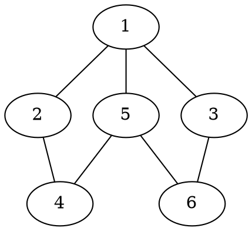
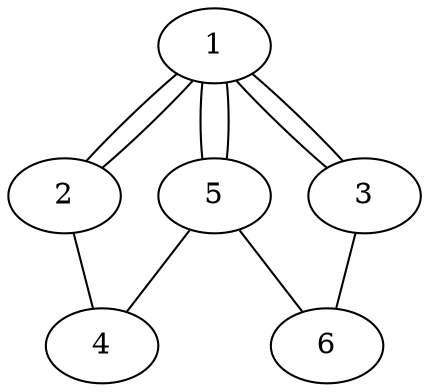

# Khái niệm cơ bản về đồ thị

## Định nghĩa đồ thị

### Đơn đồ thị vô hướng

***Định nghĩa:***

- Đơn đồ thị vô hướng $G = (V, E)$ bao gồm $V$ là tập các đỉnh và $E$ là tập các cặp **không có thứ tự** gồm **hai phần tử khác nhau** của $V$ gọi là **cạnh**.

> Ví dụ trên hình trên, ta có một đồ thị $G = (V, E)$ với số lượng đỉnh của tập $V$, kí hiệu là $|V|$, có giá trị bằng $6$ và số lượng cạnh của tập $E$, kí hiệu là $|E|$, có giá trị bằng $7$.

Ta có thể biểu diễn các tập $V$ và $E$ như sau:

- $V = \{1; 2; 3; 4; 5; 6\}$
- $E = \{(1, 2); (1, 5); (1, 3); (2, 4); (5, 4); (5, 6); (3, 6)\}$

Trong tập $E$, mỗi cạnh là có thể xem như một phần tử, được biểu diễn bằng một cặp $(x, y)$ với hai giá trị $x, y$ là hai phần tử khác nhau thuộc tập $V$.

Theo định nghĩa, vì đồ thị $G$ vô hướng, nên cặp $(x, y)$ và cặp $(y, x)$ là tương đương nhau, đều có ý nghĩa là tồn tại cạnh nối hai đỉnh $x$ và $y$ với nhau.

Một số các cặp cạnh không tồn tại trong đồ thị như: $(5, 2); (3, 4); (1, 6); \ldots$.

### Đa đồ thị vô hướng

***Định nghĩa:***

- Đa đồ thị vô hướng $G = (V, E)$ bao gồm $V$ là tập các đỉnh, $E$ là họ các cặp **không có thứ tự** gồm **hai phần tử khác nhau** của $V$ gọi là **cạnh**.

- $e_1 \in E$ và $e_2 \in E$ được gọi là cạnh bội nếu chúng cùng tương ứng với một cặp đỉnh.

Ta có thể biểu diễn các tập $V$ và $E$ như sau:

- $V = \{1; 2; 3; 4; 5; 6\}$
- $E = \{(1, 2); (1, 2); (1, 5); (1, 5); (1, 3); (1, 3); (2, 4); (5, 4); (5, 6); (3, 6)\}$

Ta thấy, có hai cạnh nối đỉnh $1$ với đỉnh $2$ và tương tự với hai cặp đỉnh $(1, 5)$ và $(1, 3)$.
