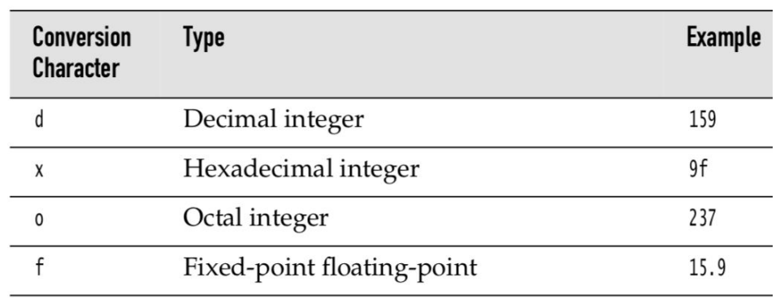

# Mở đầu với Java, Cài đặt Java và Nền tảng cơ bản của Java

---

## Mục lục

* [Mở đầu với Java, Cài đặt Java và Nền tảng cơ bản của Java](#-mở-đầu-với-java-cài-đặt-java-và-nền-tảng-cơ-bản-của-java-)
  + [Chương 1 - Mở đầu về Java](#-chương-1---mở-đầu-về-java-)
    - [Những ưu điểm khi lập trình với Java](#-những-ưu-điểm-khi-lập-trình-với-java-)
    - [The Java "White Paper" Buzzwords](#-the-java-white-paper-buzzwords-)
  + [Chương 2 - Môi trường phát triển Java](#-chương-2---môi-trường-phát-triển-java-)
    - [Tải JDK - Java development kit - Bộ phát triển ngôn ngữ Java](#-tải-jdk---java-development-kit---bộ-phát-triển-ngôn-ngữ-java-)
    - [Cài đặt JDK](#-cài-đặt-jdk-)
    - [Biên dịch code Java bằng Command line tool](#-biên-dịch-code-java-bằng-command-line-tool-)
    - [Sử dụng IDE](#-sử-dụng-ide-)
  + [Chương 3 - Nền tảng cơ bản của Java](#-chương-3---nền-tảng-cơ-bản-của-java-)
    - [Chương trình Java đơn giản](#-chương-trình-java-đơn-giản-)
    - [Comments - Ghi chú](#-comments---ghi-chú-)
    - [Data types - Kiểu dữ liệu](#-data-types---kiểu-dữ-liệu-)
      - [Kiểu dữ liệu số nguyên](#-kiểu-dữ-liệu-số-nguyên-)
      - [Số thực](#-số-thực-)
      - [Kiểu kí tự](#-kiểu-kí-tự-)
      - [Kiểu logic](#-kiểu-logic-)
    - [Biến](#-biến-)
      - [Khởi tạo, khởi gán biến](#-khởi-tạo-khởi-gán-biến-)
      - [Hằng số](#-hằng-số-)
    - [Toán tử](#-toán-tử-)
      - [Hàm và hằng số toán học](#-hàm-và-hằng-số-toán-học-)
      - [Ép kiểu giữa các kiểu dữ liệu số](#-ép-kiểu-giữa-các-kiểu-dữ-liệu-số-)
      - [Kết hợp gán giá trị với toán tử](#-kết-hợp-gán-giá-trị-với-toán-tử-)
      - [Toán tử tăng và toán tử giảm (increment and decrement operators)](#-toán-tử-tăng-và-toán-tử-giảm-increment-and-decrement-operators-)
      - [Toán tử quan hệ và toán tử logic](#-toán-tử-quan-hệ-và-toán-tử-logic-)
      - [Toán tử bit](#-toán-tử-bit-)
      - [Thứ tự ưu tiên thực hiện các phép toán](#-thứ-tự-ưu-tiên-thực-hiện-các-phép-toán-)
      - [Kiểu Enum](#-kiểu-enum-)
    - [Strings](#-strings-)
    - [Input và Output](#-input-và-output-)
      - [Reading Input](#-reading-input-)
      - [Formatting Output](#-formatting-output-)
      - [File Input and Output](#-file-input-and-output-)
    - [Control Flow](#-control-flow-)
      - [Block scope](#-block-scope-)
      - [Câu lệnh điều kiện](#-câu-lệnh-điều-kiện-)
      - [Vòng lặp](#-vòng-lặp-)
    - [Số lớn](#-số-lớn-)
    - [Array - Mảng](#-array---mảng-)
      - [Sao chép mảng](#-sao-chép-mảng-)
      - [Sắp xếp mảng](#-sắp-xếp-mảng-)
  + [References](#-references-)

---

## Chương 1 - Mở đầu về Java

### Những ưu điểm khi lập trình với Java

* Cú pháp dễ chịu (*pleasant syntax*), ngữ nghĩa dễ hiểu (*comprehensible semantics*).
* Môi trường thực thi chất lượng cao (*high-quality execution environment*).
* Nhiều thư viện hỗ trợ (*a vast library*).

### The Java "White Paper" Buzzwords

> 1. Simple
> 2. Object-Oriented
> 3. Distributed
> 4. Robust
> 5. Secure
> 6. Architecture-Neutral
> 7. Portable
> 8. Interpreted
> 9. High-Performance
> 10. Multithreaded
> 11. Dynamic

---

## Chương 2 - Môi trường phát triển Java

### Tải JDK - Java development kit - Bộ phát triển ngôn ngữ Java

* Tải ở đây: [Oracle](https://www.oracle.com/java/technologies/downloads/)

### Cài đặt JDK

(*slide*)

### Biên dịch code Java bằng Command line tool

(*slide*)

### Sử dụng IDE

(*slide*)

---

## Chương 3 - Nền tảng cơ bản của Java

### Chương trình Java đơn giản

```java
public class FirstSample {
    public static void main(String[] args) {
        System.out.println("We will not use 'Hello, World!'");
    }
}
```

Ngôn ngữ lập trình Java có những điểm cần lưu ý sau:

* Phân biệt giữa chữ hoa và chữ thường.
* `public`: từ khóa thay đổi truy cập (*access modifier*) - điều khiển level của truy cập (*control the level of access*).
* `class`: mọi thứ ở trong một chương trình Java đều nằm ở trong một `class`.
* `FirstSample`: tên của `class`.
* Tên của source code phải giống tên của `public class`.
* Một chương trình Java phải có phương thức `main` (`main method`).

### Comments - Ghi chú

*Comments (ghi chú) sẽ không được dịch khi trình dịch thực hiện biên dịch source code!*

```java
// inline comments - Ghi chú trên một dòng.

/*
Multiplelines comments - Ghi chú trên nhiều dòng hay còn gọi là comment block (khối ghi chú).
*/

/*
* Generate documents - Tài liệu ghi chú.
*/
```

### Data types - Kiểu dữ liệu

* Ngôn ngữ lập trình Java nặng về kiểu dữ liệu.
* Gồm tám kiểu dữ liệu nguyên thủy:
    1. Bốn kiểu dữ liệu về số nguyên.
    2. Hai kiểu dữ liệu về số thực.
    3. Một kiểu dữ liệu về kí tự.
    4. Một kiểu dữ liệu về logic.

#### Kiểu dữ liệu số nguyên

| Kiểu dữ liệu | Dung lượng | Vùng giá trị giới hạn |
| :--- | :--- | :--- |
| `int` | 4 bytes | $-2, 147, 483, 648$ đến $2, 147, 483, 647$ (*khoảng 2 tỉ*) |
| `short` | 2 bytes | $-32, 768$ đến $32, 767$ |
| `long` | 8 bytes | $-9, 223, 372, 036, 854, 775, 808$ đến $9, 223, 372, 036, 854, 775, 807$ |
| `byte` | 1 bytes | $-128$ đến $127$ |

* Số nguyên lớn (long integer): thêm hậu tố `L` hoặc `l`, ví dụ: `4000000000L`.
* Số thấp lục phân: có thêm tiền tố `0x` hoặc `0X`, ví dụ: `0xCAFE` là $51966$ ở hệ thập phân.
* Số bát phân: có thêm tiền tố `0`, ví dụ: `010` là $8$ ở hệ thập phân.
* Số nhị phân: có thêm tiền tố `0b` hoặc `0B`, ví dụ: `0b1001` là $9$ ở hệ thập phân.

#### Số thực

| Kiểu dữ liệu | Dung lượng | Vùng giá trị dữ liệu |
| :--- | :--- | :--- |
| `float` | 4 bytes | Gần bằng $\pm 3.40282347\text{E} + 38\text{F}$ (6 - 7 chữ số sau dấu phẩy thập phân) |
| `double` | 8 bytes | Gần bằng $\pm 1.7976931348623157\text{E} + 308$ (15 chữ số sau dấu phẩy thập phân) |

**Ba giá trị số thực đặc biệt:**

* Âm vô cùng
* Dương vô cùng
* Không phải số (`NaN` - Not a number)

#### Kiểu kí tự

* Giá trị của kiểu kí tự từ `\u0000` đến `\uFFFF`
* Kí tự được đặt trong cặp dấu `''` (nháy đơn) và kiểu `String` được đặt trong cặp dấu `""`.

***Một số kí tự đặc biệt:***

| Kí tự Escape | Tên gọi | Giá trị Unicode |
| :--- | :--- | :--- |
| `\b` | Backspace | `\u0008` |
| `\t` | Tab | `\u0009` |
| `\n` | Linefeed | `\u000a` |
| `\r` | Cariage return | `\u000d` |
| `\"` | Double quote | `\u0022` |
| `\'` | Single quote | `\u0027` |
| `\\` | Backslash | `\u005c` |

* Kiểu dữ liệu kí tự mô tả một đơn vị kí tự trong mã UTF-16.
* Chỉ sử dụng kiểu dữ liệu kí tự khi quản lí kí tự mã UTF-16.

#### Kiểu logic

* Gồm hai giá trị `true/false`.
* Không thể ép kiểu giữa hai kiểu dữ liệu số nguyên và logic.

### Biến

* Mọi **biến** đều phải có kiểu dữ liệu.
* Tên **biến** có những điểm cần phải chú ý sau:
    1. Phân biệt chữ hoa và chữ thường.
    2. Luôn bắt đầu với chữ cái.
    3. Gồm một chuỗi các chữ cái hoặc chữ số.
* Các kí tự có thể sử dụng: `A` - `Z`,  `a` - `z`,  `0` - `9`,  `_`,  `$`, vân vân.
* Không nên đặt trùng tên biến.
* Không nên sử dụng kí tự `$` khi muốn tên biến được tạo bởi trình dịch của Java và các công cụ khác (*not use `$`, it is intended for names that are generated by the Java compiler and other tools*).

#### Khởi tạo, khởi gán biến

Có thể khởi tạo một biến trong Java theo cấu trúc sau:

```java
// Khởi tạo: <kiểu dữ liệu> <tên biến>;
int numberOfElements;

// Khởi gán: <kiểu dữ liệu> <tên biến> = <giá trị>;
int arraySize = 10;

// Hoặc

int values;
values = 12;
```

#### Hằng số

* Từ khóa: `final`.
* Tên hằng: tất cả các kí tự đều được in hoa và ngăn cách nhau bởi dấu gạch dưới `_`.

```java
final double PI = 3.14;
```

* Lớp hằng (*class constants*)
* Từ khóa: `static final`

```java
public class Constants2 {
    public static final double PI = 3.14;
}
```

### Toán tử

#### Hàm và hằng số toán học

* Java hỗ trợ một lớp `Math` gồm các hàm số và hằng số toán học

```java
public class MathTest {
    public static void main(String[] args) {
        double x = 4;
        double y = Math.sqrt(x);
        System.out.println("SQRT(y)" + y);
        System.out.println("PI " + Math.PI);
    }
}
```

#### Ép kiểu giữa các kiểu dữ liệu số


* Mũi tên liền: ép kiểu không bị mất dữ liệu.
* Mũi tên gãy đứt: ép kiểu có thể bị mất tính chính xác.

```java
// Mất thông tin khi ép kiểu int sang float
int n = 1234567890;
float f = n; // f is 1.23456792E8

// Thông tin có thể bị mất khi ép kiểu từ double sang int
double x = 9.997;
int nx = (int)x; // x = 9
```

#### Kết hợp gán giá trị với toán tử

> *Sự kết hợp tiện lợi khi sử dụng toán tử hai ngôi với toán tử gán!*

Ví dụ: `x += 4;` sẽ tương đương với `x = x + 4;` .

#### Toán tử tăng và toán tử giảm (increment and decrement operators)

* `++n` và `n++`: tăng `n` lên một giá trị.
* `--n` và `n--`: giảm `n` xuống một giá trị.

```java
public class Main {
    public static void main(String[] args) {
        int n = 10;
        int firstValues = 10 * ++n; // firstValues = 110
        System.out.println("n: " + n); // n = 11;
        int secondValues = 10 * n++; // secondValues = 110
        System.out.println("n: " + n); // n = 12
        System.out.println("firstValues: " + firstValues);
        System.out.println("secondValues: " + secondValues);
        System.out.println("n: " + n); // n = 12
    }
}
```

#### Toán tử quan hệ và toán tử logic

| Toán tử | Ý nghĩa |
| :---: | :--- |
| `==` | so sánh bằng |
| `!=` | không bằng |
| `<` | bé hơn |
| `>` | lớn hơn |
| `<=` | bé hơn hoặc bằng |
| `>=` | lớn hơn hoặc bằng |
| `&&` | toán tử AND |
| `||` | toán tử OR |
| `? :` | toán tử điều kiện |

#### Toán tử bit

| Toán tử | Ý nghĩa |
| :---: | :--- |
| `&` | phép toán AND |
| `|` | phép toán OR |
| `^` | phép toán XOR |
| `~` | phép toán NOT |
| `<<` | phép toán dịch bit sang trái |
| `>>` | pháp toán dịch bit sang phải |

#### Thứ tự ưu tiên thực hiện các phép toán


#### Kiểu Enum

* Nếu biến chỉ nên giữ một tập giá trị duy nhất thì nên sử dụng kiểu enum.

```java
public class Main {
    public static void main(String[] args) {
        enum Size {
            SMALL, MEDIUM, LARGE, EXTRA_LARGE
        };

        Size s = Size.MEDIUM;
        System.out.println(s);
    }
}
```

### Strings

* Mỗi chuỗi trong Java sẽ thuộc lớp `String`.

```java
String s = ""; // Chuỗi rỗng
String greeting = "Hi";
```

* Một chuỗi có thể là chuỗi con của chuỗi khác.
* Một số thao tác cộng chuối:
    1. Chuỗi + chuỗi.
    2. Chuỗi + giá trị khác.
    3. Cộng nhiều chuỗi.

```java
public class Main {
    public static String Print() {
        return "random";
    }

    public static void main(String[] args) {
        String s1 = "hello " + Print();
        String s2 = Print() + 13;
        String s3 = Print() + true;
        String s4 = Print() + Print() + Print();
        String s5 = String.join(" ", "hello", Print(), "hello");
        System.out.println(s1);
        System.out.println(s2);
        System.out.println(s3);
        System.out.println(s4);
        System.out.println(s5);
    }
}
```

* `String` không thể bị tác động, có nghĩa là không thể thay đổi các kí tự trong một chuỗi đã tồn tại.
* Kiểm tra tính tương đồng giữa các chuỗi khác nhau:
    1. Kiểm tra giá trị: dùng hàm `equals`, `equalsIgnoreCase`.
    2. Kiểm tra từng vị trí trong chuỗi: `==`, ở cùng vị trí có cùng giá trị.
        - Chỉ có các chuỗi hằng có thể chia sẽ vị trí (*shared location*).
        - Các chuỗi là các chuỗi cộng gộp hoặc chuỗi con thì không được chia sẽ vị trí (*shared location*).

* Chuỗi rỗng là chuỗi `""` và chuỗi `null` là chuỗi Null.

```java
String s = ""; // Chuỗi rỗng.
String p = null; // Chuỗi null.
```

* Kiểu dữ liệu kí tư là một đơn vị code trong việc biểu diễn mã Unicode, còn gọi là code point.
* Một số kí tự đặc biệt sẽ yêu cầu 2 code units.
* Hàm `length` sẽ cho biết số lượng đơn vị code (code units) cần thiết của một `String`.

```java
public class Main {
    public static void main(String[] args) {
        String message = "My name is nnminh, I love __qwqp";
        int len = message.length();
        System.out.println(message);
        System.out.println(len);
    }
}
```

* String API có hơn 50 phương thức, xem slide 72.
* Xem thêm ở API Documentation: [Oracle](https://docs.oracle.com/javase/8/docs/api/)

***Xây dựng String - building strings***

* Tạo một string bulider rỗng:
    

```java
    StringBuilder builder = new StringBuilder();
    ```

* Thêm một phần vào string:
    

```java
    builder.append(ch); // thêm một kí tự.
    builder.append(str); // thêm một chuỗi.
    ```

* Chuyển đổi builder thành string:
    

```java
    String completeString = builder.toString();
    ```

### Input và Output

#### Reading Input

> *Đọc thêm ở trang 80*

***Đọc Input từ Console:***

```java
import java.util.*;

public class Main {
    public static void main(String[] args) {
        Scanner in = new Scanner(System.in);

        System.out.println("What is your name? ");
        String name = in.nextLine();
        System.out.println("Hi " + name + " my name is Haise!");

        System.out.println("Where are you now? ");
        String place = in.next();
        System.out.println("Oh I know " + place + " too!");

        System.out.print("How old are you? ");
        int age = in.nextInt();
        System.out.println("Your age: " + age);
    }
}
```

***Đọc Password từ console:***

```java
import java.io.Console;

public class Main {
    public static void main(String[] args) {
        Console cons = System.console();
        String username = cons.readLine("Username: ");
        char[] password = cons.readPassword("Password: ");

        System.out.println("Username: " + username);
        System.out.print("Password: ");
        System.out.println(password);
    }
}
```

#### Formatting Output



```java
public class Main {
    public static void main(String[] args) {
        double x = 10000.0 / 3.0;
        System.out.println(x);
        System.out.printf("%8.2f", x);
    }
}
```

```java
public class Main {
    public static void main(String[] args) {
        String name = "Minh";
        int age = 19;
        String message = String.format("Hello, %s! Next year, you'll be %d.", name, age);
        System.out.println(message);
    }
}
```

#### File Input and Output

(*xem slide*)

### Control Flow

#### Block scope

* Một khối lệnh sẽ bao gồm các câu lệnh của ngôn ngữ Java và được đặt trong cặp ngoặc nhọn `{}`.
* Không thể tái định nghĩa một biến đã được định nghĩa trong một khối lệnh khác.

#### Câu lệnh điều kiện

***Ví dụ ứng dụng câu lệnh điều kiện if đánh giá điểm:***

```java
public class Main {
    public static String GradeValidation(double point) {
        if (point < 5) { return "F"; }
        else if (point <= 6) { return "D"; }
        else if (point <= 7) { return "C"; }
        else if (point <= 8) { return "B"; }
        else if (point <= 9) { return "A"; }
        return "A+";
    }

    public static void main(String[] args) {
        System.out.println(GradeValidation(5));
    }
}
```

#### Vòng lặp

***Vòng lặp `while` :***

```java
import java.util.*;

public class Main {
    public static void main(String[] args) {
        Scanner input = new Scanner(System.in);

        int sum = 0;
        int inputValue = -1;
        while (inputValue != 0) {
            System.out.print("Please enter an integer greater than 0! Or enter 0 to stop! ");
            inputValue = input.nextInt();
            if (inputValue > 0) {
                sum += inputValue;
            }
            else if (inputValue != 0) {
                System.out.println("You enter a negative number! Please enter another number!");
            }
        }

        System.out.println("The total of all positive number you have entered: " + sum);
    }
}
```

***Vòng lặp `do...while` :***

```java
import java.util.*;

public class Main {
    public static void main(String[] args) {
        Scanner input = new Scanner(System.in);

        int sum = 0;
        int inputValue = -1;

        do {
            System.out.print("Please enter an integer greater than 0! Or enter 0 to stop! ");
            inputValue = input.nextInt();
            if (inputValue > 0) {
                sum += inputValue;
            }
            else if (inputValue != 0) {
                System.out.println("You enter a negative number! Please enter another number!");
            }
        } while (inputValue != 0);

        System.out.println("The total of all positive number you have entered: " + sum);
    }
}
```

***Vòng lặp `for` :***

```java
import java.util.*;

public class Main {
    public static void main(String[] args) {
        Scanner inStream = new Scanner(System.in);

        System.out.print("Enter the array size: ");
        int arrSize = inStream.nextInt();
        int[] a = new int[arrSize];

        for (int i = 0; i < arrSize; ++i) {
            System.out.printf("Enter value for a[%d]: ", a[i]);
            a[i] = inStream.nextInt();
        }
        System.out.print("You have entered an array: ");
        for (int i = 0; i < arrSize; ++i) {
            System.out.print(a[i] + " ");
        }
    }
}
```

```java
import java.util.*;

public class Main {
    public static long Factorial(int n) {
        long result = 1;
        for (int i = 1; i <= n; ++i) { result *= i; }
        return result;
    }

    public static void main(String[] args) {
        Scanner inStream = new Scanner(System.in);

        System.out.print("Enter value n: ");
        int n = inStream.nextInt();

        long result = 1;
        for (int j = 0; j < 6; ++j) {
            result *= (n - j);
        }
        result /= Factorial(6);

        System.out.println("Your chance is 1 in " + result);
    }
}
```

***Cấu trúc đa lựa chọn `switch - case` :***

* Một `case` có thể:
    1. Nhập một giá trị hằng thuộc kiểu `char`, `byte`, `short`, `int`.
    2. Giá trị enum.
    3. Một chuỗi hằng.

```java
import java.util.*;

public class Main {
    public static String GetDays(int month) {
        switch (month) {
            case 1:
            case 3:
            case 5:
            case 7:
            case 8:
            case 10:
            case 12:
                return "31 days";
            case 4:
            case 6:
            case 9:
            case 11:
                return "30 days";
            default:
                return "29 or 28 days";
        }
    }

    public static void main(String[] args) {
        Scanner inStream = new Scanner(System.in);
        System.out.print("Enter a month: ");
        int month = inStream.nextInt();
        System.out.println("There are " + GetDays(month) + " in the " + month + "-th month of year.");
    }
}
```

*Hoặc:*

```java
import java.util.*;

public class Main {
    public static String GetDays(int month) {
        return switch (month) {
            case 1, 3, 5, 7, 8, 10, 12 -> "31 days";
            case 4, 6, 9, 11 -> "30 days";
            default -> "29 or 28 days";
        };
    }

    public static void main(String[] args) {
        Scanner inStream = new Scanner(System.in);
        System.out.print("Enter a month: ");
        int month = inStream.nextInt();
        System.out.println("There are " + GetDays(month) + " in the " + month + "-th month of year.");
    }
}
```

### Số lớn

* Sử dụng `BigInteger` và `BigDecimal`.
* Lưu một số lớn vào biến $x$:
    

```java
    BigInteger x = BigInteger.valueOf(100);
    ```

***Ví dụ:***

```java
import java.math.BigDecimal;
import java.math.RoundingMode;
import java.util.*;

public class Main {
    public static BigDecimal Factorial(int n) {
        BigDecimal result = BigDecimal.valueOf(1);
        for (int i = 1; i <= n; ++i) {
            result = result.multiply(BigDecimal.valueOf(i));
        }
        return result;
    }

    public static void main(String[] args) {
        Scanner inStream = new Scanner(System.in);

        System.out.print("Enter value n: ");
        int n = inStream.nextInt();

        BigDecimal result = BigDecimal.valueOf(1);
        for (int j = 0; j < 6; ++j) {
            result = result.multiply(BigDecimal.valueOf(n - j));
        }
        result = result.divide(Factorial(6), 10, RoundingMode.CEILING);

        System.out.println("Your chance is 1 in " + result);
    }
}
```

### Array - Mảng

* Mảng chứa tập hợp các phần tử cùng kiểu dữ liệu.
* Một khi được khởi tạo, kích thước của mảng không thể thay đổi.
* Truy cập đến từng phần tử thông qua chỉ số.

```java
import java.util.*;

public class Main {
    public static void main(String[] args) {
        Scanner inStream = new Scanner(System.in);

        System.out.print("Enter the array size: ");
        int arraySize = inStream.nextInt();
        int[] arr = new int[arraySize];

        for (int i = 0; i < arraySize; ++i) {
            System.out.printf("Enter value for arr[%d]: ", i);
            arr[i] = inStream.nextInt();
        }

        System.out.print("Value of array: ");
        for (int i = 0; i < arraySize; ++i) {
            System.out.print(arr[i] + " ");
        }
    }
}
```

```java
import java.util.*;

public class Main {
    public static Scanner inStream = new Scanner(System.in);

    public static void InputArray(int[] arr, int arraySize) {
        for (int i = 0; i < arraySize; ++i) {
            System.out.printf("Enter value for arr[%d]: ", i);
            arr[i] = inStream.nextInt();
        }
    }

    public static void PrintArray(int[] arr, int arraySize) {
        System.out.print("Value of array: ");
        for (int i = 0; i < arraySize; ++i) {
            System.out.print(arr[i] + " ");
        }
    }

    public static void main(String[] args) {
        System.out.print("Enter the array size: ");
        int arraySize = inStream.nextInt();
        int[] arr = new int[arraySize];

        System.out.print("Enter [true] to manually enter array's values or [false] to auto generate! ");
        boolean selector = inStream.nextBoolean();
        if (selector) {
            InputArray(arr, arraySize);
        }
        else {
            arr = new int[] {1, 2, 3, 4, 5};
        }
        PrintArray(arr, arraySize);
    }
}
```

#### Sao chép mảng

* Tạo một tên gọi khác (không phải biến mới) cùng chỉ đến một biến ban đầu:
    

```java
    int[] arr = new int[] {1, 2, 3};
    int[] arrb = arr;
    ```

* Sao chép tất cả các giá trị của mảng vào một mảng mới. Sử dụng phương thức `copyOf` ở trong lớp `Array`.
    

```java
    int[] arr = new int[] {1, 2, 3};
    int[] arrb = Array.copyOf(arr, arr.length);
    ```

* Mảng có thể bị tác động (*mutable*).

#### Sắp xếp mảng

```java
import java.lang.reflect.Array;
import java.util.*;

public class Main {
    public static Scanner inStream = new Scanner(System.in);

    public static void main(String[] args) {
        System.out.print("Enter number of row: ");
        int n = inStream.nextInt();
        System.out.print("Enter number of col: ");
        int m = inStream.nextInt();

        int[][] arr = new int[n][m];

        for (int i = 0; i < n; ++i) {
            for (int j = 0; j < m; ++j) {
                System.out.printf("Enter value for a[%d][%d]: ", i, j);
                arr[i][j] = inStream.nextInt();
            }
        }

        for (int i = 0; i < n; ++i) {
            for (int j = 0; j < m; ++j) {
                System.out.print(arr[i][j] + " ");
            }
            System.out.println();
        }

        System.out.println(Arrays.deepToString(arr));
    }
}
```

---

## References

* [Java "White Paper" Buzzwords](http://underpop.online.fr/j/java/help/java-white-paper-buzzwords-an-introduction-to-java.html.gz)
