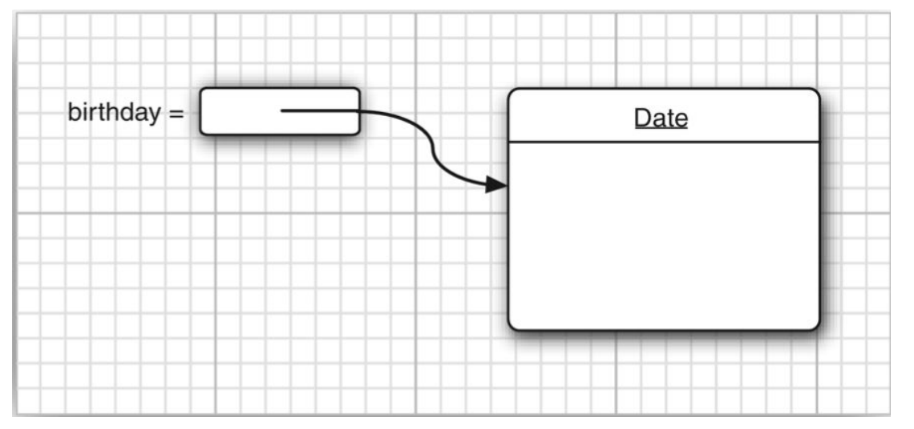
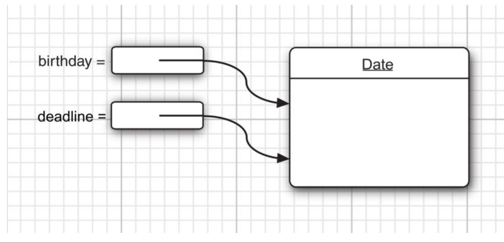

# Object and Classes

---

## Introduction to Object-Oriented Programming

### Classes

- `Class` là template để `Object` dựa vào đó và được tạo ra.
- Tạo một `Object` từ một `Class` thì `Object` đó là một *instance* (phiên bản/trường hợp) của `Class`.
- **Encapsulation** - Tính bao đóng:
    - Kết hợp dữ liệu và hành vi của nó vào trong một bộ, giấu chi tiết cách hoạt động khỏi người dùng.
    - Dữ liệu là một instance của một field và mỗi hành vi được xem như một method.
    - Mỗi `Object` cụ thể có các giá trị cụ thể cho một field của nó đại diện cho một trạng thái của `Class` đó.
    - Chương trình chỉ tương tác với `Object` thông qua các method của nó.
- Trong `Java`, khi tạo ra một `Object` mới từ một `Object` đã có sẵn thì `Object` mới sẽ có những field và method của `Object` gốc.

### Objects

- Ba đặc tính chủ chốt của `Object`:
    1. **Hành vi của `Object`** - "Đối tượng đó sẽ làm gì?".
    2. **Trạng thái của `Object`** - Thông tin của `Object` mô tả hình dáng của `Object`. Cách `Object` hoạt động khi gọi các method của nó.
    3. **Danh tính của `Object`** - Cách các `Object` có  thể phân biệt với nhau nếu những `Object` có cùng hành vi và trạng thái.

### Định nghĩa các Class

- Định danh của các `Class` nên là các **danh từ** đại diện cho ý nghĩa của `Cless` đó.
- Định danh của các `method` của `Class` nên là các **động từ** chỉ hoạt động của phương thức đó.

### Quan hệ giữa các Class

Các quan hệ thông dụng nhất giữa các `Class`:

- Dependence - Quan hệ phụ thuộc.
- Aggregation - Quan hệ thu nạp (*hoặc quan hệ kết hợp*).
- Inheritance - Quan hệ kế thừa.

#### Dependence - Quan hệ phụ thuộc

- Trong kỹ nghệ phần mềm (software engineering) thì sự phụ thuộc (dependence) hay sự liên kết (coupling) giữa hai lớp khác nhau là khi phương thức của lớp này sử dụng hoặc thao tác lớp khác.

> ➣ *English:* Dependence or coupling in software engineering: a class depends on 
another class if its methods use or manipulate objects of that class.

***Ví dụ:***

Lớp `Order` sẽ sử dụng lớp `Account` để kiểm tra trạng thái thanh toán của tài khoản đó.

#### Aggregation - Quan hệ thu nạp

- Khi đối tượng $A$ của lớp này **chứa** đối tượng $B$ của lớp khác thì hai lớp đó được gọi là có quan hệ thu nạp.

#### Inheritance - Quan hệ kế thừa

> 💡 *Một lớp tổng quát và một lớp cụ thể.*

- Nếu lớp $A$ là một lớp mở rộng (extend) từ lớp $B$ thì lớp $A$ sẽ có tất cả những gì mà lớp $B$ có (bao gồm tất cả các field và method) và thêm những khả năng mới.

***Ví dụ:***

- Lớp `Order` là lớp các loại đơn đặt hàng.
- Lớp `RushOrder` là một lớp chỉ các đơn đặt hàng nhanh.
- Lớp `RughOrder` là một lớp được mở rộng từ lớp `Order`: vì cả hai đều có điểm chung là đơn đặt hàng. Sonh lớp `RushOrder` có thêm những field và method mới đặc trưng cho các loại đơn đặt hàng nhanh.

---

## Objects and Object variables

- Khai báo một Object variable:

```java
Date birthday; // Không ám chỉ đến một đối tượng nào cụ thể.
```

- Khởi tạo một Object sử dụng các Constructor:

```java
Date birthday = new Date();
```

- Constructors sẽ có tên trùng với đối tượng của Constructors tương ứng.



- Một hàm `toString()` trong đối tượng `Date` có chức năng trả về một chuỗi đại diện cho đối tượng đó là một ngày theo định dạng ngày tháng năm phù hợp.

```java
String strBirthday = birthday.toString();
```

- Phép gán:

```java
Date deadline = birthday;
```



Cả hai biến `birthday` và `deadline` đều có chung một lớp là `Date`


### Mutator and Accessor methods

- **Mutator methods**: là những phương thức tác động lên một đối tượng và thay đổi trạng thái của đối tượng đó.
- **Accessor methods:** là những phương thức chỉ tác động lên một đối tượng mà không thay đổi trạng thái của đối tượng đó.

---

## Tạo một đối tượng trong Java

File `Problem.java`

```java
public class Problem {
    private String m_ProblemName;
    private String m_Directory;

    public String getM_ProblemName() {
        return m_ProblemName;
    }

    public void setM_ProblemName(String m_ProblemName) {
        this.m_ProblemName = m_ProblemName;
    }

    public String getM_Directory() {
        return m_Directory;
    }

    public void setM_Directory(String m_Directory) {
        this.m_Directory = m_Directory;
    }

    public Problem(String problemName, String directory) {
        this.m_Directory = directory;
        this.m_ProblemName = problemName;
    }
}
```

File `Main.java`

```java
public class Main {
    public static void main(String[] args) {
        Problem problem = new Problem("math", "c/users/nnminh");
        System.out.println("name = " + problem.getM_ProblemName());
        System.out.println("path = " + problem.getM_Directory());
    }
}
```

### Constructor

- Constructor có tên cùng với tên `class`.
- Một `class` có thể có nhiều hơn một constructor.
- Một constructor có thể có đa dạng số lượng các tham số.
- Constructor không có giá trị trả về $\rightarrow$ không có kiểu dữ liệu.
- Constructor luôn được gọi với từ khóa `new` để khởi tạo cho một trường hoặc một instance mới.

### Lợi ích của tính bao đóng (encapsulation)

- Field accesstor (các getter) chỉ trả về giá trị của field tương ứng.
- Vì sao không đặt các field public? $\rightarrow$ Vì có thể có nhiều field người dùng không nên truy cập vào, từ đó hạn chế việc thay đổi dữ liệu ngoài ý muốn.
- Accesstors và Mutators $\rightarrow$ các hàm getter và setter.
- Dễ dàng thay đổi internal implementation (phương thức viết code).
- Mutators có thể kiểm tra lỗi (errors checking).

> 💡 ***Không nên viết các Accesstor methods trả về tham chiếu của một trường!***

- Nếu cần trả về một tham chiếu của một trường thì trước tiên sẽ tạo một bản sao của trường đó và sau đó trả về tham chiếu của trường bản sao.

### Private method

- Phần lớn các phương thức đều public, song trong một số trường hợp có một số các phương thức private.
- Các private method giúp việc chia code thực hiện việc tính toán thành những phương phức trợ giúp (helper method).

### Final field - Trường cố định (hằng)

- Một field có thể sử dụng với từ khóa `final` để tạo thành trường hằng. Và luôn được khởi tạo với một giá trị khởi tạo.
- Sau đó trường này không thể thay đổi giá trị.

### Static field and method

#### Static field

- Trường static là trường độc nhất trong tất cả các `class` cùng loại.

File `Problem.java` sau khi thêm trường private static int id;

```java
public class Problem {
    private String m_ProblemName;
    private String m_Directory;
    private static int NextId;
    private int id;

    public String getM_ProblemName() {
        return m_ProblemName;
    }

    public void setM_ProblemName(String m_ProblemName) {
        this.m_ProblemName = m_ProblemName;
    }

    public String getM_Directory() {
        return m_Directory;
    }

    public void setM_Directory(String m_Directory) {
        this.m_Directory = m_Directory;
    }

    public Problem(String problemName, String directory) {
        this.m_Directory = directory;
        this.m_ProblemName = problemName;
    }
}
```

**Giải thích:** Có nhiều instances của class `Problem` nhưng trong tất cả các instances đó thì sẽ có chung một trường `id` $\rightarrow$ trường `id` là độc nhất (chung) cho tất cả các instances của class `Problem`.

#### Static constants

- Static field sẽ ít xuất hiện, song static constants sẽ thường xuất hiện hơn.
- Vì hằng số chỉ cần một instance cho tất cả các class chứ không cần nhiều instance cho nhiều class.

```java
public class Math {
    ...
    public static final double PI = 3.14;
    ...
}
```

**Giải thích:** Hằng số PI chỉ cần có một instance cho mọi instance của class Math có thể có. Ngược lại thì mỗi instance của class Math sẽ có một instance của PI $\rightarrow$ không cần thiết.

#### Static method

- Static method là phương thức không vận hành trên đối tượng. Hoặc không sử dụng tham số ẩn (implicit parameters).
- Gọi static method không có đối tượng.

File `Problem.java`

```java
public class Problem {
    private String m_ProblemName;
    private String m_Directory;
    private static int nextId;

    private int id;

    public void setID() {
        id = nextId;
        nextId++;
    }

    public static int getNextId() {
        return nextId;
    }

    public String getM_ProblemName() {
        return m_ProblemName;
    }

    public void setM_ProblemName(String m_ProblemName) {
        this.m_ProblemName = m_ProblemName;
    }

    public String getM_Directory() {
        return m_Directory;
    }

    public void setM_Directory(String m_Directory) {
        this.m_Directory = m_Directory;
    }

    public Problem(String problemName, String directory) {
        this.m_Directory = directory;
        this.m_ProblemName = problemName;
    }
}
```

#### Factory methods

- Factory methods là các phương thức được sử dụng để xây dựng các object khác (ví dụ như xây dựng object khác hoặc object con).

```java
NumberFormat currencyFormatter = NumberFormat.getCurrencyInstance(); 
NumberFormat percentFormatter = NumberFormat.getPercentInstance(); 
double x = 0.1;
System.out.println(currencyFormatter.format(x)); // prints $0.10 
System.out.println(percentFormatter.format(x)); // prints 10
```

#### Main method

- Mọi class có thể có một `Main` method để chạy code và thích hợp để chạy unit test.

### Method parameters

File `Custom.java`

```java
public class Custom {
    public static int SQR(int value) {
        return value * value;
    }

    public static void TrySQR(int value) {
        value *= value;
        System.out.println("SQR = " + value);
    }
}
```

File `Main.java`

```java
public class Main {
    public static void main(String[] args) {
        System.out.println(Custom.SQR(10));

        int value = 100;
        Custom.TrySQR(value);
        System.out.println("after = " + value); // after = 100
    }
}
```

**Giải thích:** giá trị của biến `value` không bị thay đổi sau khi bị tác động bởi hàm `TrySQL` $\rightarrow$ Pass by value.

> 💡 Vậy đối với các tham số là kiểu dữ liệu nguyên thủy (primitive data types) thì sẽ được truyền bằng giá trị (**pass by value**).


---

## References
