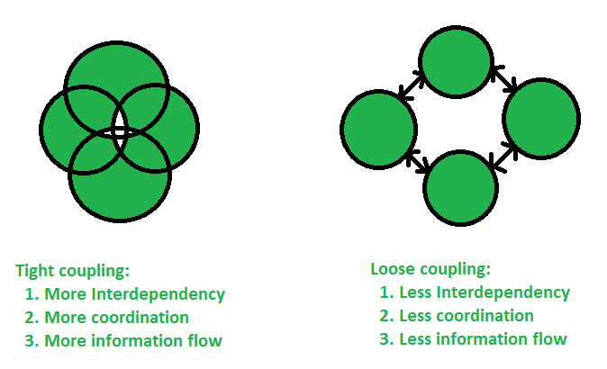

# Áp dụng Dependency injection vào Spring Boot

---

## Module Coupling

### Khái niệm Module coupling

- Coupling là mối quan hệ giữa hai module có sự phụ thuộc vào nhau, có liên quan đến nhau.
- Gồm hai loại coupling:
    - Tight coupling: hai module có quan hệ chặt chẽ, liên kết chặt chẽ với nhau.
    - Loose coupling: hai module liên kết rời rạc nhau.



- Trong chương trình sẽ có nhiều module riêng lẻ, mỗi module lại có quan hệ với nhau (tương tác hoặc kế thừa).

***Ví dụ:***

```java
public static class Point() {
    int x, y;
}

public static class Segment() {
    private Point A;
    private Point B;
}
```

### Nguyên tắc về sự phụ thuộc

> *Để code dễ bảo trì và sửa đổi thì nguyên tắc là giảm sự phụ thuộc giữa các module.*
> *Nghĩa là biến đổi từ quan hệ tight coupling thành loose coupling.*

Trong ví dụ trên:
- Nếu sửa đổi class `Point` thì cần sửa dối class `Segment`.
- Khó test module.
- Khó bảo trì module.

---

## Nguyên lý Dependency inversion

### Dependency inversion principle

> *Đây là nguyên lý số 5 trong SOLID principle, tượng trưng cho chữ D, giúp thiết kế các module sao cho hạn chế sự phụ thuộc nhất có thể.*

***Dependency inversion principle có hai ý chính:***

- Các module cấp cao không nên phụ thuộc (trực tiếp) vào các module cấp thấp. Cả hai nên phụ thuộc vào abstraction (OOP).
- Abstraction không nên phụ thuộc vào chi tiết mà ngược lại.

### Dependency là gì?

Trong ví dụ trên, class `Segment` phụ thuộc vào class `Point` nên claas `Point` là một dependency (phụ thuộc) của `Segment` $\Rightarrow$ Lúc này, class `Segment` là một module **cấp cao** còn `Point` là một module **cấp thấp**.

### Ý nghĩa thứ nhất của Dependency Inversion Principle

Đoạn code trên đã vi phạm ý 1 của DI Principle. Vì class `Segment` phụ thuộc trực tiếp vào class `Point`.

Để đúng với DI Principle thì ta cho hai module cùng phụ thuộc vào abstraction (Trong OOP thường là Interface).

```java
// Interface đại diện cho tọa độ trong hệ tọa độ đa chiều.
interface Coordinate {
    ...
}

// Point là một điểm có tọa độ
class Point impelements Coordinate {
    ...
}

/*
* Segment là một đoạn thẳng có tọa độ (nói chung). Không cụ thể tọa độ nào.
* Loại điểm cụ thể sẽ được inject vào lúc tạo (không phải hard code).
* Do đó có thể tạo Segment với nhiều loại tọa độ khác nhau.
*/
class Segment {
    private Coordinate A;
    pricate Coordinate B;

    public Segment(Coordinate x, Coordinate y) {
        this.A = x;
        this.B = y;
    }
}
```

Đoạn code trên sử dụng tính đa hình của OOP để chuyển đổi giữa các loại `Point` mà không có lỗi gì xảy ra.

***Giải thích code:***

Sau khi sửa lại thì `Point` và `Segment` đều phụ thuộc vào Interface `Coordinate` (đại diện cho abstraction). Như thế đúng với nguyên lí DI đặt ra.

- `Point` là một loại `Coordinate` (có thể có tọa độ nhiều chiều). `Coordinate` có những method nào thì `Point` sẽ phải implement những method đó. Do vậy, khi đưa vào `Segment` thì chức năng của các loại `Coordinate` đều giống nhau và có trong các `Point` khác nhau.
- `Segment` sử dụng `Point` làm tọa độ thay vì một class cụ thể nào đó. Do đó chỉ cần `Point` thuộc interface `Coordiante` thì đều đưa được vào `Segment`.

Lúc này mỗi quan hệ giữa `Segment` và `Point` đã lỏng lẻo hơn rất nhiều. Khi đó, có thể có thêm một class `Point` khác như sau:

```java
class ThreeDimensionPoint implements Coordinate {
    ...
}
```

Khi tạo ra đối tượng `Segment` thì ta sẽ đưa đối tượng `Point` phù hợp vào:

```java
Coordinate PointTypeA = new Point();
Coordinate PointTypeB = new ThreeDimensionPoint();

Segment SegmentTypeA = new Segment(PointTypeA);
Segment SegmentTypeB = new Segment(PointTypeB);
```

Kỹ thuật này gọi là **Constructor-based Injection**.

### Ý nghĩa thứ hai của Dependency Inversion Principle
