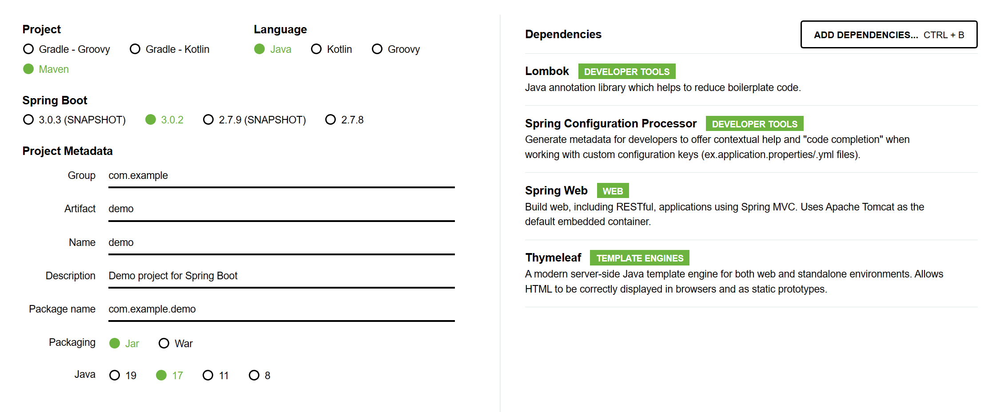
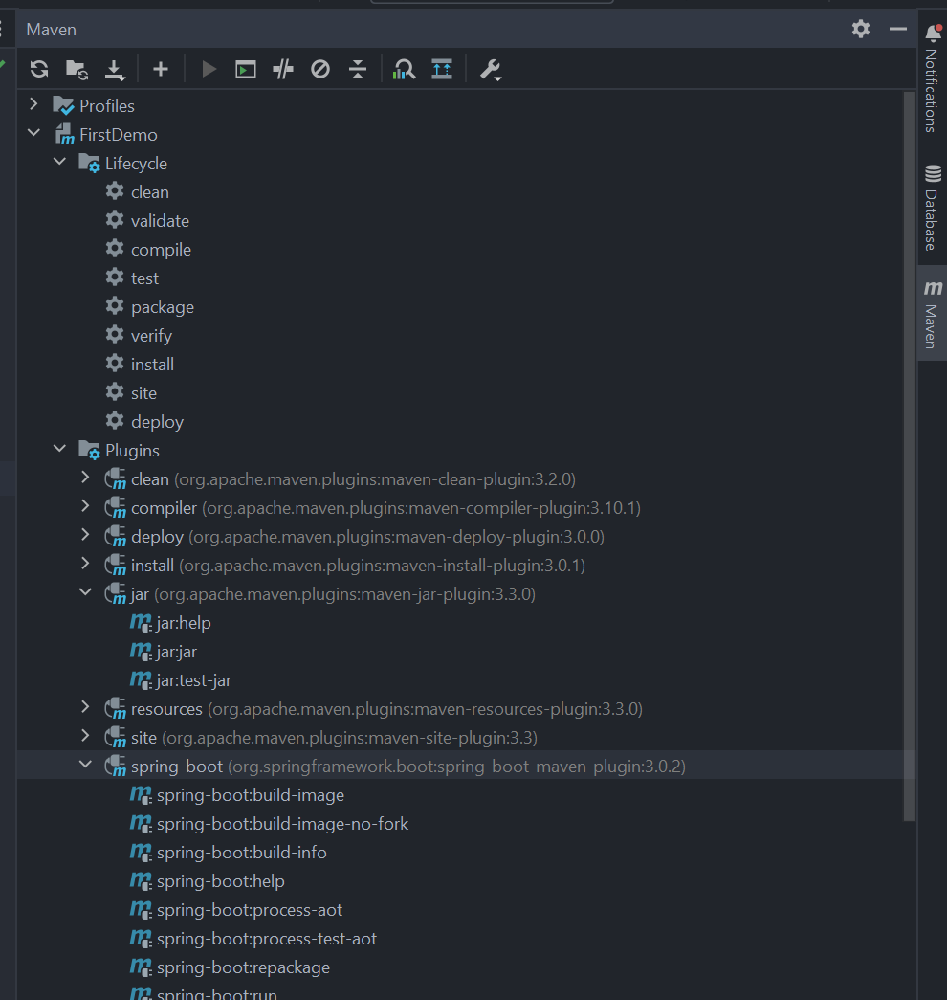

# Tạo dự án Spring Boot đầu tiên

---

## Spring initializr



---

## Code chương trình đơn giản

> Tạo một web trả về HTML đơn giản khi người dùng truy cập.

### Tạo controller đơn giản

> *Controller là thành phần đầu tiên để bắt URL người dùng truy cập. Ví dụ bạn vào trang chủ của web, thì controller method có mapping tới URL sẽ được gọi.*

Tạo một Java class ở trong thư mục `com.abc.xyz` có tên là `HomeController`.

```java
package com.example.demo;

import org.springframework.web.bind.annotation.GetMapping;

@Controller  // Chỉ định HomeController là Controller
public class HomeController {
    // Khi user truy cập vào endpoint / thì homepage() được gọi
    @GetMapping("/")
    public String homepage() {
        return "index";  // Trả về trang index.html
    }
    
    // Có thể mapping thêm các endpoint khác nữa...
}
```

- Web chỉ có một endpoint là / (trang chủ).
- Spring Boot sử dụng các `@Annotaion` để chỉ định ý nghĩa một số thành phần trong code. Ví dụ ở trong đoạn code trên có 2 annotation là `@Controller` và `@GetMapping`
    $\rightarrow$ Giúp code dễ hiểu hơn.

### Tạo trang HTML để trả về

Trong đoạn code trên, có class `HomeController` khi truy cập vào `/` sẽ trả về trang `index.html`.

Chuột phải ở thư mục `resources/template`, chọn `New > HTML file` và tạo template cho `index.html`.

```html
<!DOCTYPE html>
<html lang="en">
<head>
    <meta charset="UTF-8">
    <title>Spring Boot web</title>
</head>
<body>
    Hello World!
</body>
</html>
```

> ❗ *Cần cài thư viện Thymeleaf để hoạt động!*

### Build code để chạy dự án

Nếu không có lỗi gì xảy ra, truy cập địa chỉ `localhost:8080` để xem kết quả. Bạn nên thấy một trang chủ màu trắng và dòng chữ `Hello World!`.

Nếu sử dụng Spring Boot `2.x.x` thì đoạn code trên có thể chạy được, nếu sử dụng Spring Boot `3.x.x` thì nên thêm dòng lệnh này trước dòng lệnh `import org..`

```java
import org.springframework.stereotype.Controller;
```

---

## Chạy chương trình

### Chạy trong IDE

> *Build code như bình thường.*

### Build Jar



Sau khi build file `jar` xong, di chuyển vào đường dẫn chứa file `jar` được ghi trên console và dùng lệnh sau để chạy.

```bash
java -jar <tên file>
```
