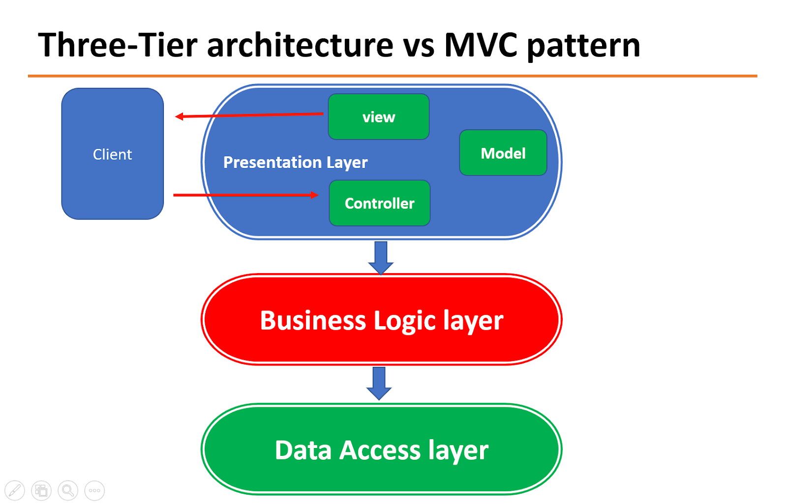
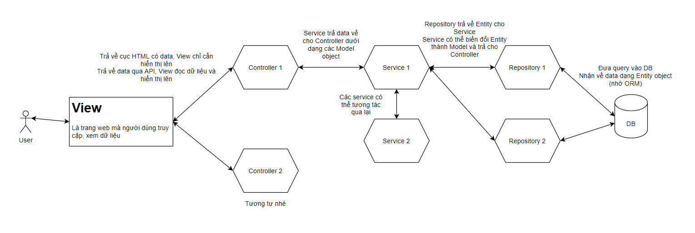

# Luồng đi trong Spring Boot

---

## Hai mô hình quen thuộc

> *Cấu trúc source code của Spring Boot được dựa trên hai mô hình là **mô hình MVC** và **mô hình 3 lớp**.*

### Mô hình ba lớp (three tier)

Mô hình tổ chức source code rất phổ biến trong Spring Boot. Ứng dụng được chia làm 3 tầng (tier hoặc layer) như sau:
- **Presentation layer:** tầng này tương tác với người dùng, bằng View, Controller (trong MVC) hoặc API (nếu có).
- **Business logic layer:** chứa toàn bộ logic cảu chương trình, các đa số code nằm ở đây.
- **Data access layer:** Tương tác với database, trả về kết quả cho tầng business logic.

Trong Spring Boot, một số thành phần đại diện cho từng lớp:
- **Service:** chứa các business logic code.
- **Repository:** đại diện cho tầng data access.

***Mô hình presentation layer:***

### Mô hình MVC

> *Spring Boot chỉ là wrapper cho Spring!*

Mô hình MVC chia tầng presentation làm 3 phần:

- **Model:** các cấu trúc dữ liệu của toàn chương trình, có thể đại diện cho trạng thái của ứng dụng.
- **View:** lớp giao diện, dùng để hiển thị dữ liệu ra cho user xem và tương tác.
- **Controller:** kết nối giữa Model và View, điều kiển dòng dữ liệu.

Dữ liệu từ Model qua Controller sau đó được gửi cho View hiển thị ra. Và ngược lại, khi có yêu cầu mới từ View, thì sẽ qua Controller thực hiện thay đổi dữ liệu của Model.

> MVS chỉ mô tả luồng đi của dữ liệu, không nói rõ code đặt ở đâu (ở Model, View hay Controller) rồi lưu trữ Model vào database như thế nào? Do vậy cần kết hợp cả mô hình MVC và Three-tier với nhau.

## Áp dụng Spring Boot

### Các thành phần quan trọng

Khi kết hợp hai mô hình lại, sẽ có được ứng dụng Spring Boot hoàn chỉnh, gồm các thành phần sau:

- Controller: trả về View (có chứa data sẵn, dạng trang HTML), hoặc Model thể hiện dưới dạng API cho View (View viết riêng bằng React, Vue, hoặc Angular).
- Service: chuwacs các code tính toán, xử lý. Khi controller yêu cầu, thì Service tương tứng sẽ tiếp nhận và cho ra dữ liệu trả cho Controller (trả về Model). Controller sẽ gửi về View như trên.
- Repository: Service còn có thể tương tác với service khác, hoặc dùng Repostory để gọi database. Repository trực tiếp tương tác, đọc ghi dữ liệu trong database và trả cho service.

Về Model và View:

- Model chỉ đơn giản là các dối tượng được Service tính toán xong trả về cho Controller.
- View thì có 2 loại, một là dạng truyền thống là trả về 1 cục HTML có data rồi. Lúc này Controller sẽ pass dữ liệu vào View và return về (Spring MVC có JSP hoặc template engine như Thymeleaf làm điều đó).
- View dạng 2 là dạng View tách riêng (không thuộc về project Spring Boot). Thường có trong các hệ thống dùng API. View sẽ được biết riêng bằng React, Angular, ... Controller sẽ đưa dữ liệu Model thông qua API cho View và cũng nhận lại các yêu cầu qua API luôn.

### Sơ đồ luồng đi

***Xem xét sơ đồ trên từ trái sang:***

- Đầu tiên, user sẽ vào View để xem, tương tác.
- Khi user load dữ liệu (ví dụ click nút reload), một request được gửi từ View đến Controller.
- Từ Controller nhận yêu cầu từ View và bắt đầu gọi các Service thích hợp (gọi các method có trong các Service).
- Service nhận yêu cầu từ Controller, nếu các yêu cầu đơn giản, thì Service có thể tính toán và trả lại kết quả ngay. Ngược lại nếu các tính toán có liên quan đến database thì Service sẽ gửi yêu cầu truy vấn đến Repository.
- Repository nhận yêu cầu từ Service, thao tác với database. *Data lấy ra trong DB được hệ thống ORM (như JPA hoặc Hibernate) mapping thành các object (trong Java). Các object này gọi là Entity.*

***Chiều ngược lại:***

- Service nhận các Entity từ Repository, sau khi thực hiện các biến đổi (tính toán/thêm method/...) và biến Entity thành Model. Model trả về cho Controller.
- Controller nhận Model và trả về View.
    1. Dùng template engine, pass dữ liệu của Model vào trang HTML rồi cục HTML có data về cho client.
    2. Gửi qua API, View tự parse và thể hiện lên client.
- Khi View hiển thị xong, user sẽ thấy thông tin cần tìm thể hiện ở trên web.

***Một số cách tổ chức luồng đi tốt:***

- Giữ Controller ít nhất có thể $\rightarrow$ Controller chỉ đóng vai trò trung gian giúp kết nối View và Service. Do vậy Controller không nên chứa nhiều code, thay vào đó nên tích hợp vào Service.
- Nên tách bạch Service rõ ràng. Không nên để nhiều tích năng vào cùng một Service, nên tách thành nhiều Service khác nhau, mỗi Service thực hiện một công việc cụ thể rõ ràng.

## Code ví dụ

