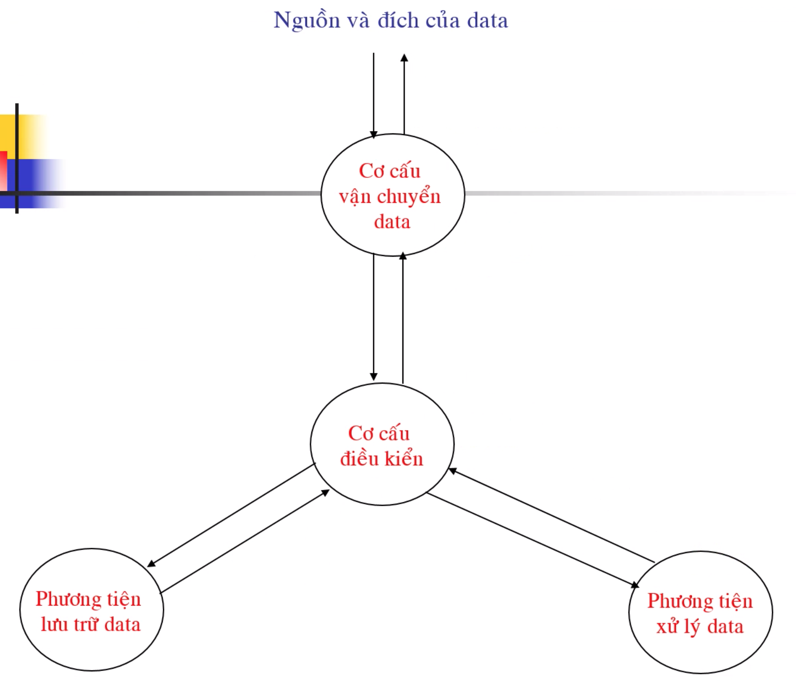
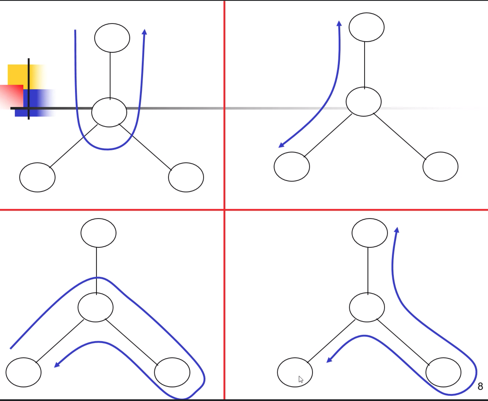
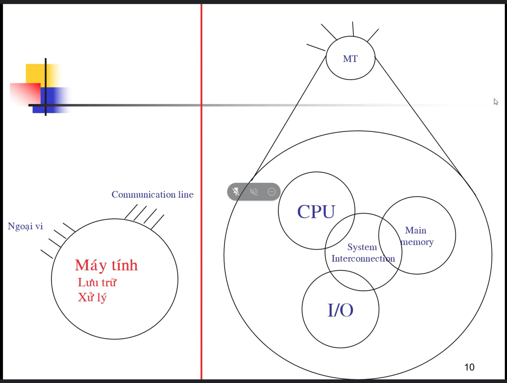
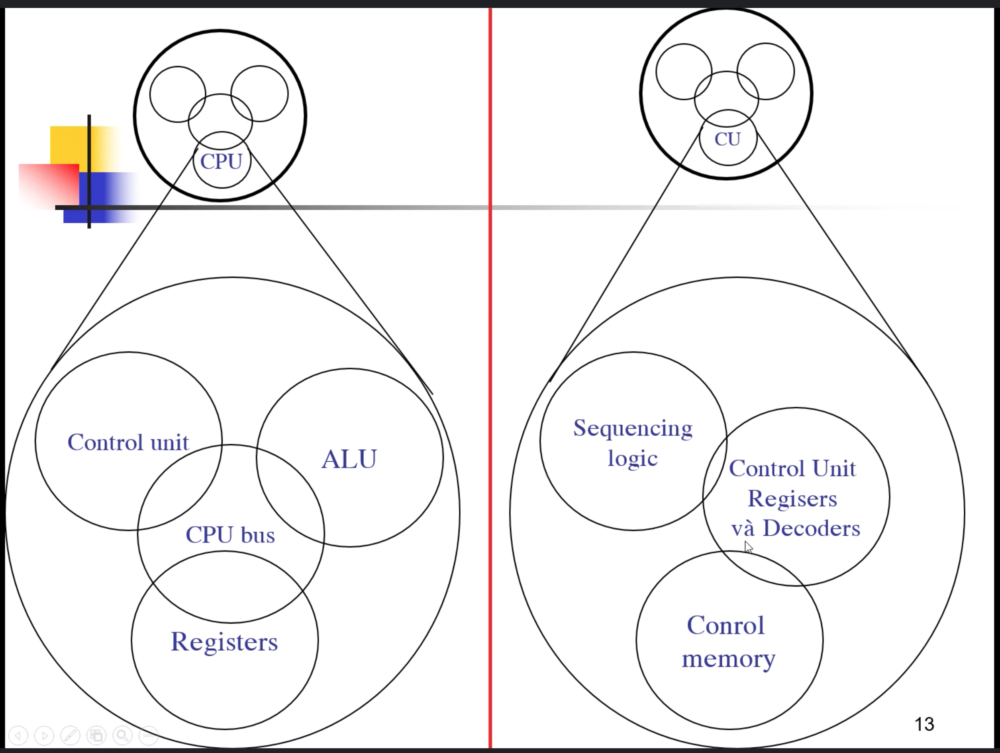

# Bài 1 - Giới thiệu | Kiến trúc máy tính

---

---

## Tổ chức và kiến trúc

Hai thuật ngữ dùng để mô tả hệ thống máy tính.

- Kiến trúc đề cập đến các **thuộc tính** mà người lập trình nhận thấy được, **ảnh hưởng trực tiếp đến thực thi chương trình** (Introduction set, số bit biểu diễn data type, cơ cấu I/O, addressing).
- Tổ chức máy tính đề cập đến các **đơn vị hoạt động và sự liên kết của chúng**, thực hiện các đặt tả kiến trúc (chi tiết phần cứng, control signal, interfaces, memory technology).
- Ví dụ xây dựng multiply instruction.

---

## Cấu trúc và chức năng

- **Cấu trúc:** cách thức các thành phần hệ thống liên hệ với nhau.
- **Chức năng:** hoạt động của mỗi thành phần riêng lẻ với tư cách là một phần của cấu trúc.

---

## Chức năng của máy tính

- Data processing
- Data storage
- Data movement (I/O, peripheral, comunication)
- Control

> *Bốn chức năng cần thiết của một máy tính*

***Mô hình hoạt động của máy tính:***

***Luồng hoạt độc thực tế của máy tính (dựa trên mô hình hoạt động):***

---

## Các thành phần chính

- **CPU:** Điều khiển các hoạt động và thực hiện các chức năng xử lí data (**cơ cấu điều khiển, phương tiện xử lí data**).
- **Main memory:** Lưu trữ data (**phương tiện lưu trữ data**).
- **I/O:** Vận chuyển data với máy tính bên ngoài (**cơ cấu vận chuyển data**).
- **System Interconnection:** Cung cấp cơ chế truyền thông giữa các thành phần trên (**mũi tên nối các thành phần trên**).

> *Có bốn thành phần chính*

***Tổng quan về máy tính:***

 

- Một máy tính có thể có một hay nhiều CPU.
- Dung lượng bộ nhớ là tùy chọn.
- Cơ cấu I/O có qui mô khác nhau tùy theo nhu cầu.

***Thành phần phức tạp nhất là CPU:***

- Control unit.
- ALU (Arithmetic and Logic Unit)
- Register.
- CPU Interconnection.

***Mô hình CPU:***

 

---

## Sơ lược về lịch sử phát triển

> ***Đọc kỹ hơn trong slide!***

- Thế hệ thứ nhất:

    1. Đèn chân không (vacuum tubes).
    2. ENIAC
    3. John Von Neumann/Alan Turing.

- Thế hệ thứ hai:

    1. Transistor.
    1. Multiplexer.
    1. Lập trình mức cao.
    1. Phần mềm hệ thống.

- Thế hệ thứ ba:

    - Mạch tích hợp (Intergrated circuits):

        - SSI, MSI.
        - Microelectronics.
        - IBM/360, PDP - 8 (minicomputer đầu tiên, dùng bus).
        - Luật Moore.

- Thế hệ thứ tư:

    - LSI, VLSI, ULSI.

- Các thế hệ sau...

---

## Nâng cao chất lượng

- Tốc độ bộ vi xử lý

    - Dự đoán nhánh
    - Phân tích luồng số liệu
    Thực thi có dự báo

- Cân đối hiệu suất
- Cải thiện tổ chức và cấu trúc chip

---

## Giải pháp cân đối hiệu suất

- Bộ nhớ lớn hơn
- Cache
- Liên kết CPU - memory tốc độ cao
- Thiết kế

    - Tốc độ giữa các thiết bị
    - Các ứng dụng và thiết bị ngoại vi

---

## Cải thiện tổ chức và cấu trúc chip

- Tốc độ và clock rate
- Kích thước và tốc độ cache
- Kiến trúc sóng song
- Các hệ quả

    - Công suất
    - Trễ (RC delay)
    - Trễ truy xuất bộ nhớ (Memory latency)

---

## References

- [Computer organization & architecture - design for performance, William Stalling, 10th edition, Prentice-Hall International, Inc]
- [Principle of computer architecture, Miles Murdocca & Vincent Heuring]
- [Slide bài giảng (onedrive)]
