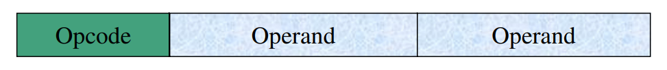
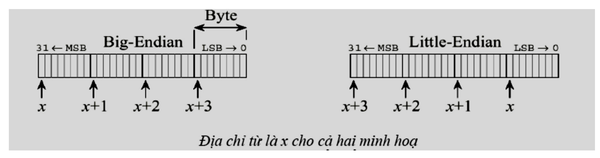
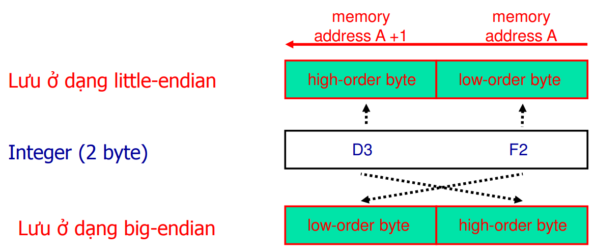
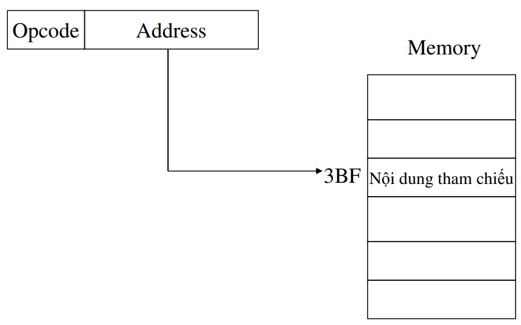
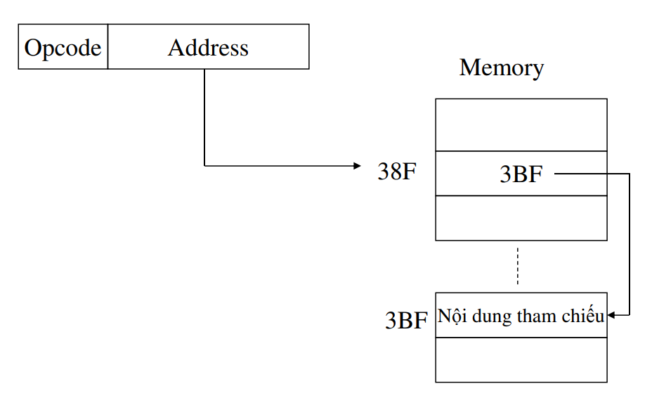
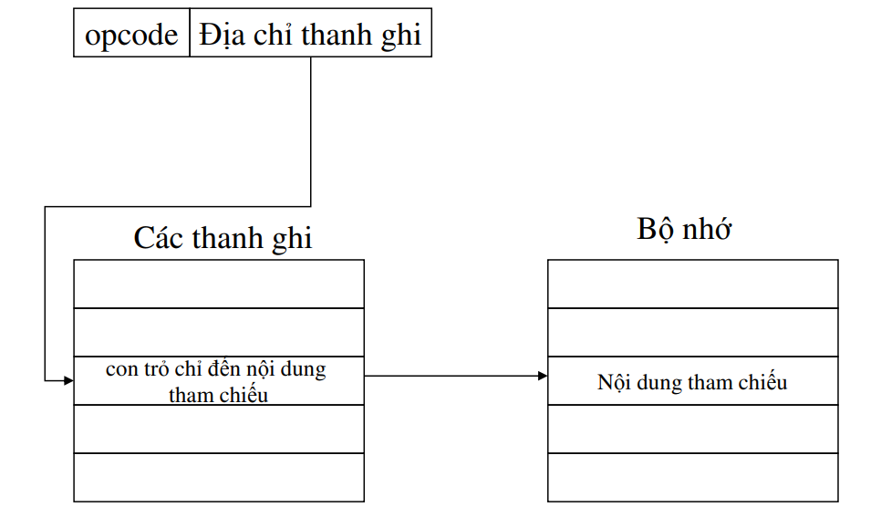
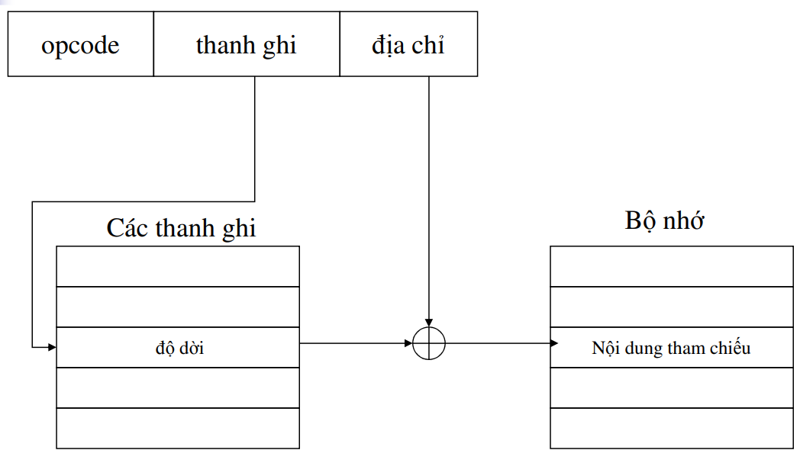

# Bài 4 - Kiến trúc tập chỉ thị ISA (Instruction Set Architecture) | Kiến trúc máy tính

---

- [Tập chỉ thị](#-tập-chỉ-thị-)
- [Các đặc trưng](#-các-đặc-trưng-)
  - [Các thành phần của một chỉ thị (instruction)](#-các-thành-phần-của-một-chỉ-thị-instruction-)
  - [Biển diễn chỉ thị](#-biển-diễn-chỉ-thị-)
  - [Loại chỉ thị](#-loại-chỉ-thị-)
  - [Số lượng địa chỉ](#-số-lượng-địa-chỉ-)
  - [Các đặc trưng thiết kế](#-các-đặc-trưng-thiết-kế-)
- [Các kiểu toán hạng](#-các-kiểu-toán-hạng-)
- [Tập chỉ thị được đo lường qua vài yếu tố](#-tập-chỉ-thị-được-đo-lường-qua-vài-yếu-tố-)
- [Các cân nhắc thiết kế](#-các-cân-nhắc-thiết-kế-)
- [Thứ tự byte của số nguyên](#-thứ-tự-byte-của-số-nguyên-)
- [Hỗ trọ lưu trữ bên trong CPU](#-hỗ-trọ-lưu-trữ-bên-trong-cpu-)
- [Chế độ địa chỉ (addressing mode)](#-chế-độ-địa-chỉ-addressing-mode-)
  - [Địa chỉ tức thời (Immediate addressing)](#-địa-chỉ-tức-thời-immediate-addressing-)
  - [Địa chỉ trực tiếp (Direct addressing)](#-địa-chỉ-trực-tiếp-direct-addressing-)
  - [Địa chỉ gián tiếp (Indirect addressing)](#-địa-chỉ-gián-tiếp-indirect-addressing-)
  - [Địa chỉ gián tiếp thanh ghi (register indirect addressing)](#-địa-chỉ-gián-tiếp-thanh-ghi-register-indirect-addressing-)
  - [Địa chỉ dùng độ dời (Displacement addressing)](#-địa-chỉ-dùng-độ-dời-displacement-addressing-)
  - [Relative addressing](#-relative-addressing-)
  - [Địa chỉ dùng thanh ghi nền (Base-register addressing)](#-địa-chỉ-dùng-thanh-ghi-nền-base-register-addressing-)
  - [Indexed addressing](#-indexed-addressing-)
  - [Địa chỉ ngăn xếp (Stack addressing)](#-địa-chỉ-ngăn-xếp-stack-addressing-)
  - [Các chế độ địa chỉ cải tiến](#các-chế-độ-địa-chỉ-cải-tiến)
- [References](#-references-)

---

## Tập chỉ thị

- Tập hợp các chỉ thị (instruction) khác nhau mà bộ xử lý có thể thực thi.

---

## Các đặc trưng

- Các thành phần của một chỉ thị
- Biểu diễn chỉ thị
- Loại chỉ thị
- Số địa chỉ
- Đặc trưng thiết kế

### Các thành phần của một chỉ thị (instruction)

- Mã lệnh (operation code)
- Toán hạng nguồn (Source operand): địa chỉ bộ nhớ chính (hoặc bộ nhớ ảo), tên thành ghi, địa chỉ thiết bị I/O
- Toán hạng đích (Destination operand): địa chỉ bộ nhớ chính (hoặc bộ nhớ ảo), tên thanh ghi, địa chỉ thiết bị I/O
- Tham chiếu chỉ thị kết (Next instruction reference).

    1. Tường minh
    1. Không tường minh

### Biển diễn chỉ thị

- Một tuần tự các bit.

```bash
<operation code> <source operand> <destination operand>
```



### Loại chỉ thị

- Tính toán

    1. Số học
    1. Luận lý

- Lưu trữ dữ liệu: memory
- Di chuyển dữ liệu: I/O
- Điều khiển: kiểm tra, rẽ nhánh, chuyển điều khiển

(Xem slide về ví dụ *rẽ nhánh*, *gọi thủ tục*)

### Số lượng địa chỉ

- Xác định số lượng địa chỉ được chứa trong một chỉ thị (gồm 3 loại chỉ thị: 0, 1, 2, 3 địa chỉ).
- Địa chỉ được biểu diễn tường minh hay không tường minh:

    1. Địa chỉ bộ nhớ
    2. Thanh ghi bộ tích lũy (Accumulator)
    3. Chỉ thị không địa chỉ

### Các đặc trưng thiết kế

- Tác vụ của lệnh
- Kiểu toán hạng
- Các thanh ghi
- Chế độ địa chỉ

---

## Các kiểu toán hạng

- Địa chỉ
- Con số

    1. Nguyên (integer)
    2. Dấu chấm động (floating point)
    3. Thập phân, nhị phân

- Kí tự
- Luận lý

---

## Tập chỉ thị được đo lường qua vài yếu tố

- Kích thước lưu trữ mà chương trình cần
- Độ phức tạp của tập chỉ thị cũng như độ phức tạp của các tác vụ
- Chiều dài của chỉ thị
- Tổng số chỉ thị
- Bao nhiêu thanh ghi và tổ chức các thanh ghi như thế nào

---

## Các cân nhắc thiết kế

- Chỉ thị ngắn hoặc dài
- Chiều dài cố định hay thay đổi (cố định dễ giải mã nhưng lãng phí)
- Tổ chức bộ nhớ (địa chỉ hóa theo byte hay không)
- Chỉ thị có chiều dài cố định không nhất thiết phải cố định số toán hàng (expanding operation code)
- Chế độ địa chỉ hóa
- Thứ tự lưu giữ các byte của các từ có nhiều byte: little endian hoặc big endian.



---

## Thứ tự byte của số nguyên



---

## Hỗ trọ lưu trữ bên trong CPU

- Kiến trúc stack: dùng một stack để thực thi chỉ thị, các toán hàng được ngầm định ở đỉnh stack, không thể truy xuất ngẫu nhiên, khó sinh mã hiệu quả.
- Kiến trúc accumulator: một toán hàng ngầm định (không tường minh) trong thanh ghi AC, tối thiểu hóa độ phức tạp nhưng lưu lượng bộ nhớ lớn.
- Kiến trúc thanh ghi mục đích tổng quát (GPR: General Purpose Register): dùng một số thanh ghi, truy xuất nhanh. Có hai đặc trưng chính: số lượng toán hàng và cách thức địa chỉ hóa toán hạng.

## Chế độ địa chỉ (addressing mode)

1. Immediate addressing
2. Direct addressing
3. Indirect addressing
4. Register addressing
5. Register indirect addressing
6. Displacement addressing
7. Based addressing
8. Indexed addressing
9. Stack addressing
10. Các chế độ cải tiến

### Địa chỉ tức thời (Immediate addressing)

- Giá trị tham chiếu nằm ngay trong chỉ thị
- Không có tham chiếu bộ nhớ để lấy dữ liệu
- Nhanh
- Ví dụ: `ADD #5`

    1. Cộng $5$ vào nội dung của thanh ghi AC
    1. $5$ là toán hạng

### Địa chỉ trực tiếp (Direct addressing)

- Toán hàng là địa chỉ của giá trị tham chiếu
- Tham chiếu một vị trí bộ nhớ để truy xuất dữ liệu
- Ví dụ: `ADD 3BF`

    1. Cộng nội dung của ô nhớ `3BF` với nội dung trong AC
    1. `3BF` là địa chỉ hiệu quả (effective address)



### Địa chỉ gián tiếp (Indirect addressing)

- Toán hàng là địa chỉ của con trỏ chỉ đến dữ liệu
- Địa chỉ hiệu quả chính là con trỏ
- Ví dụ: `ADD 38F`

    1. Cộng nội dung tại ô nhớ có địa chỉ được chứa trong ô nhớ `38F` với nội dung trong AC
    2. `38F` không phải địa chỉ hiệu quả.



### Địa chỉ gián tiếp thanh ghi (register indirect addressing)

- Kết hợp địa chỉ thanh ghi và địa chỉ gián tiếp
- Dùng thanh ghi để chứa con trỏ chỉ đến vị trí chứa giá trị tham chiếu



### Địa chỉ dùng độ dời (Displacement addressing)

- Phần toán hạng chứa hai giá trị:

    1. Địa chỉ
    2. Thanh ghi giữ độ dời (offset)

- Địa chỉ hiệu quả = địa chỉ + độ dời



### Relative addressing

- Từ displacement addressing nếu thanh ghi là PC thì gọi là địa chỉ quan hệ (relative addressing)
- Lấy nội dung từ ô nhớ tị vị trí "địa chỉ" tính từ vị trí hiện hành được chỉ ra trong thanh ghi PC.
- Ví dụ: `LD A` nạp nội dung từ ô nhớ `A + (PC)` vào thanh ghi AC.

### Địa chỉ dùng thanh ghi nền (Base-register addressing)

- Giá trị thứ nhất là độ dời (offset)
- Thanh ghi chứa con tỏ chỉ đến địa chỉ nền
- Thanh ghi có thể là tường minh hoặc không tường minh

### Indexed addressing

- Giá trị địa chỉ trong chỉ thị chứa địa chỉ nền
- Thanh ghi chứa độ dời (offset)
- Địa chỉ hiệu quả = địa chỉ nền + độ dời
- Thích hợp cho truy xuất mảng:

    1. Địa chỉ truy xuất = địa chỉ nền + độ dời trong thanh ghi R
    2. R++

### Địa chỉ ngăn xếp (Stack addressing)

- Các toán hạng được ngầm định trên đỉnh stack
- Ví dụ __ ADD __` lấy $2$ giá trị trên đỉnh stack và thực hiện cộng hai giá trị với nhau.

### Các chế độ địa chỉ cải tiến

- Có thể kết hợp các chế độ địa chỉ với nhau
- Ví dụ: indirect indexed addressing, indirect based register addressing, ...

---

## References

- [Computer organization & architecture - design for performance, William Stalling, 10th edition, Prentice-Hall International, Inc]
- [Principle of computer architecture, Miles Murdocca & Vincent Heuring]
- [Slide bài giảng (onedrive)]
