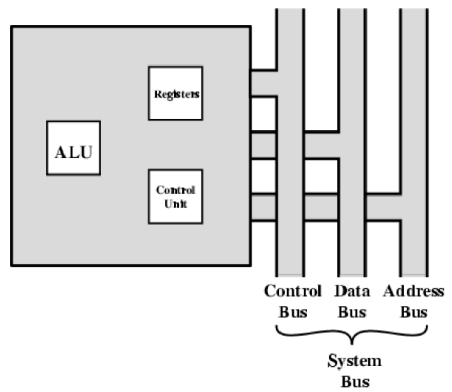
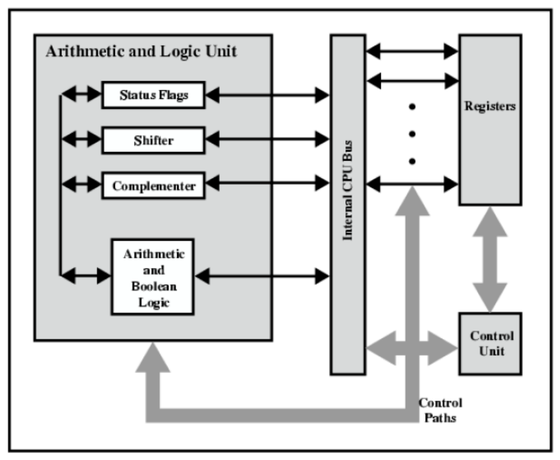

# Bài 5 - Cấu trúc bộ xử lí và thực thi chương trình | Kiến trúc máy tính

---

## Công việc của CPU

CPU phải:

- Fetch instructions
- Interpret instructions
- Fetch data
- Process data
- Write data

## CPU với system bus

## Cấu trúc bên trong của CPU

## Tổ chức các thanh ghi

- CPU cần các vùng nhớ tạm để làm việc gọi là thanh ghi (register).
- Số lượng và chức năng thay đổi tùy vào thiết kế của bộ xử lý.
- Là một trong các quyết định thiết kế quan trọng.
- Mức cao nhất trong phân cấp bộ nhớ.

---

## References

- [Computer organization & architecture - design for performance, William Stalling, 10th edition, Prentice-Hall International, Inc]
- [Principle of computer architecture, Miles Murdocca & Vincent Heuring]
- [Slide bài giảng (onedrive)]
