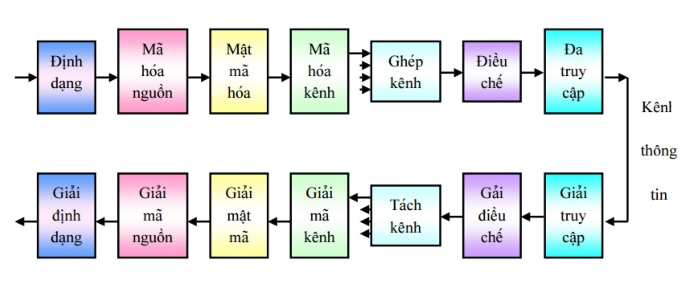

# Chương 2: Nguồn tin | Lý thuyết thông tin

---

## Thông tin

> - Hai người nói chuyện với nhau. Cái được trao đổi giữa họ chính là thông tin.
> - Một người đang xem thông tin từ đài/tivi/đọc báo, người đó đang tiếp nhận thông tin từ đài/báo.
> - Các máy tính được nối mạng và trao đổi thông tin với nhau.
> - Máy tính nạp chương trình, dữ liệu từ đĩa cứng vào RAM để thực thi.

- Thông tin là cái được truyền từ đối tượng này đến đối tượng khác để báo một “điều” gì đó.
- Thông tin chỉ **có nghĩa** khi "điều" đó bên nhận chưa biết.
- Thông tin xuất hiện dưới nhiều dạng âm thanh và hình ảnh.
- Ngữ nghĩa của thông tin chỉ có thể được hiểu khi bên nhận hiểu được cách biểu diễn ngữ nghĩa của bên phát.
- Có hai trạng thái của thông tin: **truyền và lưu trữ**. Môi trường truyền/lưu trữ được gọi là **môi trường chứa tin** hay **kênh tin**.

> - Trong khoa học kỹ thuật, LTTT nghiên cứu nhằm tạo ra một “cơ sở hạ tầng” tốt cho việc truyền thông tin chính xác, nhanh chóng và an toàn; lưu trữ thông tin một cách hiệu quả.
> - Ở các góc độ nghiên cứu khác LTTT nghiên cứu các vấn đề về cách tổ chức, biểu diễn và truyền đạt thông tin, và tổng quát là các vấn đề về xử lý thông tin.
> - LTTT ứng dụng trong truyền thông và xử lý thông tin: truyền thông, nén, bảo mật, lưu trữ, vân vân.
> - LTTT đã được áp dụng trong nhiều lĩnh vực khác: vật lý, ngôn ngữ học, Kinh tế, khoa học máy tính, tâm lý học, hóa học.

### Bản chất thông tin

- Bản chất của quá trình truyền tin theo quan điểm toán học.
- Cấu trúc vật lí của môi trường truyền tin.
- Các vấn đề liên quan đến tính chất bảo mật, tối ưu hóa quá trình.
- Các vấn đề đó thường được gọi là các lý thuyết thông tin, lý thuyết năng lượng.

### Mục tiêu của lý thuyết thông tin

- Rời rạc hóa nguồn
- Mô hình phân phối xác suất của nguồn và đích.
- Các vấn đề mã hóa và giải mã.
- Khả năng chống nhiễu của hệ thống.

### Truyền tin

- Là quá trình dịch chuyển thông tin từ địa điểm này sang địa điểm khác trong một môi trường xác định.
- Hai điểm này sẽ được gọi là điểm nguồn tin (information source) và điểm nhận tin (information destination). Môi trường truyền tin được gọi là kênh tin (chanel).

$$\text{Nguồn tin} \rightarrow \text{Kênh tin} \rightarrow \text{Nhận tin}$$

### Hệ thống thông tin số

Sơ đồ hệ thống truyền dẫn số đơn giản:

---

## Nguồn tin

### Định nghĩa

> *Để đánh giá định lượng cho tin tức người ta đưa ra khái niệm lượng tin.*

- Lượng tin đưa ra khả năng dự đoán được của tin.
- Một tin có xác suất xuất hiện càng nhỏ thì có độ bất ngờ càng lớn, lượng tin càng lớn và ngược lại.

> Xét nguồn tin $X$ rời rạc sinh ra các tin $i$ với xác suất là $p(i)$, lượng tin $i$ phải là một hàm có các đặc điểm sau:
>
> - Tỉ lệ nghịch với xác suất xuất hiện $p(i), f\left(\dfrac{1}{p(i)}\right)$.
> - Hàm này phải bằng $0$ khi $p(i) = 1$.

***Tiêu chí đánh giá chất lượng hệ thống thông tin***

> - Tính hiệu quả:
>
>     - Tốc độ truyền tin
>     - Truyền đồng thời nhiều tin khác nhau
>     - Chi phí hoạt động và đầu tư
>
> - Độ tin cậy
> - Bảo mật
> - Đảm bảo chất lượng dịch vụ

- Nếu hai tin độc lập thống kê $i$ và $j$ đồng thời xuất hiện ta có tin là $(i, j)$, thì lượng tin chung phải bằng tổng lượng tin của từng tin:

$$f\left(\dfrac{1}{p(i, j)}\right) = f\left(\dfrac{1}{p(i)}\right) + f\left(\dfrac{1}{p(j)}\right)$$

- Với luật nhân xác suất thì:

$$p(i, j) = p(i) \cdot p(j)$$

- Vì vậy:

$$f\left(\dfrac{1}{p(i) \cdot p(j)}\right) = f\left(\dfrac{1}{p(i)}\right) + f\left(\dfrac{1}{p(j)}\right)$$

- Hàm loga thỏa mãn hết tất cả các yêu cầu này nên hàm $\log\left(\dfrac{1}{p(i)}\right)$ được chọn để đánh giá định lượng cho tin.
- Lượng tin của một tin $i$ được kí hiệu là $I(i)$. Định nghĩa lượng tin của một tin $i$:

$$I(i) = \dfrac{1}{p(i)} = - \log p(i)$$

- Đơn vị là `bit` hay `nat` hay `hartley` khi cơ số là $2, e$ hay $10$.
- Cơ số $2$ hay được chọn.

### Tính chất của lượng tin

- Nếu $P(x_i) < P(x_j)$ thì $I(x_i) > I(x_j)$.
- Nếu $x_i$ và $x_j$ độc lập thì $I(x_i, x_j) = I(x_i) + I(x_j)$

***Ví dụ:***

> Tung một đồng xu, xác suất xuất hiện mặt sấp và mặt ngửa đều là $\dfrac{1}{2}$.
>
> - Lượng tin chứa trong thông điệp "mặt xuất hiện là mặt sấp" là: $I = \log_2 \left(\dfrac{1}{1 \div 2}\right) = \log_2 (2) = 1 \quad (bit)$
> - Lượng tin chứa trong thông điệp "mặt xuất hiện là mặt ngửa" là: $I = \log_2 \left(\dfrac{1}{1 \div 2}\right) = \log_2 (2) = 1 \quad (bit)$
> - Nếu sử dụng hàm $\log_e$ thì: $I = \log_e (2) = 0.6931 \quad (nat)$

***Ví dụ:***

> Tung hột xúc xắc, xác suất xuất hiện mặt có số nút chẵn là: $\dfrac{3}{6} = \dfrac{1}{2}$.
> Lượng tin chứa trong thông điệp "mặt xuất hiện có số nút chẵn" là: $I = \log_{10} \left(\dfrac{1}{1 \div 2}\right) = \log_{10} (2) = \lg(2) = 0.301 \quad (hartley)$

***Ví dụ:***

> Rút ngẫu nhiên một lá bài từ bộ bài $52$ lá. Xác suất mà lá bài rút ra có hình người là $\dfrac{12}{52}$.
> Lượng tin chứa trong thông điệp "lá bài rút ra là lá bài có hình mặt người" là:
>
> $$I = \log_2 \left(\dfrac{1}{12 \div 52}\right) = 2.1155 \quad (bit)$$

### Entropy của nguồn tin

- Entropy $H$ được định nghĩa là giá trị trung bình thống kê của lượng tin. Đó là lượng tin trung trình chứa trong một ký tự bất kì của nguồn tin.
- Entropy của một nguồn $M$:

$$H = \sum\limits_{m = 1}^{M}p(m) \log_2 \dfrac{1}{p(m)} \quad (bit/\text{kí tự})$$

*Trong đó:* $p(m)$ là xác suất của kí tự thứ $m$ và $\sum \limits_{m = 1}^{M}p(m) = 1$.

- Giá trị lớn nhất của entropy là:

$$H_{\max} = \log_2 (M)$$

*Đạt được khi:* $p(m) = \dfrac{1}{M}$.

- Tốc độ thông tin nguồn: $R = r \cdot H \quad (bit/s)$.

### Thông lượng của kênh (Chanel capacity)

- Lượng tin tối đa kênh cho đi qua trong một đơn vị thời gian mà không gây lỗi. Kí hiệu của thông lượng kênh là $C$ và đơn vị đo $(bit/s)$.
- Thông thường tốc độ tập tin bé hơn nhiều so với thông lượng tin: $R << C$.
- **Truyền tin trên kênh không nhiễu:** toàn bộ tin tức được truyền qua kênh mà không bị lỗi. Lượng tin tối đa mà kênh cho qua cũng bằng với lượng tin tối đa mà nguồn có thể thiết lập.
    - Thông lượng kênh cho trường hợp này là:

$$C = R_{\max} = n_0 \cdot H_{\max}$$

> **Theo Shannon, nếu $R < C$ thì có thể mã hóa để làm cho tốc độ lập tin của nguồn tiệm cận với thông lượng kênh: $C - R < e$, $e$ vô cùng bé.** *Phương pháp mã hóa này được gọi là mã hóa thống kê tối ưu.*

- **Truyền tin trên kênh có nhiễu:** lượng tin truyền đi bị hao hụt một phần do nhiễu nên thông lượng kênh bị giảm đi. Lượng tin bị nhiễu phá hủy trong một đơn vị thời gian được tính bằng $n_0 \cdot E$. 
    - Thông lượng kênh có nhiễu là:

$$R = n_0 \cdot H_{\max} - n_0 \cdot E = n_0 \cdot (H_{\max} - E)$$

> - Theo Shannon, nếu $R < C$ thì có thể mã hóa để tin được truyền đi trong kênh với xác suất lỗi bé tùy ý.
> - Nếu $R > C$ thì không thể truyền tin đi mà không bị lỗi.

- Theo định lý Hartley - Shannon, thông lượng của kênh là:

$$C = B \cdot \log_2\left(1 + \dfrac{S}{N}\right) \quad (bit/s)$$

- Băng thông của kênh là $B$, tỷ số tín hiệu trên nhiễu trung bình là $\dfrac{S}{N}$.

---

## References

- [Slide giáo trình (*OneDrive*)]

