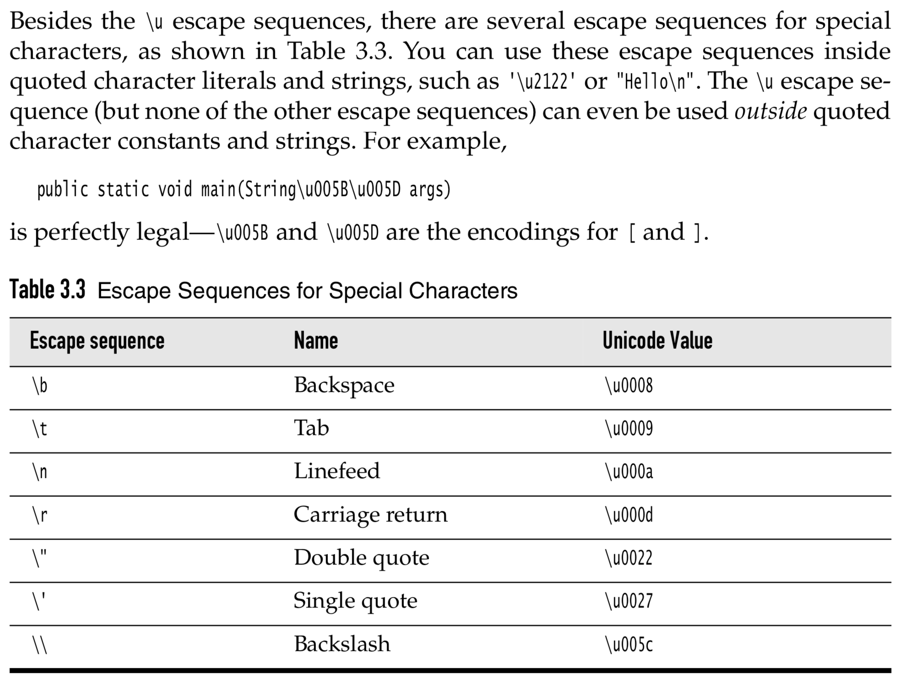
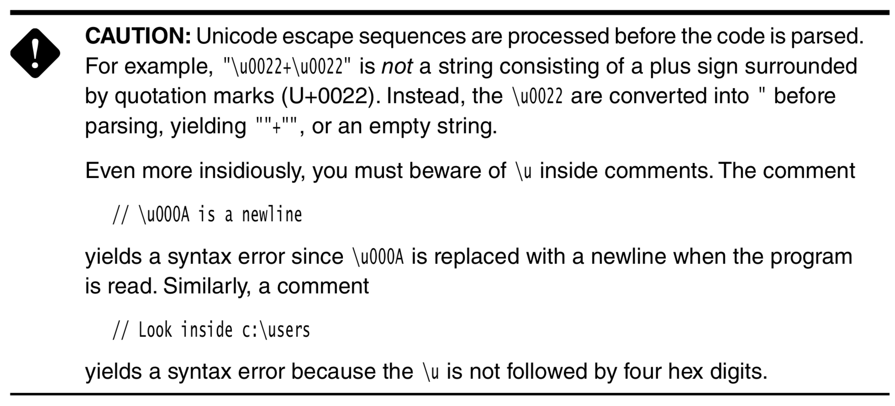

# Data Types

> *Java is a strongly typed language and has 8 types of primitive data types.*

## Integer types

|  Type   |   Size    |                     Range                     |
| :-----: | :-------: | :-------------------------------------------: |
| `byte`  | $1$ byte  |                 $[-128, 127]$                 |
| `short` | $2$ bytes |               $[-32768, 32767]$               |
|  `int`  | $4$ bytes |          $[-2147483648, 2147483647]$          |
| `long`  | $8$ bytes | $[-9223372036854775808, 9223372036854775807]$ |

**Notes:**

- The range of Integer types is a constant, which does not changes base on the machine's operating system.
- `long` integers must have a suffix of `L` or `l` such as: `40000000000000L`.
- Hexadecimal numbers must have a prefix of `0x` or `0X` such as: `0xCAFE`.
- Octal numbers must have a prefix of `0` such as `010`.
- From Java SE 7 and later, binary numbers can be writen with a prefix of `0b` or `0B` such as: `0B1001`.
- From Java SE 7 and later, `_` symbol can be added to number literals to seperates digits such as: `1_000_000_000` or `0B1000_0001_1010_1100`.

---

## Floating-point types

|   Type   |   Size    |                                        Range                                        |
| :------: | :-------: | :---------------------------------------------------------------------------------: |
| `float`  | $4$ byte  | Approximately $\pm 3.40282347\text{E}+38\text{F}$ (6-7 significant decimal digits)  |
| `double` | $8$ bytes | Approximately $\pm 1.79769313486231570\text{E}+308$ (15 significant decimal digits) |

**Notes:**

- `float` literals must have a suffix of `F` or `f` such as: `123.141F`.
- All floating point computations follow the IEEE 754 specification.
- Positive infinity, negative infinity and NaN (not a number will cause overflow and errors).
- To check a variable is not a number we'll do like this:

```java
if (x == Double.NaN) { //! Do not check like this.
    // code
}

if (Double.isNaN(x)) {
    // code
}
```

- Due to the fact that floating-point numbers are represented in binary number system, there won't be preceise floating-point number representation, such as: $\dfrac{1}{3}$ or $\dfrac{1}{10}$.

---

## The `char` type

- Use single quotes `'` to enclosed the `char` literals.
- Values of type `char` can be expressed as hexadecimal values from `\u0000` to `\uFFFF`



**Caution:**



---

## Boolean type

The `boolean` type has two values `true` and `false` to evaluate logical contitions.

You cannot convert betwwn integers and `boolean` values.

---
