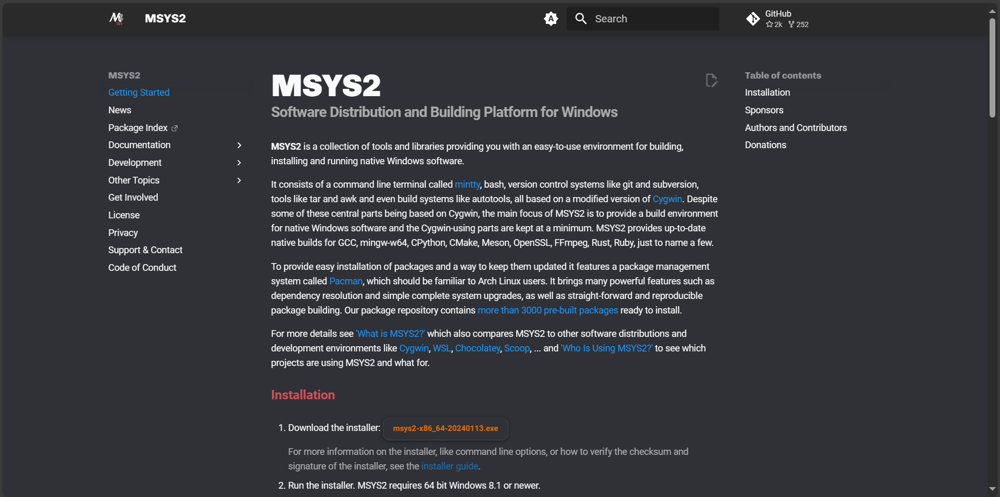
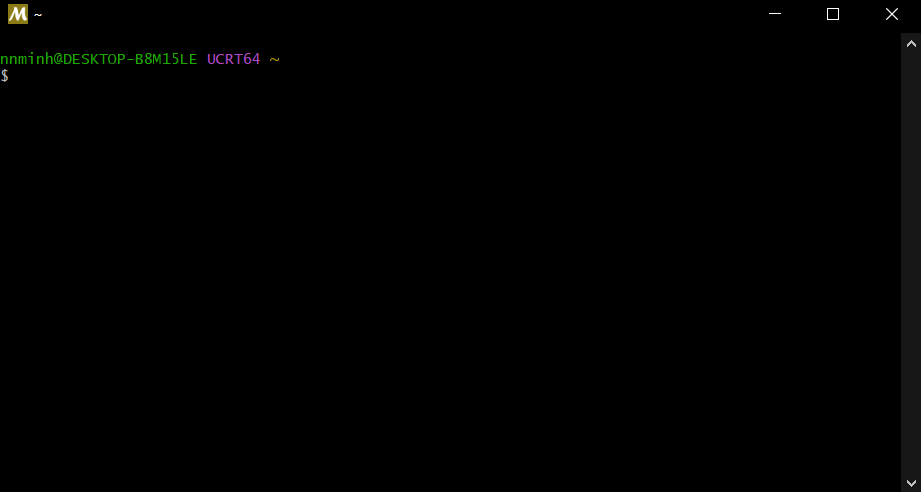

# Seting up GCC and CMake

## Installing GCC

There are many C++ compiler, and GCC is one of them. You can read more about it [here](https://gcc.gnu.org/).

You can install GCC from many source, but i find some of them are out dated. Therefore, I'll show you this which is supporting at least C++20.

First you go to this website: [MSYS2](https://www.msys2.org/)



You can start reading the Instalation section and do the follow steps:


I still include those steps in here:

1. Download this file: [MSYS2 - last updated 2024-01-13](https://github.com/msys2/msys2-installer/releases/download/2024-01-13/msys2-x86_64-20240113.exe)

2. Run the installer and install it as usual.

3. When the installation process finished, you will see a console screen pop up which looks like this:



4. Then you paste the follow code inside and press Enter:

```bash
pacman -S mingw-w64-ucrt-x86_64-gcc
```

5. You might see the console shows up with a question, type "Y" then press Enter to continue the installation process.

6. When the process complete, you can use the below command to check you GCC version:

```bash
gcc --version
```

If you can see the version without any error, then the installation process if complete successfully!

You can check the version release date of GCC at [here](https://gcc.gnu.org/releases.html).

Also you can check the C++ standard support in GCC at [here](https://gcc.gnu.org/projects/cxx-status.html).

## Installing CMake

CMake is a build system for C++. You can download it from [here](https://cmake.org/download/)

The installation process is quite straight forward, just choose the proper version, download then install it in your computer.

