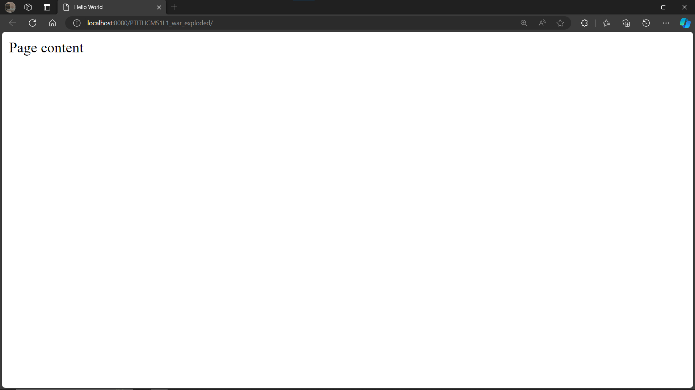
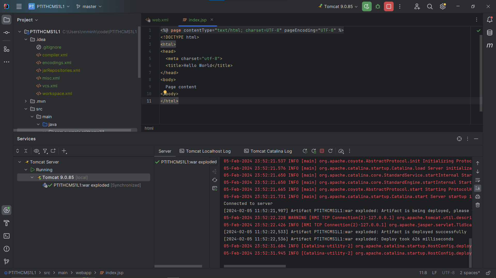

# Create a Java EE webapp using Spring MVC and Tomcat in IntelliJ

---

## Prerequisites

- IntelliJ IDE Ultimate edition
- Tomcat server
- JDK 17+

All of above must be download and installed on your computer!

## Setup a new project and add Tomcat server

Project informations:
- Name: PTITHCMS1L1
- Description: Lab 1 project for my web development class in PTITHCM.

Usage:
- IDE: IntelliJ IDEA Ultimate version
- Build tool: Maven

### Add Tomcat server to IntelliJ

- Go to IntelliJ settings -> Build, Executons, Deployment -> Application servers


- Add a new server by pressing the add button (the plus symbol) and choose Tomcat


- Browse for your Tomcat server location and press OK


### Chaging Tomcat server port

- Go ro Run -> Edit configurations


- Press the add config button and search for Tomcat and choose local


- System is gonna auto detect your Tomcat server settings


- From now you can change your port number

### Creating new Java EE project in IntelliJ

- Create a new project with Jakarta EE with my suggest options, then choose Next


- Inside Specifications choose: Serlet, XML web service and Spring MVC. I dont choose any implementations since I'm gonna do it manually


- Press Next to create project


- Project structure and auto generated files

---

## Create a Hello World website

### Project directory explanation

We are using Maven as our build system, so there are something you must know and understand.

- `pom.xml`: This is the Maven Project Object Model file, and it is used to manage the project's build configuration, dependencies, plugins, and other settings. You can specify Spring-related dependencies, plugins, and other project configurations in this file.

- `src/main/java`: This is the default source directory for your Java classes. You would typically place your Spring MVC controllers, services, and other Java classes in packages under this directory.

- `src/main/resources`: This directory is used to store non-Java resources, such as configuration files, properties files, and Spring configuration files. You might place your applicationContext.xml or other Spring configuration files here.

- `src/main/webapp`: This directory contains web resources like HTML, JSP, CSS, JavaScript, and other static files. You may customize your web application structure, create JSP views, and include static resources in this directory.

- `webapp/WEB-INF/web.xml`: The `web.xml` file is used for configuring the Servlet container and other web-related settings. You may configure servlets, filters, and listeners in this file.

- `src/main/resources/application.properties or application.yml`: This is where you can place your application-specific properties. You can configure various Spring settings, database connection details, and other application-specific configurations here.

- `src/test`: This directory is for placing test classes and resources. You can write unit tests for your Spring components in this directory.

### Making Hello world webapp

- Inside the `webapp` directory, create a new `index.jsp` file with the below content:

```jsp
<%@ page contentType="text/html; charset=UTF-8" pageEncoding="UTF-8" %>
<!DOCTYPE html>
<html>
<head>
  <meta charset="utf-8">
  <title>Hello World</title>
</head>
<body>
  Page content
</body>
</html>
```

Note that this file might be auto generated so you can overwrite the file content.

- Run the project buy pressing the build button on the tool bar.


- IntelliJ will use your default browser to open the web



And inside the IntelliJ IDE




