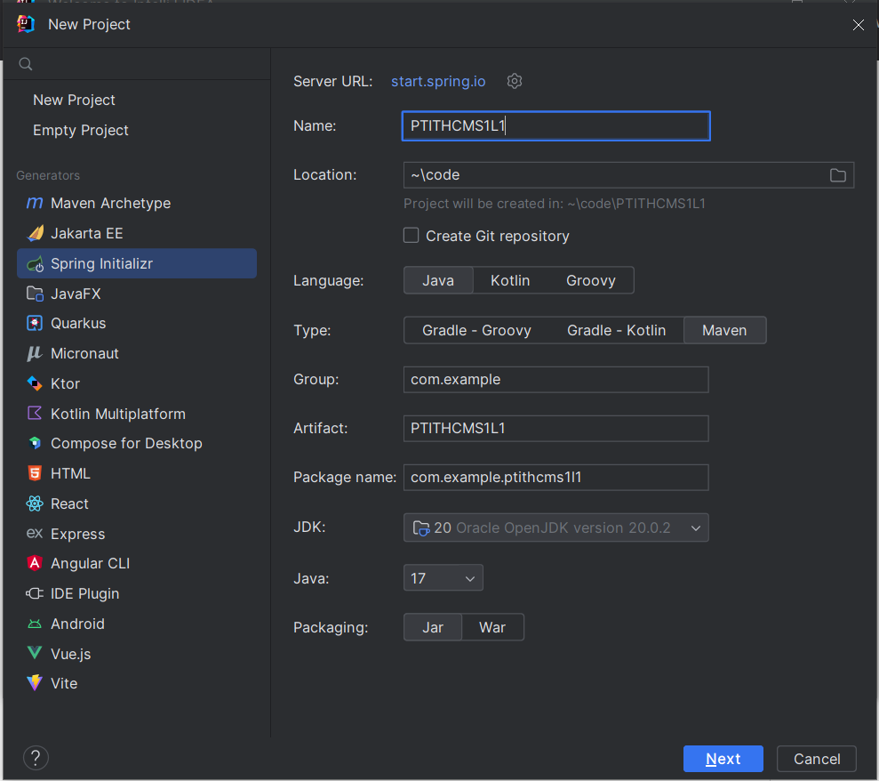
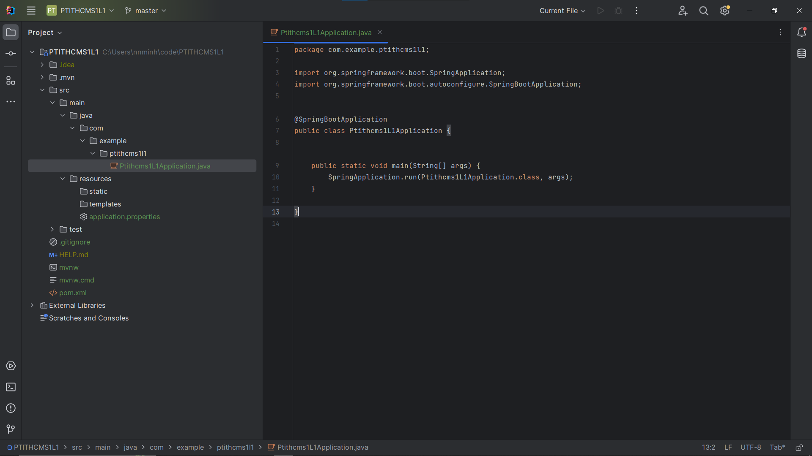

# Setting up Tomcat server on IntelliJ and create Spring MVC SSR project

---

## Prerequisites

- IntelliJ IDE (any version)
- Tomcat server
- JDK 17+

All of above must be download and installed on your computer!

## Setup a new project and add Tomcat server

### Creating new Java project in IntelliJ

- Create a new project with Spring Initializer with my suggest options, then choose Next

- Choosing any version of spring boot you want, and under dependency selection -> Web -> Spring web

- Then press Create to create project, the project should looks like this

### Chaging Tomcat server port

- Go ro Run -> Edit configurations

- Press the add config button and search for Tomcat and choose local

- System is gonna auto detect your Tomcat server settings

- From now you can change your port number

---

## Create a SSR Hello World website

### Project directory explanation

We are using Maven as our build system, so there are something you must know and understand.

- `pom.xml`: This is the Maven Project Object Model file, and it is used to manage the project's build configuration, dependencies, plugins, and other settings. You can specify Spring-related dependencies, plugins, and other project configurations in this file.

- `src/main/java`: This is the default source directory for your Java classes. You would typically place your Spring MVC controllers, services, and other Java classes in packages under this directory.

- `src/main/resources`: This directory is used to store non-Java resources, such as configuration files, properties files, and Spring configuration files. You might place your applicationContext.xml or other Spring configuration files here.

- `src/main/webapp`: This directory contains web resources like HTML, JSP, CSS, JavaScript, and other static files. You may customize your web application structure, create JSP views, and include static resources in this directory.

- `webapp/WEB-INF/web.xml`: The `web.xml` file is used for configuring the Servlet container and other web-related settings. You may configure servlets, filters, and listeners in this file.

- `src/main/resources/application.properties or application.yml`: This is where you can place your application-specific properties. You can configure various Spring settings, database connection details, and other application-specific configurations here.

- `src/test`: This directory is for placing test classes and resources. You can write unit tests for your Spring components in this directory.
